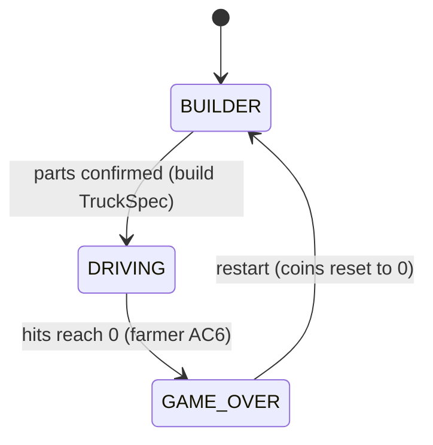
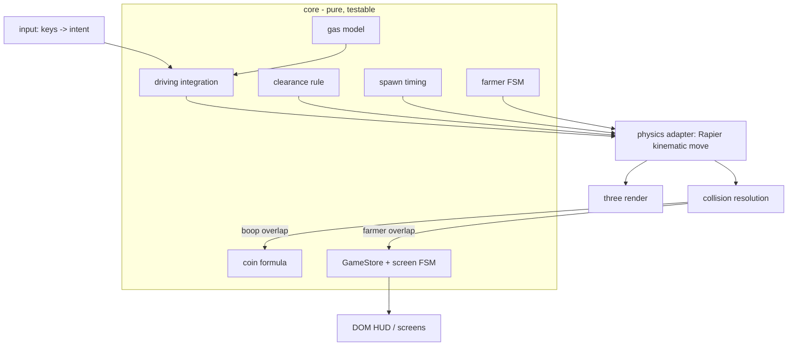

# ADR 0001 — Foundation: stack, structure, and the physics model

Status: Proposed (Sprint 1, greenfield)
Date: 2026-07-06
Related: all four Sprint 1 requirements docs; ADR 0002 (upgrade data), 0003 (farmer FSM), 0004 (gas)

## Context

This is the first architecture pass on a brand-new repo. The stack (Three.js + Vite, static-site deploy) is already chosen by the human. The remaining foundational decisions — physics library, language, how gameplay logic relates to rendering and physics, the module layout, the game loop, and the screen/UI structure — will shape everything the developer builds this sprint and every sprint after. The dominant forces are:

- **Target player is a young child** → forgiving, predictable, simple. The truck must never flip over or behave chaotically; obstacles block without crashing (drive AC3/AC6–AC9); gas never hard-stalls (drive AC11/AC14).
- **The world grows a lot** → Sprint 1 ships a stub, but the full farm (river, mountains, dressing), full farmer AI, and the coin-spend upgrade flow are all coming. The structure must absorb those additively.
- **Much of the behavior is data-driven and must be unit-testable** without a browser: tier stats (builder AC1–AC5), coin formula (animal AC8), gas drain/regen/limp (drive AC10–AC13), farmer hit accounting and game-over (farmer AC3/AC6). The `test-engineer` owns writing tests, but the architecture must give them a seam that doesn't require a WebGL context or a physics WASM module to exercise core rules.

## Decision

### 1. Language: TypeScript

The tier data, entity shapes, and cross-system contracts (a `TruckSpec` consumed by driving, gas, and farmer systems) benefit directly from static types, and typed contracts are how we keep the Sprint-2 additions (owned/locked tiers, farmer states) from silently breaking Sprint-1 callers. Cost: a compile step — already free under Vite.

### 2. Physics: Rapier3D (`@dimforge/rapier3d-compat`), used in **kinematic** mode only — not rigid-body vehicle dynamics

The truck is a **kinematic character**, moved each frame by Rapier's `KinematicCharacterController`. Driving math (throttle → speed → heading → intended displacement) is **arcade logic we own in `core/`**; Rapier only resolves that intended move against solid colliders (slide along, never pass through, never crash) and reports sensor overlaps for contacts. Obstacles, animals, and the farmer are colliders/sensors; the ground and soft boundary are static colliders.

Why this shape:
- Rapier's `KinematicCharacterController` gives us "blocked by an obstacle above your clearance, slide around it, no damage, no fail state" essentially for free — which is *exactly* drive AC3 and AC6–AC9. A full rigid-body vehicle would fight us here (it wants to climb/topple, not treat clearance as a gameplay rule).
- Arcade kinematic control is the forgiving, predictable feel a young child needs; a dynamics-driven truck can flip or spin unpredictably.
- Keeping driving integration as pure math in `core/` makes top-speed, acceleration, and steering **unit-testable** (drive AC2/AC4) with no physics engine in the test.
- Rapier scales to the full farm (fast WASM broad-phase, actively maintained, deterministic option) better than the alternatives, and its sensor events cleanly model both the animal "boop" and the farmer "bump".

Rapier's one real cost — an **async WASM init** — is contained: physics lives entirely behind a `PhysicsWorld` adapter (see §4), and `core/` never imports it, so unit tests never touch WASM.

### 3. UI: HTML/CSS DOM overlays, not in-canvas 3D UI

The builder screen, the HUD (coins, gas gauge, hit-icon row), and the game-over screen are DOM elements layered over the WebGL canvas. Large kid-friendly buttons, keyboard focus/navigation (builder must be keyboard-operable — builder constraints; drive AC1), and clear immediate feedback (animal AC6, farmer AC4) are all easier and more accessible in the DOM than drawn in Three.js. The 3D canvas is used for the truck preview in the builder and for the driving scene.

### 4. Module layout — a hard boundary between pure simulation and the engine adapters

```
src/
  core/          # PURE TypeScript. MUST NOT import three or rapier.
    types.ts     #   TruckSpec, entity types, tier enums
    stats/       #   tier tables + selection -> TruckSpec   (ADR 0002)
    driving/     #   arcade movement integration (accel, steer, top-speed cap)
    gas/         #   gas drain / regen / limp model          (ADR 0004)
    coins/       #   coin formula (data-driven table)
    farmer/      #   farmer finite state machine             (ADR 0003)
    spawn/       #   spawn-timing logic (interval, max-concurrent)
    clearance.ts #   wheel-tier vs obstacle-class rule
    game-state.ts#   GameStore (pub/sub) + screen state machine
  physics/       # Rapier adapter: PhysicsWorld interface + impl
  render/        # three scene, meshes, camera, glTF loading
  input/         # keyboard -> intent mapping
  ui/            # DOM overlays: builder, hud, game-over
  systems/       # per-frame wiring that bridges core <-> physics <-> render
  assets/
  main.ts        # bootstrap
```

The rule that matters: **`core/` imports neither `three` nor Rapier.** It deals in plain numbers and typed data. `systems/` is the only place the three worlds are wired together. This seam is what makes the game's rules testable in Vitest without a browser. Recommend enforcing it with an ESLint `no-restricted-imports` rule on `core/**` (cheap insurance; convention alone erodes).

### 5. Game loop: fixed-timestep simulation, decoupled render

An accumulator loop steps the simulation at a fixed `dt` (e.g. 60 Hz) and renders separately (interpolated). Fixed `dt` makes gas drain, spawn timers, and farmer chase reproducible and testable (feed a known `dt`, assert the result). Each simulation tick runs the systems in order:

`input → driving → physics(move + collect contacts) → collision-resolution (boop/bump/clearance) → gas → spawn → farmer-AI → coin → hud-sync`

### 6. State & screen flow: a small screen FSM plus a pub/sub `GameStore`

No state-management framework (Redux/Zustand) — overkill for a canvas game. A single `GameStore` holds run state (coins, gas level, hits remaining, built `TruckSpec`) and emits change events that the DOM HUD subscribes to. A top-level screen state machine drives the flow:



On `DRIVING → GAME_OVER → BUILDER`, the store resets coins to 0 and clears run state; builder tier selections need not persist (builder AC7). No `localStorage` persistence in Sprint 1 (out of scope per project intent). The `GAME_OVER` beat stays friendly in tone (farmer AC7) — a DOM screen, no scary framing.

### 7. Systems overview (Sprint 1)



**Obstacle clearance (drive AC6–AC9, ADR 0002 wheel tiers).** Each obstacle carries a `sizeClass` (small/medium/large ⇒ requiredTier 0/1/2). At run start we know the built truck's wheel tier, so `core/clearance.ts` partitions obstacles: those **above** the truck's clearance get a **solid** collider (the controller slides the truck around them — no damage, no hit, drive AC9); those **at or below** clearance get **no blocking collider** (drive over). Because clearance is fixed for the run, this is a one-time setup, and the rule itself (`canClear(truckTier, obstacleClass)`) is a pure unit-testable function.

**Animals (animal AC1–AC8).** A `SpawnSystem` uses `core/spawn` timing (tunable interval + max-concurrent — animal Open Q1, ship as config constants) to place animals at random valid points (not inside an obstacle/on the player). Each animal has `sizeTier` + `speedTier` (data). Contact is a **sensor** overlap → `core/coins.computeCoins(size, speed)` (data-driven table, animal AC8) increments the store, the animal plays a non-violent scatter and is removed (animal AC4/AC5). Coin gain is surfaced immediately in the DOM HUD (animal AC6).

**Farmer & HUD & game-over** are specified in ADR 0003; the gas mechanic in ADR 0004.

### 8. Testing approach

- **Vitest** (Vite-native, fast, first-class TS) for unit tests over `core/`: tier→`TruckSpec` resolution, driving top-speed cap, gas drain/regen/limp thresholds, coin formula monotonicity, farmer FSM transitions and hit/game-over accounting, clearance rule. These need no browser and no WASM.
- Physics/render/UI wiring is covered by lighter integration or manual verification this sprint; an end-to-end tool (e.g. Playwright) can come later and is not mandated now.
- `test-engineer` writes the tests; this ADR's contribution is the seam (§4) that makes the important logic reachable without a rendering context.

## Alternatives considered

- **Full rigid-body vehicle physics (Rapier `DynamicRayCastVehicleController` or Cannon-es `RaycastVehicle`).** Rejected: unpredictable/flippable feel is wrong for a young child, and clearance-as-a-gameplay-rule fights realistic dynamics rather than falling out of it.
- **Cannon-es instead of Rapier.** Rejected: its main edge is sync/pure-JS simplicity, but we've isolated physics behind an adapter so init complexity is contained, and Rapier's performance headroom, active maintenance, and `KinematicCharacterController` matter more as the farm grows. Reversible if Rapier's WASM init proves painful — the `PhysicsWorld` interface is the swap point.
- **Pure geometric collision (custom XZ circle/AABB), no physics lib.** Tempting for Sprint 1's tiny scene and trivially testable, but we'd reimplement broad-phase and character sliding as the world scales, and the human explicitly wants a physics library chosen. Kept as the fallback if Rapier is dropped.
- **In-canvas 3D UI / a UI framework (React, etc.).** Rejected: heavier and less accessible than DOM overlays for large kid-friendly, keyboard-navigable buttons; no SPA framework is warranted.
- **Full ECS framework.** Rejected as over-engineering for this scope; plain typed entity objects updated by ordered systems give the same decoupling without the ceremony.

## Consequences

- The `core/` ↔ `physics/`/`render/` boundary is the project's load-bearing invariant. It buys testability and swappability but adds a little wiring in `systems/` and the discipline (lint rule) to keep `core/` clean. If that boundary erodes, testability erodes with it.
- Arcade kinematic driving means we own the movement feel entirely (good: tunable and predictable; cost: we hand-write accel/steer/friction rather than getting it from a dynamics solver).
- Choosing Rapier commits us to an async bootstrap (await WASM init before the first frame) and a slightly larger bundle — acceptable for a static site, and hidden from `core/`.
- TypeScript + Vitest + DOM UI are all conventional, low-surprise choices that keep onboarding and the coming sprints cheap.

## Risks

- **`core/` purity drifts** (someone imports `three` for convenience) → tests start needing a browser. Detected by the ESLint boundary rule and by unit tests suddenly requiring a DOM. Mitigation: lint rule from day one.
- **Kinematic controller tuning feels floaty or sticky** against obstacles. Detected in first playtest with the child. Mitigation: movement constants live in one config module; the `PhysicsWorld` adapter isolates controller specifics.
- **Rapier WASM init adds a loading beat** before play. Detected at bootstrap. Mitigation: init during the builder screen so it's ready before `DRIVING`.
- Per-tier numeric tuning (speeds, drain/regen, spawn cadence, farmer speed) is deliberately deferred to playtest constants (several requirements Open Questions). Risk is only that defaults feel off, not that anything needs re-architecting — all such values live in config modules.
