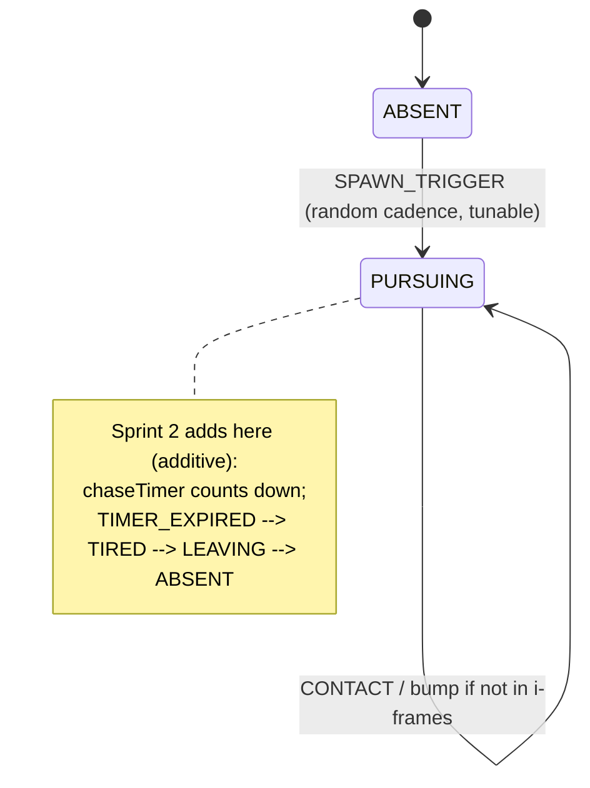

# ADR 0003 — Farmer state machine & game-over flow

Status: Proposed (Sprint 1)
Date: 2026-07-06
Related: `farmer-minimal-bump.md`; ADR 0001 (screen FSM, GameStore), ADR 0002 (`hitCapacity`)
Amended by: ADR 0005 (issue #20) — the "always outrunnable" guarantee (§"Farmer speed") must hold against every tier's *minimum effective* top speed, including gas limp mode, not just its nominal top speed.
Amended by: ADR 0007 (Sprint 2) — realizes the reserved `PURSUING → TIRED → LEAVING → ABSENT` extension and the dynamic "1/3 of the truck's *instantaneous* speed" cap; the flat `FARMER_SPEED` constant is retired from the pursuit path and the "always outrunnable" guarantee becomes structural (`v/3 < v`).

## Context

Sprint 1 ships the minimal farmer: appear → chase → bump, where a bump drains exactly one hit (farmer AC3), the remaining hits are shown in the HUD (AC4), and reaching 0 hits triggers a **hard game over** back to the builder with coins reset (AC6) — the one deliberate fail state in the game. Sprint 2 adds a ~10s chase timer, a 1/3-of-truck-speed cap, and a "tired"/give-up disengage (backlog #15). The state machine must make those additive, not a rewrite (farmer constraint: keep Sprint 1 simple so Sprint 2 isn't rework-heavy). One open item — a contact cooldown so a single unlucky brush doesn't drain several hits — needs deciding now that hits are a hard resource (farmer Open Q1).

## Decision

Model the farmer as an explicit finite state machine in `core/farmer` — a pure reducer `farmerReduce(state, event, dt) → state` — with a `FarmerState` enum and a transition table. Sprint 1 implements a subset of the states; Sprint 2 adds states and one timer field without touching the Sprint 1 transitions.

**Sprint 1 states:** `ABSENT` (default; a spawn timer runs) → `PURSUING` (move toward the player's current position, AC2) → on sensor contact, apply a bump and stay pursuing.

Bump handling is not its own state — it's an **effect** on `CONTACT`: if the truck is not in an invulnerability window, decrement `hitsRemaining` by 1 and start the window; otherwise ignore. Keeping it an effect (not a `BUMPING` state) is what lets Sprint 2 slot its timer/tired states in without disturbing the contact logic.

**Contact cooldown (resolves Open Q1):** on a successful bump, start a short **invulnerability window** on the truck (recommend ~1.0 s, tunable config) during which further farmer contacts do not drain hits. This lives as a `bumpCooldown` timer on the truck's hit state, checked in the collision-resolution step. Rationale: with hits now a hard game-over resource, draining several at once from one contact would feel unfair to a child (AC's fairness intent). Recommended default, flagged for confirmation — but the mechanism is needed regardless of the exact value.

**Hit accounting & game-over (AC3/AC6).** The bump effect decrements `hitsRemaining` in the `GameStore`. When it reaches 0, the store raises game-over, and the **screen FSM** (ADR 0001) transitions `DRIVING → GAME_OVER → BUILDER`, resetting coins to 0 and clearing run state. Hit accounting is a pure `core` concern (unit-testable: N bumps on a Tier-K body ⇒ game over on hit `3+K`); the screen transition and the friendly game-over presentation (AC7) are the wiring/UI layers.

**Farmer speed (Sprint 1).** The 1/3-of-truck-speed cap is a Sprint 2 item (farmer non-goals). For Sprint 1 the farmer moves toward the player at a **constant tunable speed set safely below the lowest engine tier's top speed**, so a driving child can always outrun it (preserves the forgiving bias and keeps the bump mechanic fair). Movement toward the player is a simple steering vector in a system; the FSM owns *state*, not the kinematics. **(Amended by ADR 0005, issue #20:** "below the lowest engine tier's top speed" was too weak — ADR 0004's gas limp mode drops the truck's *effective* top speed below the farmer's constant speed on every tier. The guarantee now reads: the farmer stays below every tier's **minimum effective** top speed, including limp mode, enforced by a `GAS_LIMP_MIN_SPEED` floor in `core/gas` and a cross-system test.**)** **(Further amended by ADR 0007, Sprint 2:** the constant farmer speed is replaced by the dynamic "1/3 of the truck's *instantaneous* velocity" rule; because the farmer then scales with the truck's actual speed, the guarantee holds by construction and ADR 0005's floor is retired.**)**

**HUD hit display (AC4/AC5).** `hitsRemaining` / `hitCapacity` renders as a simple icon row in the DOM HUD (no numbers required for a child). A bump triggers a distinct "something happened to me" feedback — a truck shake/flash — clearly different from the reward feel of an animal boop (AC5), and never scary/violent.

### Sprint 2 extension (documented, not built)

Add `chaseTimer: number` to the farmer state, and states `TIRED`/`LEAVING`. New transitions: `PURSUING --TIMER_EXPIRED--> TIRED --> LEAVING --> ABSENT`, and the 1/3-speed cap becomes a function of the truck's *current* speed. The Sprint 1 `ABSENT`/`PURSUING`/contact logic is unchanged — this is the whole point of choosing an explicit FSM over ad-hoc booleans. (Per ADR 0005: this dynamic cap is also the proper long-term resolution of issue #20 — when the farmer slows *with* the truck, the `GAS_LIMP_MIN_SPEED` floor can be relaxed back toward the 0.25 factor and limp-mode tier differentiation returns.) **(Realized by ADR 0007 — which adopts the truck's *instantaneous* velocity as "current speed" plus a small creep floor, and does retire the `GAS_LIMP_MIN_SPEED` floor.)**

## Alternatives considered

- **Ad-hoc booleans (`farmerActive`, `farmerBumping`).** Rejected: Sprint 2's timer/tired states would force a messy rewrite of exactly the code Sprint 1 wrote — the opposite of the "keep it simple so it isn't rework-heavy" constraint.
- **A `BUMPING` state instead of a contact effect.** Rejected: adds a transient state with no behavior of its own and complicates where Sprint 2's timer lives; an i-frame timer on the truck is simpler and directly answers Open Q1.
- **Handle game-over inside the farmer system.** Rejected: game-over is a *screen/run* concern; the farmer only decrements hits and the screen FSM owns the transition — keeps the fail state in one place (ADR 0001) rather than smeared across systems.

## Consequences

- Sprint 2 farmer work is genuinely additive (new states + one timer), which is the primary goal here; the cost is a touch more structure than a boolean now.
- The i-frame cooldown adds one timer to the truck's hit state — small, and it makes the hard fail state feel fair.
- Game-over lives solely in the screen FSM + GameStore, so the hard-fail precedent stays contained and doesn't leak into gas/boop/obstacle systems (farmer constraint).

## Risks

- **Farmer feels unfair/inescapable** (no give-up until Sprint 2, so he pursues until game over). Detected in playtest with the child. Mitigation: farmer speed default well below truck speed (always outrunnable) + the i-frame cooldown; if it's still too harsh, spawn cadence is a tunable knob and pulling backlog #15 (give-up) forward is an option.
- **Cooldown value mistuned** (too long ⇒ farmer feels toothless; too short ⇒ multi-drain feels unfair). Detected in playtest. Mitigation: single config constant.
- **Speed-cap tension with CLAUDE.md** — the intent doc states a general 1/3 cap while the requirements defer it to Sprint 2. Resolved here by shipping a constant sub-truck speed in Sprint 1 and adopting the dynamic 1/3 cap in Sprint 2; called out so it's a conscious choice, not an inconsistency to trip over later.
- **Fairness guarantee vs. gas limp mode** (issue #20, resolved by ADR 0005). The original "below the lowest *nominal* top speed" guarantee did not account for ADR 0004's limp mode, which drops effective top speed to 1.5–3.0 (all below `FARMER_SPEED = 4`), making the farmer un-outrunnable when the tank is empty. Fixed by a `GAS_LIMP_MIN_SPEED` floor and a test asserting `FARMER_SPEED < limpTopSpeed(tier)` for every tier.
