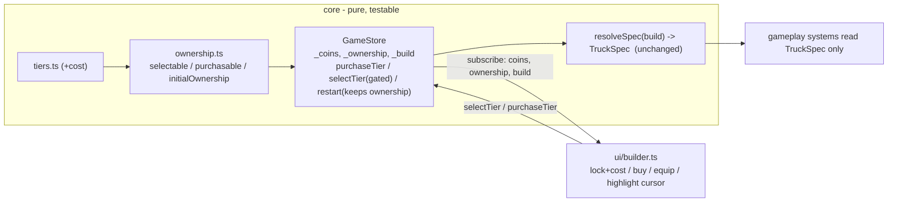

# ADR 0006 — Coin-spend & tier-unlock flow

Status: Proposed (Sprint 2)
Date: 2026-07-08
Related: `truck-builder-and-upgrades.md` (backlog #14); ADR 0002 (tier data model, which pre-designed the ownership wrapper), ADR 0001 (`GameStore`, screen FSM), `animal-chase-and-coins.md` (coin scale)
Realizes: ADR 0002 §"Sprint 2 readiness"

## Context

Sprint 1 shipped all four builder axes (body/wheels/engine/gas-tank) as freely-selectable tiers with a visible, non-gating coin counter (builder AC6/AC7). Sprint 2 adds the actual progression mechanic (backlog #14): spend accumulated coins to permanently **unlock** a higher tier in one category, then equip it. ADR 0002 deliberately shaped the tier data so this is **additive** — it anticipated an `Ownership` wrapper, a `selectable` predicate, and a coin-spend action, with the tier tables, `resolveSpec`, and every gameplay consumer untouched. This ADR confirms that shape still holds and fills in the three things ADR 0002 left open: the **cost per tier**, the **unlock rule**, and whether unlocks **persist across a hard game-over**. It also specifies the `GameStore` and `builder.ts` integration.

Two decisions here are game-feel calls the human owns; both were put to the requirements-analyst, whose recommendations are adopted below and flagged for human confirmation (see Open questions).

## Decision

### 1. Ownership is the additive wrapper ADR 0002 predicted

```ts
// core/stats/ownership.ts (new; pure, unit-testable)
type Axis = keyof TruckBuild;                    // 'body' | 'wheels' | 'engine' | 'gasTank'
type Ownership = { body: number[]; wheels: number[]; engine: number[]; gasTank: number[] }; // owned tier indices

const initialOwnership: Ownership = { body: [0], wheels: [0], engine: [0], gasTank: [0] }; // tier 0 free on every axis

const owned      = (o: Ownership, a: Axis, tier: number) => o[a].includes(tier);
const selectable = (o: Ownership, a: Axis, tier: number) => owned(o, a, tier);           // may equip only what you own
const purchasable = (o: Ownership, a: Axis, tier: number, coins: number, cost: number) =>
  !owned(o, a, tier) && owned(o, a, tier - 1) && coins >= cost;                           // sequential unlock
```

The tier tables and `resolveSpec(build)` from ADR 0002 are **unchanged**. Ownership layers on top; every gameplay system still reads only the resolved `TruckSpec`.

### 2. Cost per tier lives as data on the tier tables (tunable, in `core/stats`)

Add a `cost` field to each tier definition in `tiers.ts` (tier 0 = 0). Values are placeholders pending playtest, scaled to the Sprint 1 coin economy (a boop awards `5 × sizeMult(1–3) × speedMult(1–3)` = **5–45 coins**, `animal-chase-and-coins.md`/`coin-formula.ts`; a typical boop ≈ 15–20). A tier-1 unlock should cost ~3–4 boops; tier-2 roughly double:

| Axis | Tier 0 | Tier 1 | Tier 2 |
|---|---|---|---|
| Body | 0 | 40 | 90 |
| Wheels | 0 | 50 | 120 |
| Engine | 0 | 60 | 140 |
| Gas tank | 0 | 40 | 90 |

Keeping cost on the tier row (not a parallel table) means all balance for an axis stays in one place, consistent with ADR 0002's "tuning confined to `core/stats`."

### 3. Sequential unlock, buy-equips

You may unlock tier `N` in an axis only if you already own tier `N-1` and can afford tier `N`'s cost (`purchasable` above). This is kid-legible ("buy the next one up"), matches the ordered tiers, and prevents skip-buying the top tier. A successful purchase **deducts the cost, adds the tier to ownership, and auto-equips it** (sets that axis in `build`) — one action, immediate payoff, which suits a young child.

### 4. Unlocks persist across a hard game-over; coins do not (recommended, human-confirm)

On the hard game-over → builder round trip, `restart()` keeps `ownership` and resets `coins` to 0 (and keeps the `build` selection, which stays valid because you can only select owned tiers). Progression survives a game-over; the run's coin balance and current run do not. Rationale: the game-over's stakes are already "lose your truck and your coin balance" (`farmer-minimal-bump.md` AC6); wiping unlocks too would force a young child to re-grind coins to re-unlock the same tiers, compounding the game's *one* deliberate harsh exception into a second, larger punishment the forgiving bias doesn't authorize. `farmer-minimal-bump.md` AC6's "no persisted upgrade state" was explicitly scoped to Sprint 1's *null* case (no unlocks existed), not a forward decision. Flagged for human confirmation (Open Q1).

### 5. GameStore & builder integration

```ts
// GameStore additions (core/game-state.ts)
private _ownership: Ownership = { body: [0], wheels: [0], engine: [0], gasTank: [0] };
get ownership(): Ownership { return this._ownership; }

selectTier(axis, tier) {            // NOW GATED: only equip owned tiers (builder AC1)
  if (!selectable(this._ownership, axis, tier)) return;
  this._build = { ...this._build, [axis]: tier }; this.emit();
}
purchaseTier(axis, tier): boolean { // spend coins to unlock (backlog #14)
  const cost = tierCost(axis, tier);
  if (!purchasable(this._ownership, axis, tier, this._coins, cost)) return false;
  this._coins -= cost;
  this._ownership = { ...this._ownership, [axis]: [...this._ownership[axis], tier] };
  this._build = { ...this._build, [axis]: tier };   // buy-equips
  this.emit(); return true;
}
restart() { this._screen = nextScreen(this._screen, 'restart'); this._coins = 0; /* ownership & build KEPT */ this.emit(); }
```

`DEFAULT_TRUCK_BUILD` changes to **all zeros** — the first-run truck is all-base, so upgrades must be earned (the point of the progression). Selection/purchase logic stays entirely in `core/` (`GameStore` + the pure `ownership.ts` predicates); `builder.ts` only renders and forwards input, matching ADR 0001 §3.

`builder.ts` (DOM overlay) gains three visual states per tier button — **equipped**, **owned-not-equipped**, **locked** (shows a lock + its coin cost) — plus a **buy** affordance on the next purchasable tier. Recommended keyboard model (extends the existing arrow-key builder, builder keyboard constraint): Up/Down move rows; Left/Right move a *highlight cursor* across a row's tiers (owned or locked); Space acts on the highlighted tier — equip if owned, buy if locked-and-affordable, gentle "not enough coins" no-op otherwise; the existing "Confirm — start driving!" button stays the distinct start control. The current coin balance is shown in the builder (it already renders in the HUD) so affordability is visible.

## Alternatives considered

- **Free-tier-jump unlock (buy any tier directly, skipping lower ones).** Rejected: less legible for a child and lets a lucky coin haul skip straight to Turbo; sequential unlock reads as a clear ladder.
- **Reset unlocks on game-over.** Rejected (see §4): re-grinding the same tiers after every game-over is tedious and at odds with the forgiving bias; coin-reset already supplies the game-over cost.
- **Purchase but don't auto-equip (separate buy then select).** Rejected: two steps for a child where one suffices; buying the part you want and immediately having it is the intuitive outcome.
- **Cost in a separate purchase-config module rather than on the tier row.** Rejected: splits an axis's balance across two files; ADR 0002 already centralizes axis tuning in the tier tables.

## Consequences

- Purely additive over ADR 0002, exactly as that ADR intended: tier tables (plus one `cost` field), `resolveSpec`, and every gameplay consumer are unchanged; only `Ownership`, the predicates, `purchaseTier`, and the `selectTier` gate are new.
- The builder gains real UI complexity (three tier states + a buy action + a highlight cursor), contained to `builder.ts`; the *logic* stays pure and unit-testable in `core/`.
- First-run trucks are now all-base (default build → zeros), so the very first drive is deliberately weak — intended, but a behavior change from Sprint 1's pre-seeded tier-1 defaults; worth a note for the acceptance pass.
- Progression that survives game-over makes the hard fail state feel less punishing (a design choice, §4), at the cost of the "start fully over" flavor CLAUDE.md's game-over text evokes — the accepted trade-off, pending human confirm.

## Component / data design



Data-model changes: `tiers.ts` gains `cost` per tier; new `core/stats/ownership.ts` (`Ownership` type + pure predicates + `initialOwnership`); `GameStore` gains `_ownership` + `purchaseTier`, gates `selectTier`, and stops clearing progression in `restart()`; `DEFAULT_TRUCK_BUILD` → all zeros. No persistence layer (no `localStorage`) — ownership lives only in the in-memory `GameStore` for the session, consistent with ADR 0001 §6 (save-game is out of v1 scope), so unlocks persist across a game-over **within a session** but not across a page reload.

## Open questions (human confirmation)

1. **Unlock persistence across game-over** (§4) — recommended: persist unlocks, reset coins. Confirm this matches the intended game-over stakes, or choose reset if game-over should wipe progression too. This is the more consequential of the two feel calls.
2. **Cost values** (§2) — placeholder table scaled to the coin economy; tune in playtest. Not architecture-blocking (data only).
3. **Session-only persistence** — unlocks survive a game-over but not a page reload (no `localStorage`, per ADR 0001). Confirm that's acceptable for Sprint 2, or file a follow-up for persisted saves (currently out of v1 scope).

## Risks

- **Costs mistuned** (too cheap ⇒ trivial; too dear ⇒ a child never affords an upgrade in a short session). Detected in playtest. Mitigation: single data table in `core/stats`.
- **Builder keyboard model confuses a child** (equip vs. buy on the same Space key). Detected in playtest. Mitigation: distinct visuals per tier state and a clear "not enough coins" beat; the mapping is confined to `builder.ts` and easily revised.
- **First-run all-base truck feels frustrating** before any coins are earned. Detected in playtest. Mitigation: costs tuned so the first tier-1 unlock lands within an early session; the farmer stays outrunnable regardless (ADR 0007).
- **`selectTier` gate vs. a stale `build`** — if a future change lets `build` hold an unowned tier, the truck could resolve an unearned spec. Mitigation: the gate lives in one place (`GameStore.selectTier`), and `initialOwnership`/default build are aligned to tier 0; a unit test asserts `build`'s tiers are always owned.
