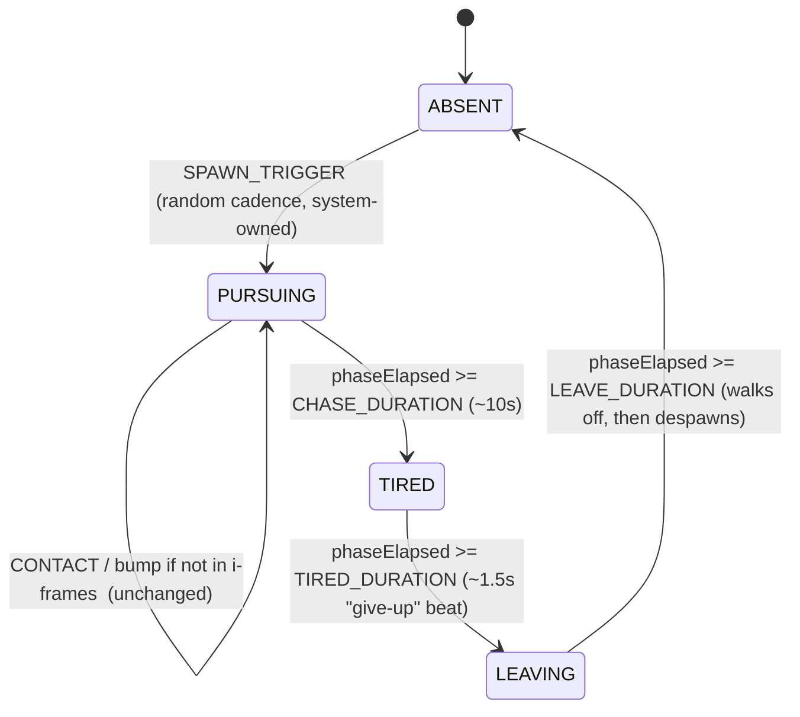

# ADR 0007 — Farmer full chase: chase timer, "tired" give-up, and dynamic 1/3-speed

Status: Proposed (Sprint 2)
Date: 2026-07-08
Revised: 2026-07-08 — §2/§3 updated after human review: `FARMER_CREEP_FLOOR` raised from a near-zero 0.4 to a deliberate **1.0 units/s** ("keep a real minimum speed when stopped"), the stopped-truck reachability invariant reframed accordingly, and Open Q1/Q2 marked resolved. See the "Revision — creep floor" note in §2.
Related: `farmer-minimal-bump.md` (backlog #15); ADR 0003 (farmer FSM, which pre-designed this extension), ADR 0004 (gas limp mode), ADR 0005 (limp-fairness stopgap)
Amends: ADR 0003 §"Farmer speed" / §"Sprint 2 extension", ADR 0005 §"Decision" (its stopgap is now superseded, as ADR 0005 itself anticipated)

Addendum pointer (2026-07-11, ADR 0018 — shared-tunable cross-check, farmer contact geometry): ADR 0018 (bigger truck, issue #52) scales `TRUCK_CONTACT_RADIUS` by a global `TRUCK_SCALE`. Since `isFarmerContact` triggers at `truckRadius + FARMER_CONTACT_RADIUS`, a bigger truck makes farmer bumps connect from slightly further out. Checked explicitly (Sprint-1-retro discipline): this does **not** weaken this ADR's guarantee, which is a *speed* guarantee (`farmerSpeed(v) = max(|v|/3, FARMER_CREEP_FLOOR)`, always outrunnable) independent of contact radius — a wider radius only matters once the farmer is already adjacent. The bounded effect (bumps land marginally easier) is handled as in-scope AC4 re-tuning in ADR 0018 §2: trim `FARMER_CONTACT_RADIUS` to hold the pre-change effective reach if a fairness playtest finds bumps cheap. No change to this ADR's decision.

## Context

Sprint 1 shipped the minimal farmer (`farmer-minimal-bump.md`): `ABSENT → PURSUING`, chase at a flat `FARMER_SPEED = 4`, bump-on-contact (as an effect, with a ~1s i-frame). ADR 0003 deliberately built the FSM so Sprint 2 could add, additively: a **~10s chase timer**, a **"tired" give-up**, and the **"farmer speed = 1/3 of the truck's current speed"** rule from CLAUDE.md (backlog #15). Two things must be resolved with care:

1. **What "1/3 of the truck's current speed" references** — the truck's *instantaneous velocity*, or its *top-speed capability*. These produce materially different feels (can the farmer catch a stopped truck?), and this is the exact class of interaction ADR 0005 had to retrofit once. Put to the requirements-analyst; recommendation adopted below.
2. **The gas limp-mode interaction** (ADR 0004/0005). ADR 0005 added a `GAS_LIMP_MIN_SPEED = 5` floor as a *stopgap* because a constant `FARMER_SPEED = 4` could out-pace a limping truck (effective top speed as low as 1.5–3.0), violating ADR 0003's "always outrunnable" guarantee. ADR 0005 explicitly said its floor is retired once this story's dynamic farmer speed lands. This ADR makes that so.

## Decision

### 1. FSM extension — the states ADR 0003 reserved, plus one timer

`ABSENT → PURSUING → TIRED → LEAVING → ABSENT`. Sprint 1's `ABSENT`/`PURSUING` transitions and the contact-as-effect bump logic are **unchanged**; we add three states-worth of transitions and timers. Because CHASE/TIRED/LEAVE durations are *fixed config* (unlike the random spawn delay), the reducer owns these transitions directly on `TICK` — mirroring how `spawnElapsed` accumulates, but here the reducer also fires the threshold transition (the spawn trigger stays system-owned because its delay is random per cycle).

```ts
type FarmerStateKind = 'ABSENT' | 'PURSUING' | 'TIRED' | 'LEAVING';
interface FarmerState {
  kind: FarmerStateKind;
  position: Vec2;
  spawnElapsed: number;   // ABSENT (existing)
  phaseElapsed: number;   // NEW: time in the current PURSUING/TIRED/LEAVING phase
}
```



- **PURSUING**: steer toward the truck at the dynamic speed (§2). The 10s timer runs from PURSUING entry and is **not** reset by a bump — a determined chase lasts at most ~10s regardless of contacts, which caps how much a single encounter can hurt (fairness).
- **TIRED**: pursuit stops; plays a friendly "tired" beat (farmer halts, wipes brow — kid-appropriate, `farmer-minimal-bump.md` AC7 tone). Brief fixed duration.
- **LEAVING**: farmer moves *away* from the truck (retreat kinematics, system-owned, symmetric to pursue) and despawns on `LEAVE_DURATION`, returning to `ABSENT` where the random spawn timer restarts — so the farmer reappears later. Give-up is **timer-based only** (`farmer-minimal-bump.md` / backlog #15: "chase for ~10s then give up"); no "get far enough away" distance condition is required.

New config constants (`core/farmer/config.ts`, tunable): `FARMER_CHASE_DURATION ≈ 10`, `FARMER_TIRED_DURATION ≈ 1.5`, `FARMER_LEAVE_DURATION ≈ 3`.

### 2. Dynamic speed = truck's *instantaneous* velocity ÷ 3, with a real minimum creep floor

Interpretation adopted (requirements-analyst recommendation; human-confirmed — see Open Q1, resolved):

```ts
farmerSpeed = max(abs(truckVelocity) / 3, FARMER_CREEP_FLOOR)   // FARMER_CREEP_FLOOR = 1.0 units/s
```

`truckVelocity` is the truck's **instantaneous** signed speed — the same `drivingSystem.speed` value the gas system already reads each frame (`gas-system.ts`). The farmer system receives it as a new argument; the FSM still "owns state, not kinematics" (ADR 0003), so this feeds the `stepTowards` step, not the reducer.

Why instantaneous velocity (not top-speed capability):

- **Driving away from the farmer always works.** A truck moving at `v` is chased at `v/3 < v`, so a child holding throttle always increases the gap — no tuned constant to keep below top speed. The guarantee holds by construction for every `v > FARMER_CREEP_FLOOR`.
- **Stopping is no longer a fixed-speed run-down, but it is no longer free either.** If the child stops, the farmer settles to a steady `FARMER_CREEP_FLOOR` creep rather than closing at a fixed 4 units/s. This still keeps the *game-over* fail state reserved for careless contact (a bump only lands via the contact check, respects the 1s i-frame, and only ends the run once hit capacity is exhausted) — but see the Revision note below: a fully stopped truck now faces genuine, deliberate pressure rather than being effectively immune.

#### Revision — creep floor raised to a "real minimum speed" (human review)

The original draft set `FARMER_CREEP_FLOOR ≈ 0.4` and made the creep so slow that a stopped-at-distance truck was structurally uncatchable (`0.4 × 10 = 4 < 8`). Human review rejected that as "basically safe" and asked to **keep a real minimum speed when stopped**, so a fully stopped truck still faces genuine pressure. This is a tuning-direction call the human owns; the value below realizes it and re-derives every dependent fairness check.

**Chosen value: `FARMER_CREEP_FLOOR = 1.0 units/s`** (2.5× the old 0.4 — a visibly determined creep, not a near-freeze). Two fairness checks bound it:

**Check A — "always outrunnable while actually driving" (the guarantee that must hold).** The binding ceiling is *not* the 6–12 normal top speeds; it is the **slowest speed a truck can ever sustain while flooring throttle**, which is limp mode on the lowest engine tier: `limpTopSpeed(6) = 6 × 0.25 = 1.5` (§3). So the load-bearing constraint is:

```
FARMER_CREEP_FLOOR < limpTopSpeed(lowestEngineTier)
        1.0        <              1.5                 ✓  (0.5 margin)
```

At that worst case the farmer, chasing a truck moving at `v = 1.5`, runs at `max(1.5/3, 1.0) = max(0.5, 1.0) = 1.0 < 1.5` — the truck still pulls away. Every faster driving speed has more margin, and `farmerSpeed(v) = v/3 < v` structurally for all `v ≥ 3 × FARMER_CREEP_FLOOR = 3.0`. So "always outrunnable while actually driving" holds on every tier, including the slowest possible limp.

**Check B — "a fully stopped truck faces genuine pressure" (the invariant the human deliberately inverted).** The old design required `FARMER_CREEP_FLOOR × FARMER_CHASE_DURATION < FARMER_MIN_SPAWN_DISTANCE` so a parked truck could *never* be reached. With the higher floor that product no longer holds, **by design**:

```
FARMER_CREEP_FLOOR × FARMER_CHASE_DURATION  vs  FARMER_MIN_SPAWN_DISTANCE
          1.0       ×          10           =  10   >   8
```

Interpretation of the numbers: a farmer that spawns at the **closest** allowed distance (8) and faces a truck that stays completely stopped closes the gap at 1.0 units/s and reaches it at `t = 8s` — inside, but near the end of, the 10s chase window. So a parked truck at close range gets a grace window of roughly 8 seconds and must start driving before then; if it does nothing at all it is reached, delivering a bump (i-frame–gated, one every ~1s for the ~2s remaining) — *not* an instant game-over unless the truck was already at its last hit. At farther spawns the reach time exceeds the chase (e.g. a 10+ unit spawn is never reached while stopped, since `10 × 1.0 = 10`), so pressure scales naturally with how close the farmer appeared. This is exactly the "stopping is no longer basically safe, but game-over still requires contact against exhausted capacity" feel the human asked for.

Because Check B's old strict form is intentionally gone, the **old load-bearing assertion** (`FARMER_CREEP_FLOOR × FARMER_CHASE_DURATION < FARMER_MIN_SPAWN_DISTANCE`) is **removed** and replaced by Check A's assertion (`FARMER_CREEP_FLOOR < limpTopSpeed(lowestEngineTier)`) — see §3 and the component design. The floor stays well below any sustained driving speed, so the only regime where the farmer out-speeds the truck is `v ∈ [0, 1.0)` — the barely-moving / idling window, which is now the intended pressure zone rather than a guaranteed-safe zone.

`FARMER_SPEED = 4` (the Sprint 1 constant) is removed from the pursuit path; `4` happens to equal `topSpeed(12)/3`, so behavior against a full-speed Turbo truck is continuous with Sprint 1.

### 3. Gas limp-mode interaction — resolved transitively, ADR 0005's floor retired

This is the cross-ADR check ADR 0005 exists to force. Because the farmer now reads the truck's **actual velocity**, the limp interaction resolves itself with **no farmer↔gas coupling** — the farmer never imports gas; limp mode simply manifests as a lower truck velocity, which the farmer already scales off:

| Situation | Truck velocity (flooring throttle) | Farmer speed = max(v/3, 1.0) | Outrunnable? |
|---|---|---|---|
| Full tank, Turbo (top 12) | ~12 | 4.0 | yes (4 < 12) |
| Full tank, Standard (top 6) | ~6 | 2.0 | yes |
| **Limp, Standard** (proportional 0.25×6 = **1.5**) | ~1.5 | max(0.5, 1.0) = **1.0** | **yes (1.0 < 1.5, 0.5 margin)** |
| Limp, Turbo (0.25×12 = 3.0) | ~3.0 | max(1.0, 1.0) = 1.0 | yes |
| Truck stopped | 0 | 1.0 (creep) | genuine pressure — reachable at close spawns (§2 Check B) |

The `FARMER_SPEED < limpTopSpeed(tier)` violation that motivated ADR 0005 **cannot occur** anymore: there is no fixed farmer speed to exceed a limp speed. Therefore:

- **`GAS_LIMP_MIN_SPEED` stays retired** (removed, or set to 0) and limp reverts to pure proportional `topSpeed × GAS_LIMP_FACTOR` (0.25) — restoring the engine-tier differentiation in limp mode that ADR 0004 wanted and ADR 0005 had to sacrifice. This is exactly the relaxation ADR 0005 pre-authorized for this milestone. **The higher `FARMER_CREEP_FLOOR = 1.0` does not force the floor back:** at the worst case (Standard limp, `v = 1.5`) the farmer runs at `1.0 < 1.5`, so the limping truck still outruns him — the margin is tighter than the old 0.4 floor gave (0.5 vs 1.0), but it stays positive on every tier, which is all Check A requires.
- **The load-bearing cross-system invariant changes**, and its test with it. Old (ADR 0005): `FARMER_SPEED < limpTopSpeed(tier)` for every tier. New: the farmer, at the creep floor, must still be outrun by a truck flooring throttle even in the *slowest* limp — `FARMER_CREEP_FLOOR < limpTopSpeed(lowestEngineTier)` (`1.0 < 1.5`). Plus a structural test that `farmerSpeed(v) < v` for all `v ≥ 3 × FARMER_CREEP_FLOOR` (= 3.0). These replace the retired constant-vs-limp assertion in `spawn.test.ts`.

One residual edge, deliberately accepted and now *intended* per the human's "real minimum speed" call: when the truck's velocity is below `FARMER_CREEP_FLOOR` (essentially stationary or barely feathering), the farmer is faster than the truck. That is the *only* regime where the farmer out-speeds the truck, its consequence at close spawns is bounded by Check B above (a grace window, then i-frame–gated bumps, not instant game-over), and it is the intended "idling near the farmer applies pressure" window. Guarded by keeping `FARMER_CREEP_FLOOR` strictly below the slowest sustained driving speed (the `FARMER_CREEP_FLOOR < limpTopSpeed(lowestTier)` assertion, mirroring the existing pattern in `farmer/config.ts`).

## Alternatives considered

- **Interpretation B — 1/3 of the truck's top-speed *capability*.** Rejected: a stopped truck would be closed on at a fixed fraction of top speed and could be bumped repeatedly at a fast, tuned rate from standstill — a second de-facto hard-fail trigger the requirements never authorize, against the forgiving bias. (It would also have re-introduced a farmer↔gas coupling to read effective top speed.) The raised creep floor deliberately moves *toward* B's "stopping isn't free" feel while keeping the run-down speed a slow, bump-gated creep rather than a full-fraction chase.
- **Keeping the near-zero 0.4 creep floor.** Rejected on human review: a farmer that only creeps 4 units in a 10s chase makes a stopped truck effectively immune, reading as "basically safe" — the opposite of the intended pressure. Raised to 1.0.
- **Raising the floor above 1.5 for maximum pressure.** Rejected: it would break Check A (a limping Standard truck flooring throttle could no longer outrun the farmer), re-opening the exact ADR 0005 class of unfairness. `limpTopSpeed(lowestTier) = 1.5` is a hard ceiling on the floor; 1.0 sits below it with margin.
- **Bump resets the 10s timer.** Rejected: lets a farmer who lands one bump renew the chase indefinitely, making the encounter feel un-skippable — the opposite of backlog #15's "give up so encounters feel fair and skippable." A fixed 10s from PURSUING entry caps the encounter.
- **Distance-based give-up (tire only once the truck is N units away).** Rejected: the requirements specify a *timed* give-up; a distance condition can strand the farmer chasing forever if the child circles at mid-range.
- **Keep `GAS_LIMP_MIN_SPEED` as belt-and-braces.** Rejected: with the dynamic speed it protects nothing (no fixed farmer speed exists to exceed limp; even at the 1.0 creep floor the slowest limp of 1.5 still outruns the farmer), and it would keep suppressing the limp-mode tier differentiation ADR 0004 wanted; ADR 0005 explicitly scoped it as a stopgap to remove here. Retiring it also removes a now-misleading invariant.
- **Collapse TIRED and LEAVING into one state.** Considered; kept separate because ADR 0003 named both and they carry distinct behavior — TIRED is a stationary give-up *beat* (feedback, no motion), LEAVING is retreat-and-despawn. The cost is one extra trivial transition.

## Consequences

- Sprint 2 farmer work is genuinely additive, as ADR 0003 intended: two new states, one renamed/added timer field (`phaseElapsed`), and a new speed argument into the pursue step. Sprint 1's `ABSENT`/`PURSUING`/contact code is untouched.
- The "always outrunnable while driving" fairness property is now **structural** (`v/3 < v`) instead of a hand-tuned constant kept below every tier — strictly more robust, and it survives future engine-tier or limp-factor changes without re-checking, as long as the one `FARMER_CREEP_FLOOR < limpTopSpeed(lowestTier)` assertion holds.
- **A parked truck is no longer immune.** Raising the floor to 1.0 intentionally trades away the old "stopping at distance is 100% safe forever" guarantee for the human's "genuine pressure when stopped" feel: at close spawns a fully idle truck is reached near the end of the chase and takes bump(s), though game-over still requires being at exhausted hit capacity. This is a deliberate feel change from the first draft, not a regression.
- **The limp-mode margin is tighter than the first draft.** A limping Standard truck flooring throttle now outruns the farmer by 0.5 units/s (was 1.0 under the 0.4 floor). Still positive and recoverable (idle briefly to regen out of limp), and it reinforces both mechanics' intent — don't run the tank dry *and* keep moving — but it is a genuinely tenser limp than before; flagged for playtest.
- **ADR 0005's stopgap is fully unwound**: `GAS_LIMP_MIN_SPEED` goes away, limp mode regains engine-tier differentiation (a higher-engine truck limps faster), and the cross-system test flips from a constant-vs-limp check to a floor-vs-limp + structural check. Net: the gas system gets *simpler* (one fewer floor) while being *more* correct.
- The farmer stays gas-ignorant (no gas import) — ADR 0003's decoupling principle is preserved; the limp interaction is handled purely through the truck's velocity value.
- New cost: the pursue path needs the truck's live speed threaded in (one extra argument at the `main.ts` call site, alongside the `drivingSystem.speed` the gas system already consumes there).

## Component / data design

```
main.ts frame loop (per tick):
  effectiveTopSpeed = gasSystem.update(intent, drivingSystem.speed, dt)   // gas: proportional limp, no floor now
  drivingSystem.setTopSpeed(effectiveTopSpeed)
  { position } = drivingSystem.update(intent, dt)
  farmerSystem.update(dt, position, drivingSystem.speed, cbs)             // NEW arg: truck's instantaneous speed

core/farmer/farmer.ts  (reducer):
  TICK in PURSUING/TIRED/LEAVING accumulates phaseElapsed and fires the
  fixed-duration transitions above; ABSENT still only accumulates spawnElapsed.
core/farmer/pursue.ts  (kinematics, unchanged signature-wise):
  stepTowards(farmerPos, truckPos, farmerSpeed, dt)
  where farmerSpeed = max(abs(truckSpeed)/3, FARMER_CREEP_FLOOR)          // FARMER_CREEP_FLOOR = 1.0, computed in farmer-system.ts
  LEAVING reuses stepTowards away from the truck (target = farmerPos + (farmerPos - truckPos)).

core/gas/config.ts:  remove GAS_LIMP_MIN_SPEED (and its assert); limpTopSpeed reverts to topSpeed * GAS_LIMP_FACTOR.
core/gas/gas.ts:     limpTopSpeed(topSpeed) = topSpeed * GAS_LIMP_FACTOR   (drop the max(...) floor)
```

**Developer touch-list (design intent, not code):**
1. `core/farmer/farmer.ts` — add `TIRED`/`LEAVING` to the kind union, `phaseElapsed` to the state, and the three fixed-duration transitions on `TICK`; leave `ABSENT`/`PURSUING`/`SPAWN_TRIGGER` intact.
2. `core/farmer/config.ts` — add `FARMER_CHASE_DURATION`, `FARMER_TIRED_DURATION`, `FARMER_LEAVE_DURATION`, and `FARMER_CREEP_FLOOR = 1.0`; remove `FARMER_SPEED` from the pursuit path (or keep only as the derived-4 comment). **Assertion change:** do *not* re-add the old `FARMER_CREEP_FLOOR * FARMER_CHASE_DURATION < FARMER_MIN_SPAWN_DISTANCE` guard (it is intentionally violated now — `10 > 8`). Instead assert `FARMER_CREEP_FLOOR < Math.min(...ENGINE_TIERS.map(t => t.topSpeed)) * GAS_LIMP_FACTOR` — i.e. below the slowest limp speed — mirroring the assert pattern already in this file. (If a direct `limpTopSpeed` import is preferred over re-deriving `topSpeed*factor`, keep the farmer config gas-import-free by re-deriving from `ENGINE_TIERS` + `GAS_LIMP_FACTOR`, or place the cross-check purely in the test layer as ADR 0005 did — architect's preference: test layer, to preserve the gas-ignorant farmer; a load-time re-derivation in farmer/config is acceptable only if it imports the constant `GAS_LIMP_FACTOR`, not gas runtime state.)
3. `systems/farmer-system.ts` — accept `truckSpeed`, compute `farmerSpeed = max(abs(truckSpeed)/3, FARMER_CREEP_FLOOR)`, drive PURSUING with it; run TIRED (no motion, `onTired` feedback callback) and LEAVING (retreat) phases; on `ABSENT` re-entry, re-roll the spawn delay (`pickSpawnDelay`) so the farmer reappears.
4. `main.ts` — pass `drivingSystem.speed` into `farmerSystem.update`; add a `flashTired`/`onTired` render hook for the give-up beat.
5. `core/gas/config.ts` + `core/gas/gas.ts` — retire `GAS_LIMP_MIN_SPEED`, revert `limpTopSpeed` to proportional.
6. `core/farmer/spawn.test.ts` + `core/gas/gas.test.ts` — replace the `FARMER_SPEED < limpTopSpeed(tier)` assertion with `FARMER_CREEP_FLOOR < limpTopSpeed(lowestTier)` (`1.0 < 1.5`) and a structural `farmerSpeed(v) < v` test (for `v ≥ 3 × FARMER_CREEP_FLOOR`); add a Check-B documentation test asserting the *intended* reachability (`FARMER_CREEP_FLOOR * FARMER_CHASE_DURATION >= FARMER_MIN_SPAWN_DISTANCE`, i.e. a stopped truck at min spawn distance is reachable within the chase — pins the deliberate design so no one "fixes" it back); update the gas limp tests to assert proportional (floor-free) limp with restored per-tier differentiation.

Render/feedback (`farmer-minimal-bump.md` AC7 tone): TIRED shows a friendly "tired" beat, LEAVING an amble-away — no scary framing.

## Open questions (human confirmation)

1. **RESOLVED** — "1/3 of current speed" = instantaneous velocity (§2), and `FARMER_CREEP_FLOOR = 1.0` ("keep a real minimum speed when stopped"). Human review confirmed the intended feel is "keep-moving-to-escape, and a fully stopped truck faces genuine pressure (not immunity) — game-over still requires contact against exhausted hit capacity." Reachability of a parked truck at close spawns is now intended (Check B). Durations remain playtest-tunable (Q3).
2. **RESOLVED** — Retiring `GAS_LIMP_MIN_SPEED` (§3). Follows from Q1: with instantaneous-velocity scaling and the 1.0 creep floor, the slowest limp (1.5) still outruns the farmer (1.0), so the gas floor protects nothing and stays retired; limp regains per-tier differentiation. (If the human ever reverses Q1 to Interpretation B, this must be revisited — but Q1 is confirmed.)
3. **Chase/tired/leave durations** (§1) — placeholders (~10 / 1.5 / 3 s); tune in playtest. Not architecture-blocking. Note the coupling: `FARMER_CHASE_DURATION` and `FARMER_CREEP_FLOOR` together set how much of the chase a parked-at-min-distance truck survives (Check B); retuning either shifts the stopped-truck grace window.
   - **Addendum (2026-07-10, ADR 0015):** a *second* coupling now hangs off `FARMER_TIRED_DURATION`. The Sprint-5 farmer art (ADR 0015) plays a distinct `Idle` "give-up" pose *only* for the length of the TIRED state (minus a ~0.25 s animation crossfade), and vehicle-art AC8 requires that pose to be visually distinguishable from PURSUING/LEAVING. Retuning `FARMER_TIRED_DURATION` down toward the crossfade time (roughly below ~1 s) makes the TIRED pose stop registering as its own beat — the AC8 guarantee silently fails even though the chase *feel* is unchanged. So this duration is no longer a pure feel knob: any retune must re-check farmer pose readability, not just chase fairness. See ADR 0015 §Risks.

## Risks

- **Interpretation A confirmed-then-regretted in playtest** (farmer feels toothless because a competent child just never stops near him). Detected in playtest with the child. Mitigation: spawn cadence, creep floor (now 1.0), and chase duration are all config knobs; escalating the farmer means raising the floor further toward Interpretation B — but note the hard ceiling `FARMER_CREEP_FLOOR < limpTopSpeed(lowestTier) = 1.5`, above which Check A breaks.
- **Creep floor mistuned upward past the limp speed**, letting a limping truck be caught even while flooring throttle (re-creating the ADR 0005 unfairness). Detected by the `FARMER_CREEP_FLOOR < limpTopSpeed(lowestTier)` assertion failing at load, and in playtest. Mitigation: that assertion is the guard; 1.0 sits 0.5 below the 1.5 ceiling.
- **Stopped-truck pressure feels too harsh for a young child** (parked at close spawn, gets bumped before they react). Detected in playtest. Mitigation: the grace window is `FARMER_MIN_SPAWN_DISTANCE / FARMER_CREEP_FLOOR ≈ 8s` at the worst (closest) spawn; lower `FARMER_CREEP_FLOOR` (toward but above the old 0.4) or raise `FARMER_MIN_SPAWN_DISTANCE` to soften it — both single constants.
- **Someone later re-adds a fixed farmer speed** (or a limp floor) without re-checking the pair, re-opening the ADR 0005 class of bug. Mitigation: the structural `farmerSpeed(v) < v` test plus the `FARMER_CREEP_FLOOR < limpTopSpeed(lowestTier)` test fail in CI, exactly as ADR 0005's test was meant to.
- **The 10s no-reset-on-bump timer feels off** (either too long/scary, or a child wants the farmer gone faster). Detected in playtest. Mitigation: `FARMER_CHASE_DURATION` is one constant (but see Q3 — it now also affects the stopped-truck grace window).
