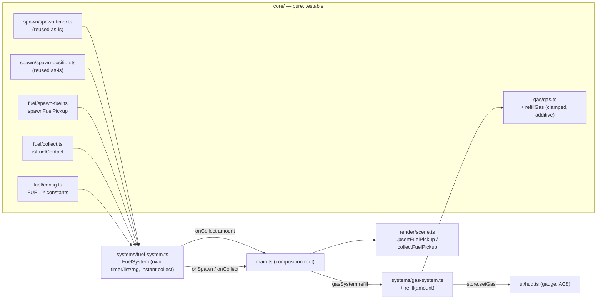

# ADR 0008 — Fuel pickups (independent spawn system + gas refill on drive-over)

Status: Proposed (Sprint 2)
Date: 2026-07-08
Related: `fuel-pickups.md` (backlog #17); ADR 0004 (gas system & limp mode), ADR 0007 (farmer dynamic speed — cross-checked here), `animal-chase-and-coins.md` (spawn + boop pattern this mirrors), ADR 0001 (`core/` purity + systems/render boundary)
Reuses: `core/spawn/spawn-timer.ts`, `core/spawn/spawn-position.ts` (both already generic — see §1)

## Context

`fuel-pickups.md` adds a second on-map pickup: an item the truck drives over to refill gas, giving an *active* alternative to the passive idle-regen the gas system already supports (ADR 0004). The requirements are explicit that it should "closely mirror animal spawning architecture" but run as its **own** parallel system — its own timer, its own `MAX_CONCURRENT_FUEL` cap, independent of `MAX_CONCURRENT_ANIMALS` (AC3). The design question is not *whether* to mirror the animal path but *what is genuinely reusable versus what needs its own module*, given `core/`'s purity boundary and this codebase's existing conventions. Three sub-decisions follow: reuse boundary, how collection writes into the capacity-clamped gas model without altering it (AC9/AC10), and where the bridge system sits alongside `AnimalSystem`. All numeric values (interval, cap, refill amount, radius) are tunable placeholders, consistent with how animal/gas constants were left open.

## Decision

### 1. Reuse the generic spawn machinery; add only the fuel-specific payload

The two hardest parts of the animal spawn path are **already system-agnostic** and take the cap/interval/position rules as parameters — nothing about them is animal-specific despite their comments:

- `core/spawn/spawn-timer.ts` — `updateSpawnTimer(state, dt, activeCount, maxConcurrent, intervalSeconds)`. Fully parameterized on cap and interval; the fuel system passes its own `FUEL_*` constants and holds its own `SpawnTimerState` instance. **Reused as-is, no change.**
- `core/spawn/spawn-position.ts` — `pickSpawnPosition({ bounds, obstacles, truckPosition, minDistanceFromTruck, rng, ... })`. Fully generic (obstacle + truck avoidance, injected RNG, terrain bounds). **Reused as-is, no change** — this is what makes AC1/AC4's "same validity rules as animal spawns" literally true rather than re-implemented.

Only the *payload* differs, so only the payload is new — a small `core/fuel/` module mirroring `core/spawn/spawn-animal.ts` + `core/boop.ts`, kept pure (no three/rapier, per ADR 0001 §4):

```ts
// core/types.ts — new plain-data type (mirrors AnimalState, minus alive/species/scatter)
interface FuelPickupState { id: string; position: Vec2; }

// core/fuel/spawn-fuel.ts — factory, parallels spawn-animal.ts
function spawnFuelPickup(id: string, position: Vec2): FuelPickupState;

// core/fuel/collect.ts — contact test, parallels boop.ts isBoopContact (same circle-overlap geometry, AC5)
function isFuelContact(truckPos: Vec2, truckRadius: number, pickup: FuelPickupState, pickupRadius: number): boolean;
```

Why a parallel `core/fuel/` module rather than widening `core/spawn/` or generalizing `boop.ts`:
- `spawn-animal.ts` is animal-typed (`AnimalSpecies`, `sizeTier`, `speedTier`), and `boop.ts`/`resolveBoop` computes coins and flips `alive` — a fuel pickup has none of that (no coins ever, AC7; instant removal, not scatter, AC13). Overloading either with a fuel branch would drag animal concepts into fuel and vice versa. A parallel factory + contact fn keeps each pickup's rules in one place, exactly as ADR 0002/0004 keep tuning per-concept.
- The genuinely shared code (timer, position) already lives in `core/spawn/` and is imported by both systems, so there is **no duplication of the hard logic** — only two trivial fuel-specific functions are added. This is the "closely mirror, don't fork" balance the requirements ask for.
- Fuel-specific tuning lives in a new `core/fuel/config.ts` (not `core/spawn/config.ts`), keeping the two spawn systems' cadence/cap physically separate per AC3's independence decision, and mirroring how `core/farmer/config.ts` sits apart from `core/spawn/config.ts`.

### 2. Collection refills gas through the gas model's existing capacity clamp — no change to drain/regen/limp

`fuel-pickups.md` AC9/AC10: a collected pickup adds a **flat** amount (not a percentage), **clamped to capacity**, and touches nothing else in the gas system (AC-non-goals: drain/regen/limp unchanged). The gas model already clamps to `[0, capacity]` in `updateGas`; collection reuses the *same* clamp via one new pure function, additive to `core/gas/gas.ts`:

```ts
// core/gas/gas.ts — new pure fn, mirrors the existing Math.min(capacity, ...) clamp in updateGas
export function refillGas(state: GasState, amount: number, capacity: number): GasState {
  return { remaining: Math.min(capacity, state.remaining + amount) };
}
```

`updateGas`, `effectiveTopSpeed`, and `limpTopSpeed` are **untouched** — `refillGas` only ever *raises* `remaining` toward the cap, so a nearly-full tank simply tops off (AC10/AC12: full tank → excess discarded, no penalty, still despawns). Because `GameStore`/`GasSystem` is the single owner of the authoritative `GasState` (the store's `_gas` is a display mirror set via `setGas`), the refill must route through `GasSystem`, not be written to the store directly. `GasSystem` gains one method:

```ts
// systems/gas-system.ts — the only writer of GasState stays the only writer
refill(amount: number): void {
  this.state = refillGas(this.state, amount, this.capacity);
  this.store.setGas(this.state.remaining);   // gauge updates immediately (AC8)
}
```

The gauge update inside `refill` satisfies AC8 (visible increase at the moment of contact) for free, through the same `store.setGas` → HUD subscription the per-frame gas update already uses. No new HUD wiring.

### 3. `FuelSystem` bridge, parallel to `AnimalSystem`, simpler (no scatter)

A new `systems/fuel-system.ts` mirrors `AnimalSystem`'s structure — owns its timer state, its live-pickup list, its id counter, its RNG — but is strictly simpler because collection is **instant** (AC13: no scatter/flee beat; an inanimate item has nothing to flee). So there is no `scatters` map and no multi-frame despawn loop:

```
FuelSystem.update(dt, truckPosition, callbacks):
  1. updateSpawnTimer(timerState, dt, pickups.length, MAX_CONCURRENT_FUEL, FUEL_SPAWN_INTERVAL_SECONDS)
  2. if shouldSpawn: pickSpawnPosition({ TERRAIN_BOUNDS, STUB_OBSTACLES, truckPosition,
                        minDistanceFromTruck: FUEL_MIN_SPAWN_DISTANCE_FROM_TRUCK, rng })
                     -> push spawnFuelPickup(id, pos); callbacks.onSpawn(id, pos)
  3. for each pickup: if isFuelContact(truckPosition, TRUCK_CONTACT_RADIUS, pickup, FUEL_CONTACT_RADIUS):
                        callbacks.onCollect(pickup.id, FUEL_REFILL_AMOUNT)   // routes to gasSystem.refill + glow effect
                        remove pickup immediately (AC13)
```

Wiring at `main.ts` (one more system alongside the existing four), refill routed to the gas system's single owner:

```
const fuelSystem = new FuelSystem(store);
...
fuelSystem.update(dt, position, {
  onSpawn:   (id, pos) => scene.upsertFuelPickup(id, pos),
  onCollect: (id, amount) => { gasSystem.refill(amount); scene.collectFuelPickup(id); },  // glow burst + remove mesh
});
```

Passing `amount` through the callback (rather than `FuelSystem` importing `GasSystem`) keeps `FuelSystem` gas-ignorant in the same spirit ADR 0007 keeps the farmer gas-ignorant — the system reports "a pickup worth N was collected," and `main.ts` wires that to `gasSystem.refill`. This preserves the ADR 0001 layering (`systems/` don't reach into each other; the composition root in `main.ts` connects them).

New config (`core/fuel/config.ts`, all tunable placeholders — fuel Open Q1/Q2):

```ts
export const FUEL_SPAWN_INTERVAL_SECONDS = 12;          // longer than animals' 4 — a secondary mechanic (fuel Open Q1)
export const MAX_CONCURRENT_FUEL = 2;                    // own cap, independent of MAX_CONCURRENT_ANIMALS (AC3)
export const FUEL_MIN_SPAWN_DISTANCE_FROM_TRUCK = 4;     // same "not on top of the player" rule as animals
export const FUEL_REFILL_AMOUNT = 15;                    // flat units (fuel Open Q2): ~75% of Tier-0 tank, ~33% of Tier-2 (AC11)
export const FUEL_CONTACT_RADIUS = 0.5;                  // pickup's own radius for the overlap check (AC5)
```

Render (`render/scene.ts`, art asset is fuel Open Q3 — non-blocking): add `upsertFuelPickup(id, pos)` (a recognizable fuel mesh, e.g. jerry can) and `collectFuelPickup(id)` (brief non-violent glow/sparkle via the existing `tickEffects` path, then remove mesh — AC6b/AC13). No scatter animation.

## Alternatives considered

- **Generalize `boop.ts`/`spawn-animal.ts` to handle both pickups (a `PickupKind` union).** Rejected: fuel and animals share only the *contact geometry* (already a one-line `Math.hypot < r+r`), not the payload (coins + alive + scatter vs. flat gas + instant remove). A shared union would branch on kind in every function and couple two independent mechanics; two tiny parallel modules over shared timer/position code is cleaner and matches the per-concept separation ADR 0002/0004 established.
- **Reuse the animal spawn timer/cap (one shared spawn system emitting both).** Rejected: directly contradicts AC3 — fuel and animals must have independent cadence and caps and not compete for slots. Separate `SpawnTimerState` instances + separate config is the requirement.
- **Write the refill straight to `store.setGas`.** Rejected: the store's `_gas` is a display mirror; the authoritative `GasState` lives in `GasSystem`. Writing the store directly would desync the two (the next `gasSystem.update` would clobber the refill from its own stale `state`). Routing through `gasSystem.refill` keeps a single owner of gas truth.
- **Percentage-of-capacity refill.** Rejected by AC9/AC11 — a flat amount is *intended* to matter more on a small (Tier-0) tank than a big one, giving early-game trucks a reason to seek pickups. A percentage would erase that gradient.
- **Scatter-then-despawn like a boop.** Rejected by AC13 — an inanimate item has nothing to flee; instant removal + a glow is the correct, simpler feedback.

## Consequences

- Purely additive: no change to `core/spawn/*`, `boop.ts`, `updateGas`, `effectiveTopSpeed`, `limpTopSpeed`, `AnimalSystem`, or the farmer. New surface is one type field, two small pure fns (`spawnFuelPickup`, `isFuelContact`), one pure gas fn (`refillGas`), one `GasSystem.refill` method, one `FuelSystem`, one config file, and two render hooks.
- The generic spawn machinery is now proven reusable by a second consumer, which is a mild validation that `core/spawn/spawn-timer|position` were drawn at the right boundary. If a *third* pickup ever appears, the pattern is set.
- Two systems now call `pickSpawnPosition` independently and do **not** deconflict each other's positions (AC3 accepts this; fuel Open Q4 flags cross-overlap avoidance as an optional polish item). A fuel pickup and an animal can rarely spawn visually close; acceptable for Sprint 2, and easy to add later since both already pass an `obstacles`-style avoidance list.
- Slightly more per-frame work (one extra system update), negligible at this scale.
- `FUEL_REFILL_AMOUNT`, interval, and cap are new balance knobs; mistuning them is a playtest concern, not an architecture risk (see Risks).

## Component / data design



Data-model change: one new pure type `FuelPickupState { id, position }` in `core/types.ts`. No persistence, no `GameStore` state added beyond the gas gauge it already tracks — live pickups live in `FuelSystem` (as animals live in `AnimalSystem`), mirroring ADR 0001's in-memory-per-session model.

**Developer touch-list (design intent, not code):**
1. `core/types.ts` — add `FuelPickupState`.
2. `core/fuel/config.ts` — the five `FUEL_*` constants above.
3. `core/fuel/spawn-fuel.ts` — `spawnFuelPickup(id, position)`; `core/fuel/collect.ts` — `isFuelContact(...)` (circle overlap, mirrors `isBoopContact`).
4. `core/gas/gas.ts` — add `refillGas(state, amount, capacity)`; `gas.test.ts` — assert it clamps to capacity and never lowers `remaining`.
5. `systems/gas-system.ts` — add `refill(amount)` (applies `refillGas`, calls `store.setGas`).
6. `systems/fuel-system.ts` — the `FuelSystem` bridge above; import the reused `spawn-timer`/`spawn-position` and the new fuel modules.
7. `main.ts` — instantiate `FuelSystem`, call `fuelSystem.update` in the loop, wire `onCollect` → `gasSystem.refill` + scene effect.
8. `render/scene.ts` — `upsertFuelPickup` / `collectFuelPickup` (mesh + glow, no scatter).
9. Tests: `fuel-system` spawn cadence/cap independence from animals (AC3), contact → refill (AC5/AC9), clamp on full tank (AC10/AC12), never-awards-coins / never-touches-hits (AC7 — assert `store.coins` and hit capacity unchanged on collect).

## Cross-ADR check (per the post–Sprint-1-retro convention)

The requirements doc asserts fuel pickups are independent of the farmer speed floor (ADR 0007) and the gas limp math. **Verified against the concrete mechanics, not assumed** — and the independence is stronger than "they don't touch": it is *monotonic in the safe direction*.

- **vs. ADR 0007 farmer floor / limp math:** `refillGas` only ever *raises* `remaining`. Raising `remaining` above 0 exits limp mode (`effectiveTopSpeed` returns full `topSpeed`), which only ever *increases* the truck's available speed. The farmer scales off the truck's instantaneous velocity (ADR 0007 §2), so a faster-capable truck is *more* outrunnable, never less. Concretely: a limping Standard truck (velocity ~1.5, farmer at the 1.0 creep floor) that collects fuel jumps toward top speed 6, farmer to `max(6/3, 1.0) = 2.0 < 6` — the gap widens. **There is no code path by which collecting fuel reduces truck speed or raises farmer speed**, so it cannot create a new fairness violation; it can only ever relieve one. The revised 1.0 creep floor is untouched and unreferenced by anything fuel adds.
- **vs. the retired `GAS_LIMP_MIN_SPEED`:** `refillGas` changes only `remaining`; `limpTopSpeed` is a pure function of `topSpeed` and is not called by the refill path. Fuel does not reintroduce, need, or interact with any limp floor. If anything, more available fuel makes the tight 0.5-unit limp-vs-farmer margin (ADR 0007 §3) *rarer*, a mild positive.
- **vs. coins / hit capacity / game-over (AC7):** the design routes collection solely to `gasSystem.refill`; it never calls `store.addCoins`, never reads/writes hit capacity, and never touches the farmer/game-over path. Test item 9 pins this.

Conclusion: the requirements doc's independence claim holds by construction. Fuel is a strictly-additive, safe-direction resource input; it needs no change to ADR 0007 and does not reopen the ADR 0005 class of interaction.

## Risks

- **Refill amount / interval / cap mistuned** (fuel trivializes gas management, or is too rare to matter). Detected in playtest. Mitigation: all four are single constants in `core/fuel/config.ts`.
- **Two independent spawners cluster a fuel pickup and an animal near each other** (mild visual overlap). Detected in playtest. Mitigation: fuel Open Q4's optional cross-avoidance — both systems already accept an avoidance list, so passing each other's live positions is a small later change; not required for Sprint 2 (AC3).
- **Refill written to the wrong owner** (store vs. `GasSystem`) reintroduces a gauge/state desync. Mitigation: §2's single-owner rule and a test asserting `remaining` after refill survives the next `gasSystem.update` tick.
- **`FuelPickupState` grows animal concepts over time** (someone adds `alive`/scatter to "reuse" more animal code), eroding the clean split. Mitigation: AC13's instant-collect decision is documented here; keep fuel's removal path a plain filter, not a scatter map.
```
