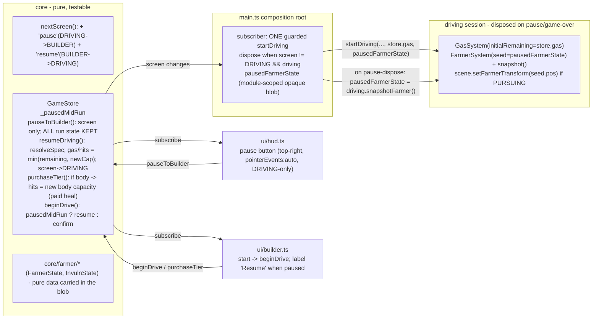

# ADR 0009 — Voluntary pause-to-builder (shop between drives)

Status: Proposed (Sprint 2)
Date: 2026-07-08
Related: ADR 0001 §6 (screen FSM + `GameStore`), ADR 0006 (coin/ownership persistence across game-over), ADR 0008 §2 (gas single-owner rule: `GasSystem` owns `GasState`, store `_gas` is a mirror), ADR 0003 (farmer FSM) and ADR 0007 (farmer chase timer/give-up/dynamic speed — **note: Proposed, NOT yet implemented**, see the sequencing note in §2c); issues #18 (dispose/recreate on a screen round trip) and #21 (re-entrant `startDriving()` recursion crash)
Amends: nothing structurally; adds two FSM transitions and one lifecycle case on top of ADR 0001 §6

## Context

ADR 0006 shipped coin-spend: the player earns coins by booping animals while driving and spends them in the builder to unlock tiers. But the only path from `DRIVING` back to `BUILDER` is the hard game-over (`DRIVING -> GAME_OVER -> BUILDER`), and `restart()` zeroes coins on that trip. So coins earned during a drive can never actually be spent — by the time the player is back in the builder, the balance is 0. The core loop ("earn while driving, spend between drives") has no "between drives" transition; only "die, lose everything, rebuild" exists.

The human, playing the shipped build, confirmed a series of decisions (all now final):
1. The return-to-shop control is an **on-screen clickable button** (a visible HUD element), **button only, no keyboard shortcut**.
2. Coins are **kept** on a voluntary return — coins reset *only* on the farmer's hard game-over, the sole stakes mechanism.
3. Run resources (**gas and hits**) are **PRESERVED** across the pause, not reset to full — "pausing shouldn't dodge a near-death bump."
4. **Buying a body upgrade while paused heals to full** — hits jump to the newly-purchased body's full capacity (a *paid* heal; see §3b).
5. **The farmer keeps chasing across a pause** — his state/position/timers continue on resume, he does not reset to a fresh spawn (see §2c/§3c). This is the big one.

The human explicitly accepted that (3)–(5) put real state-carry logic across the session dispose/recreate boundary — this project's highest-risk surface (issues #18/#21). This ADR is deliberately thorough there.

**Important status note:** ADR 0007 (farmer give-up timer, `TIRED`/`LEAVING` states, `phaseElapsed`, dynamic 1/3-speed) is **Proposed but not yet implemented** — the current farmer is still the Sprint-1 minimal FSM (`ABSENT`/`PURSUING` only, flat `FARMER_SPEED = 4`, no `phaseElapsed`, no give-up). The farmer-continuity design below is built to carry whatever fields the farmer FSM holds *at implementation time*, so it works today and composes with ADR 0007 whenever that lands — but the fuller "resume mid-give-up with the timer continuing" experience only fully exists once ADR 0007 is built. See §2c and the sequencing note.

## Decision

### 1. Two new FSM transitions: `DRIVING -> BUILDER` (`pause`) and `BUILDER -> DRIVING` (`resume`), coins untouched

Add `pause` and `resume` events to `nextScreen`, and two `GameStore` methods (`pauseToBuilder()`, `resumeDriving()`), distinct from `confirmBuild()`/`gameOver()`/`restart()`:

```mermaid
stateDiagram-v2
    [*] --> BUILDER
    BUILDER --> DRIVING: confirm  (fresh build: resolve spec, reseed hits+gas to FULL, fresh farmer)
    DRIVING --> GAME_OVER: gameOver (hits reach 0)
    GAME_OVER --> BUILDER: restart (coins reset to 0, fresh build next, farmer discarded)
    DRIVING --> BUILDER: pause   (coins/gas/hits/ownership/build/FARMER-STATE ALL KEPT)  %% new
    BUILDER --> DRIVING: resume  (resolve spec; PRESERVE gas+hits+farmer, clamped)        %% new
```



`pauseToBuilder()` is deliberately **not** an overload of `gameOver()` (which routes through `restart()`'s coin wipe) — a distinct method keeps "never zero coins voluntarily" a structural guarantee.

### 2. What crosses the dispose/recreate boundary, and where each piece lives during the pause

Pausing **disposes the driving session entirely** (same teardown as game-over); resuming **starts a fresh session**. Three kinds of state must survive the gap, and they live in two different homes:

#### 2a. Hits — store-owned, preserved by omission
`GameStore._hitsRemaining` is already store-owned; only `confirmBuild()` reseeds it. `pauseToBuilder()` doesn't touch it and `resumeDriving()` doesn't reseed it, so hits survive automatically. (The body-purchase heal in §3b is the one thing that *raises* them while paused.)

#### 2b. Gas — store mirror is the carrier
Gas is authoritatively owned by `GasSystem.state.remaining` (ADR 0008 §2), destroyed on dispose. But `GasSystem.update()` mirrors it into `store._gas` every frame, so at pause time the mirror is current to within one frame. Pause stops overwriting it; resume seeds the new `GasSystem` from it. No single-owner violation: ownership transfers with no overlap — `GasSystem(old)` → `store._gas` (during the pause, when no `GasSystem` exists) → `GasSystem(new)` seeded from the mirror.

#### 2c. Farmer FSM state — an OPAQUE snapshot captured actively at pause, held in `main.ts`
The farmer is the genuinely new, harder carry. `FarmerSystem` holds its entire mutable state — `state: FarmerState`, `invuln: InvulnState`, `spawnDelay: number` — as private fields *inside* the driving session, which is destroyed on dispose. Unlike gas, there is no passive per-frame mirror (the farmer has no HUD readout that would justify one), so its state must be **captured actively at pause time, before dispose**.

Design: `FarmerSystem` owns its own resumability, and `main.ts` treats the captured blob as **opaque**:

```ts
// systems/farmer-system.ts
export interface FarmerRunState {          // exactly FarmerSystem's mutable field set
  state: FarmerState;                      // kind + position + spawnElapsed (+ phaseElapsed once ADR 0007 lands)
  invuln: InvulnState;                     // remaining i-frame seconds
  spawnDelay: number;                      // the random delay this ABSENT cycle is counting toward
}
snapshot(): FarmerRunState                 // returns its current { state, invuln, spawnDelay }
constructor(store, rng = Math.random, seed?: FarmerRunState)   // seed reconstitutes all three; else fresh
```

**Why opaque / whole-blob, not enumerated fields:** `FarmerState` is about to grow (`phaseElapsed`, `TIRED`/`LEAVING`) when ADR 0007 is implemented. By having `FarmerSystem.snapshot()` return its complete field set and its constructor accept the same, the carry survives that FSM expansion with **zero change** to `main.ts` or the pause plumbing — `snapshot()` will simply include `phaseElapsed` because `state` will. This is what lets this feature and ADR 0007 land in either order. `main.ts` never inspects the blob; it only ferries it across the dispose/recreate.

**Home during the pause:** a `main.ts` module-scoped `let pausedFarmerState: FarmerRunState | undefined`, **not** a new `GameStore` field. Rationale: the farmer FSM was never store-owned (the store holds run *economy* — coins, gas, hits, ownership, build, screen — not subsystem internals); the snapshot's lifecycle is bound to the session dispose/recreate that `main.ts` already owns (`driving`, `startingDriving` are already module-scoped there); and only `main.ts` can capture it from the disposing session. Keeping `core/farmer` types out of `GameStore` preserves the store's responsibility boundary. (`pausedMidRun`, which the *builder UI* needs, stays in the store; the farmer blob, which only the *lifecycle* needs, stays in `main.ts` — different consumers, different homes, by design.)

**Capture timing** is the one genuinely new ordering requirement. In the `main.ts` subscriber's dispose branch, the snapshot must be taken *before* `driving.dispose()` tears the `FarmerSystem` down, and only on the *pause* exit (not game-over):

```ts
} else if (store.screen !== 'DRIVING' && driving) {
  pausedFarmerState = store.pausedMidRun ? driving.snapshotFarmer() : undefined;  // capture on pause; discard on game-over
  driving.dispose();
  driving = undefined;
}
```

`driving.snapshotFarmer()` reads `FarmerSystem`'s fields, which reflect the last completed frame (current to one frame, same as gas). Because `pauseToBuilder()` sets `pausedMidRun = true` and screen `= BUILDER` before it emits, the branch reliably distinguishes a pause from a game-over. On game-over the blob is cleared so a subsequent fresh build gets a fresh farmer.

### 3. Resume state rules

`resumeDriving()` re-resolves `spec` from the (possibly shopped) `build`, then applies:

#### 3a. Gas: absolute remaining, clamped to new capacity
`_gas = min(_gas, spec.gasCapacity)`. Buying a bigger tank does **not** fill it (you keep your 8 s in a now-30 s tank) — a fresh tank isn't pre-filled.

#### 3b. Hits: absolute remaining, clamped — EXCEPT a body purchase heals to full (human decision 4)
Default carry is `_hitsRemaining = min(_hitsRemaining, spec.hitCapacity)` (preserve; no free heal). The one exception: **buying a body upgrade sets hits to that body's full capacity.** This lives in `purchaseTier`, not `resumeDriving`:

```ts
// GameStore.purchaseTier(axis, tierIndex): after ownership/build update, on success:
if (axis === 'body') this._hitsRemaining = resolveSpec(this._build).hitCapacity;   // paid heal to the new body's full
```

- **Why in `purchaseTier` and unconditional (no `pausedMidRun` check):** `purchaseTier` is only reachable from the builder screen, which is either a fresh build (pre-first-drive / post-game-over) or a pause. On a fresh build the heal is a harmless no-op-in-effect — `confirmBuild()` reseeds hits to `spec.hitCapacity` on confirm anyway, so setting them early changes nothing observable (the HUD hides hits while `screen === 'BUILDER'`). On a pause it is the desired heal. So it needs no conditional — it is correct in both contexts. **This answers the coordinator's Q: yes it "applies" before the first drive too, but is only *observable* on the resume path.**
- **Why heal-on-*purchase* only, not on equipping an already-owned body:** the heal is deliberately tied to spending coins. Re-equipping a body you already own (via `selectTier`) does **not** heal — otherwise a player owning a higher body tier could pause at 1 hit, toggle bodies, and resume full for free, reopening the exact "pause to dodge a near-death bump" the human is preventing. Paying for a brand-new tougher body is a legitimate progression heal; toggling owned parts is not. `selectTier` is therefore left untouched. (Minor accepted asymmetry: buy-and-equip body T1 heals; equip-already-owned body T1 doesn't. This is intentional — the coin cost is the gate.)
- **Composition with the resume clamp (coordinator's "capacity at the moment of resume"):** the heal sets `_hitsRemaining` to the *just-equipped* body's full capacity on each body purchase (last purchase wins if they buy T1 then T2). `resumeDriving()` then clamps to `resolveSpec(current build).hitCapacity`. If the player buys up and leaves that body equipped, the clamp is a no-op (already full). If they then equip a *lower* owned body before resuming, the clamp lowers hits to that body's full capacity (they chose the weaker body → its full hits). Both compose correctly for every buy/swap order because the final value is always resolved against the build **as it stands at resume**.

#### 3c. Farmer: opaque restore (human decision 5)
`resumeDriving()` does nothing to the farmer directly — the carry is entirely in `main.ts`'s snapshot/seed (§2c). On resume, the fresh `FarmerSystem` is constructed with `pausedFarmerState`, so it continues in the same `kind` (ABSENT/PURSUING — and TIRED/LEAVING once ADR 0007 lands), at the same position, with `spawnElapsed`/`phaseElapsed` and `spawnDelay` continuing rather than re-rolled. Two consequences worth stating:
- **A PURSUING farmer resumes bearing down** at (approximately) the same spot — the intended "no positional respite." An ABSENT-but-about-to-appear farmer also keeps its `spawnElapsed`/`spawnDelay`, so pausing doesn't reset the "farmer is about to show up" timer either — uniformly "no free respite."
- **The invuln (i-frame) timer is carried too** (it's in the blob). Rationale: the window is ≤ `FARMER_INVULN_SECONDS` (1.0 s) and a real pause lasts longer, so it will usually have elapsed anyway — but carrying it costs one scalar and prevents the one unfair edge (pause during an active i-frame with the farmer adjacent, then resume and eat an immediate bump the i-frame should have blocked). Carrying it is strictly safer than resetting it; a reset was considered "probably unnoticeable" but rejected as needless risk in the forgiving direction.

### 4. Everything still funnels through the ONE guarded `startDriving()` call site (#21 preserved)

The `startingDriving` re-entrancy guard that fixed #21 lives in `main.ts`'s subscriber and keys on **screen state**, not on which store method caused the transition. `resumeDriving()` and `confirmBuild()` both set `screen = DRIVING` and emit; both funnel into the **same single** guarded `startDriving()` invocation, which now seeds gas (from `store.gas`) and the farmer (from `pausedFarmerState`). Resume adds **no second session-construction path**.

Crucially, the farmer seed adds **no new re-entrancy vector**: unlike `GasSystem`'s constructor (which calls `store.setGas()` → `emit()` → the #21 recursion the guard catches), `FarmerSystem`'s constructor only assigns fields and, on the fresh path, calls `pickSpawnDelay` — it calls **no** store method and emits nothing, seeded or not. So seeding the farmer cannot re-enter the subscriber; the existing guard already covers the whole `startDriving()` body regardless. The start branch consumes and clears the blob so a later game-over → fresh build can't reuse stale farmer state:

```ts
if (store.screen === 'DRIVING' && !driving && !startingDriving && store.spec) {
  startingDriving = true;
  driving = startDriving(app, world, store, store.spec, store.gas, pausedFarmerState);
  pausedFarmerState = undefined;   // consumed
  startingDriving = false;
}
```

### 5. Subsystem changes (kept minimal and encapsulated)

- **`GasSystem`** — ctor gains `initialRemaining: number = capacity`; `this.state = { remaining: Math.min(capacity, initialRemaining) }`. Default keeps every existing caller and the fresh path byte-for-byte unchanged; on resume `main.ts` passes `store.gas`.
- **`FarmerSystem`** — gains `snapshot(): FarmerRunState` and an optional `seed?: FarmerRunState` ctor param that reconstitutes `state`/`invuln`/`spawnDelay` (else the current fresh construction). The `startDriving()` session object exposes `snapshotFarmer()` that delegates to it. **Render continuity:** on a seed whose `state.kind !== 'ABSENT'`, `startDriving()` must place the farmer mesh before the first frame (call `scene.setFarmerTransform(seed.state.position)` right after `createGameScene`, mirroring the existing `scene.setTruckTransform(truckStart, 0)`), because the ABSENT→PURSUING `onAppear` callback won't fire on resume (the farmer is already PURSUING) — without this the mesh would be missing until the first `onMove`.
- **`GameStore`** — new `_pausedMidRun` flag + `pauseToBuilder()`, `resumeDriving()`, `beginDrive()`; the body-heal line in `purchaseTier`; `_pausedMidRun = false` set in `confirmBuild()` and `restart()`.

### 6. UI: a top-right pause button in the HUD; the builder's start control dispatches confirm-vs-resume

- A clickable pause/shop button in `hud.ts`, top-right (existing HUD is top-left; keep apart), rendered **only while `screen === 'DRIVING'`**. The HUD root sets `pointerEvents: 'none'`; the button must be its own element with `pointerEvents: 'auto'`. Click → `store.pauseToBuilder()`. **Button only — no keyboard shortcut** (human decision 1).
- **Back to driving:** the builder's start button + Enter call a store dispatcher `beginDrive()` (`_pausedMidRun ? resumeDriving() : confirmBuild()`), keeping `builder.ts` a dumb view (ADR 0001 §3).
- **Contextual label:** when `_pausedMidRun`, the start button reads **"Resume driving!"** (else "Confirm — start driving!"). One conditional in the existing `render()`.
- **Gas/hits/farmer on the paused builder:** keep invisible for Sprint 2 (the HUD already hides them off-DRIVING). Note this interacts with §3b — showing "1 heart" beside a purchasable body upgrade could be confusing, but since a body purchase *does* now heal, showing it would arguably be informative; still recommend deferring the readout as polish (Open Q2).

## Decision history

The original (2026-07-08) recommendation was **Option A**: resume fresh (full gas/hits, fresh farmer) via unmodified `confirmBuild()`, for minimum lifecycle risk. The human overrode it in three escalating steps, each toward more preserved state: preserve gas/hits (Option B); then heal-to-full on body purchase; then full farmer chase-continuity across the pause. Each was a conscious trade of lifecycle risk for game-feel, made with the risk called out. This document specifies that final shape. Option A remains the contained fallback if the state-carry proves troublesome in playtest (drop `resumeDriving()`/`snapshotFarmer()`, point `beginDrive()` at `confirmBuild()`, pass no seeds).

## Alternatives considered

- **Preserve a live driving session across the pause** (freeze the rAF loop + Rapier world + scene instead of disposing). Rejected: a brand-new lifecycle state the codebase has never had, on top of the #18/#21 surface. Carrying serializable state (scalars + one opaque farmer blob) through a clean dispose/recreate is lower risk than freeze/thaw of live subsystems.
- **Store-owned farmer snapshot** (a `GameStore._farmerSnapshot` field). Rejected: expands `GameStore` to know `core/farmer` FSM internals it has never owned; the snapshot's lifecycle belongs with the session lifecycle in `main.ts`. Kept the store subsystem-agnostic.
- **Enumerated farmer-field carry** (copy `kind`/`position`/`spawnElapsed` explicitly). Rejected: breaks when ADR 0007 adds `phaseElapsed`. The opaque whole-blob snapshot is forward-compatible by construction.
- **Reset the farmer's invuln timer on resume.** Considered (window is ≤1 s, usually elapsed). Rejected: carrying it is one scalar and removes an unfair-double-bump edge; no reason to reset in the punishing direction.
- **Heal on any body *equip*, not just purchase.** Rejected: re-equipping an owned body would be a free heal (a pause-dodge). Tying the heal to the coin cost of a *purchase* is the non-exploitable rule the human's "keep the farmer's teeth" implies.
- **Fresh full gas + hits + farmer (Option A).** The original recommendation; overridden (see Decision history). Kept as the documented fallback.

## Consequences

- The core loop closes with real stakes intact: earn, keep coins, shop, and resume the *same* run — same low health, same gas, and the same farmer still on your tail. Pausing buys shopping time, not safety.
- **This is now genuine multi-state carry across the #18/#21 boundary** — the risk profile the human consciously accepted. Gas/hits are scalars in the store; the farmer is an opaque FSM blob captured at pause and reseeded on resume. All of it still routes through the single guarded `startDriving()`, so the *crash/re-entrancy* surface is unchanged, but the *state-correctness* surface grew (see Risks).
- **The farmer carry is forward-compatible with ADR 0007 but its full behavior depends on it.** Today (0007 unimplemented) the farmer only has ABSENT/PURSUING and never gives up, so "resume mid-chase" works but there is no give-up/tired continuity to preserve. Once 0007 lands, the same opaque snapshot carries `phaseElapsed` and the TIRED/LEAVING states with no plumbing change. **Sequencing flag for the PM:** if both are in the same sprint, either order works; the developer implementing this should not hand-code the 3-field farmer shape but use the `FarmerSystem.snapshot()` encapsulation so 0007 slots in cleanly.
- New surface: two FSM events, three `GameStore` methods + one flag + one `purchaseTier` line, one `GasSystem` ctor param, `FarmerSystem.snapshot()` + seed param + one render-placement call, a `main.ts` snapshot var + capture/seed lines + the dispose-branch generalization, one HUD button, one builder label/dispatch tweak. No new persistence; `core/` purity intact (the farmer blob is pure `core/farmer` data).
- Session churn increases (dispose/recreate on voluntary pause too) — same teardown the game-over path already exercises and #21's close-out validated for repeated bootstraps.

## Component / data design



Data-model changes: **none** to types or tier tables. `Screen` union unchanged. `nextScreen` event union gains `'pause'`/`'resume'`. `GameStore` gains `_pausedMidRun` + three methods + one `purchaseTier` line. `GasSystem` ctor gains `initialRemaining`. `FarmerSystem` gains `snapshot()` + a `seed` ctor param; new exported `FarmerRunState` interface (its own field set). `main.ts` gains a module-scoped `pausedFarmerState`. No `localStorage`.

**Developer touch-list (design intent, not code):**
1. `core/game-state.ts` — `nextScreen` add `'pause'`/`'resume'`; add `_pausedMidRun`, `pauseToBuilder()`, `resumeDriving()` (resolve spec; `gas`/`hits = min(remaining, newCap)`), `beginDrive()`; add the `if (axis === 'body') _hitsRemaining = resolveSpec(_build).hitCapacity` line to `purchaseTier`; set `_pausedMidRun = false` in `confirmBuild()` and `restart()`. `pauseToBuilder` touches nothing but screen + flag.
2. `systems/gas-system.ts` — optional `initialRemaining` ctor param with clamp.
3. `systems/farmer-system.ts` — export `FarmerRunState`; add `snapshot()`; add optional `seed` ctor param that restores `state`/`invuln`/`spawnDelay`.
4. `main.ts` — `startDriving(app, world, store, spec, initialGas, farmerSeed?)`: construct `GasSystem` with `initialGas`, `FarmerSystem` with `farmerSeed`, and if `farmerSeed?.state.kind !== 'ABSENT'` call `scene.setFarmerTransform(farmerSeed.state.position)` before the loop; expose `snapshotFarmer()` on the returned object. Subscriber: seed on start (pass `store.gas`, `pausedFarmerState`, then clear it); on dispose, `pausedFarmerState = store.pausedMidRun ? driving.snapshotFarmer() : undefined` **before** `driving.dispose()`; generalize the dispose condition to `store.screen !== 'DRIVING' && driving`.
5. `ui/hud.ts` — top-right pause button, `pointerEvents:'auto'`, DRIVING-only, `onclick -> store.pauseToBuilder()`.
6. `ui/builder.ts` — start button + Enter call `store.beginDrive()`; label `store.pausedMidRun ? 'Resume driving!' : 'Confirm — start driving!'`.
7. Tests — see below.

## Testing

Unit (pure `core/` + system-level with a fake store, no browser):
- `pauseToBuilder()`: `DRIVING -> BUILDER`; coins/gas/hits/ownership/build unchanged; `pausedMidRun` true.
- `resumeDriving()`: `BUILDER -> DRIVING`; spec re-resolved; gas/hits preserved (and `min`-clamped) when capacities unchanged; `pausedMidRun` false.
- **Body-heal:** `purchaseTier('body', 1)` sets `hitsRemaining` to the new body's capacity; a non-body purchase does **not**; `selectTier('body', ...)` does **not** heal; buy T1 then T2 → hits = T2 capacity; buy body then equip a lower owned body → resume clamps to the lower body's capacity.
- **Gas preserve:** resume after buying a bigger tank keeps absolute remaining, not refilled.
- `beginDrive()` routing; `confirmBuild()`/`restart()` clear `pausedMidRun`.
- `GasSystem` ctor seeds/clamps from `initialRemaining`.
- **`FarmerSystem` round-trip:** `snapshot()` then `new FarmerSystem(store, rng, snapshot)` reproduces `kind`, `position`, `spawnElapsed`, `invuln.remainingSeconds`, `spawnDelay` exactly; a PURSUING snapshot resumes PURSUING (not ABSENT); an ABSENT snapshot keeps its `spawnElapsed`/`spawnDelay` (no re-roll).

Dedicated live smoke-test (browser — REQUIRED, beyond the retro-convention default battery, because this carries multi-state across the dispose/recreate boundary and mostly fails *quietly*, not by crashing):
- **Preserve-on-resume (no purchase):** drive to ~50% gas and down to 1 hit, pause, resume (buy nothing) — HUD shows ~50% gas (not full) and 1 hit (not 3).
- **Body-heal:** pause at 1 hit, buy a body upgrade, resume — HUD shows full hearts for the new body; then a variant buying a bigger *tank* (not body) — gas stays the preserved partial value (not refilled), hits stay preserved.
- **Farmer continuity (the new must-catch):** drive until the farmer is PURSUING and *close* to the truck, pause, resume — confirm the farmer mesh is present from the first rendered frame, at ≈ the pre-pause position, still PURSUING (bearing down), **not** reset to a fresh spawn-delay ABSENT (i.e. he doesn't vanish for 6–12 s). Once ADR 0007 is implemented, extend to: pause mid-PURSUING with several seconds of `phaseElapsed` elapsed, resume, confirm the give-up timer continues (farmer tires ~on schedule, not ~10 s after resume).
- **Crash/re-entrancy battery (#21 standard):** zero-input, plus a scripted `DRIVING -> pause -> BUILDER -> resume -> DRIVING` loop several times — no "Too many active WebGL contexts" warnings, no `startDriving()` recursion (instrument the subscriber as #21's close-out did), exactly one live session at a time, no `pageerror`.

## Risks

- **Multi-state carry correctness across the session boundary — the central risk the human accepted.** Fails *quietly* (wrong gas/hits/farmer on resume), so the standard zero-input crash battery won't catch it. Mitigation: the dedicated preserve/heal/farmer-continuity smoke-tests above plus the unit round-trip tests; the developer must run them, not just the crash battery.
- **Farmer snapshot taken after teardown, or on the wrong exit** (captured on game-over, or read from an already-disposed system → stale/empty farmer, or a `null` deref). This is exactly the #18 dispose-ordering class. Mitigation: the capture is specified to run *before* `driving.dispose()` and only when `store.pausedMidRun`; the farmer-continuity smoke-test asserts a live, correctly-positioned PURSUING farmer on resume, and the game-over path asserts a *fresh* farmer (blob cleared).
- **Render desync on resume** — a seeded PURSUING farmer with no mesh until the first `onMove` (because `onAppear` doesn't fire on resume), so he "pops in" a frame late or at the wrong spot. Mitigation: the explicit `scene.setFarmerTransform(seed.state.position)` placement before the first frame (§5); the smoke-test checks presence on frame 1.
- **The `startingDriving` guard silently weakened** by a future refactor giving resume its own `startDriving()` call. Mitigation: this ADR mandates a **single** `startDriving()` call site through which confirm and resume both funnel; a comment at the site should say so — a code-reviewer callout on the diff.
- **`FarmerRunState` and ADR 0007 drift** — if 0007 is implemented as a field enumeration copy elsewhere rather than via `FarmerSystem.snapshot()`, the carry could miss `phaseElapsed`. Mitigation: the encapsulated `snapshot()`/seed is the single source of "resumable farmer state"; a unit test asserts a round-trip preserves *all* fields (add `phaseElapsed` to that assertion when 0007 lands).
- **Pause button steals canvas input** via mismanaged `pointerEvents`. Mitigation: only the button gets `pointerEvents:'auto'`; HUD root stays `none`. Caught by the smoke-test (driving input still works with the button present).
- **Body-heal feels exploitable or confusing** in playtest (buy body → full heal mid-fight). It is coin-gated and human-chosen; contained follow-up if it misfeels (it's one line + one test). Not a re-architecture.

## Open questions (human confirmation)

1. **RESOLVED (human decision 4)** — body upgrade bought mid-pause **heals to the new body's full capacity**; implemented in `purchaseTier`, unconditional (no-op-in-effect pre-first-drive), heal-on-*purchase*-only (not on equipping an owned body — coin cost is the anti-exploit gate). Gas is always absolute-preserve (a bought tank isn't pre-filled).
2. **Show gas/hits (and farmer?) on the paused builder?** Recommended: no for Sprint 2 (invisible; resume restores). Now that a body purchase heals, a hits readout would be *informative* rather than misleading, so this is a reasonable near-term polish follow-up — flagged, not blocking.
3. **RESOLVED (human decision 5)** — the farmer **keeps chasing across a pause**: state/position/timers/invuln continue on resume via an opaque `FarmerSystem` snapshot, no reset to a fresh spawn. Full give-up/tired continuity depends on ADR 0007 being implemented (sequencing flag in Consequences); the carry is forward-compatible regardless.
