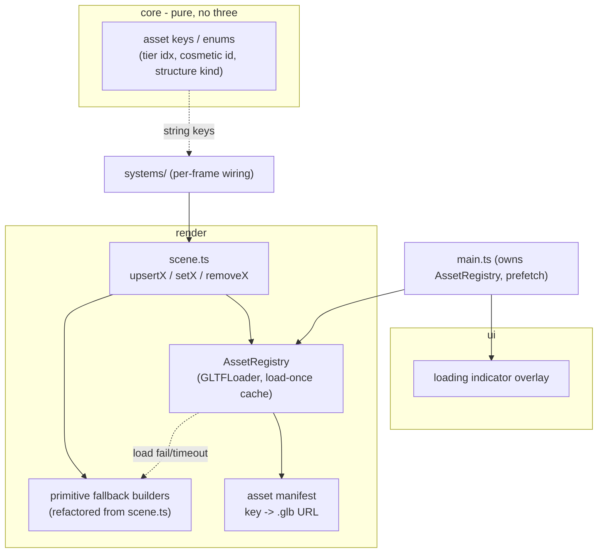

# ADR 0010 — Art asset pipeline: format, sourcing, loading, budget, and fallback

Status: Proposed (Sprint 3)
Date: 2026-07-08
Related: `docs/requirements/vehicle-and-character-art.md` (AC10-AC13 — the shared perf/loading/fallback NFR), `docs/requirements/environment-dressing.md` (AC7), `docs/requirements/truck-cosmetics.md` (AC4); ADR 0001 §4 (`render/` owns glTF loading, `core/` purity boundary); ADR 0011 (cosmetic/tier variants), ADR 0012 (environment dressing). This is the parent ADR of the Sprint-3 art trilogy — 0011 and 0012 build on the pipeline defined here.

## Context

Sprints 1-2 shipped the full gameplay loop rendered entirely in primitive Three.js shapes (`src/render/scene.ts`). Sprint 3 replaces those placeholders with real stylized/low-poly glTF art across three requirements docs, all of which share one non-functional budget: a perf/bundle ceiling, a loading behaviour, and a "never hard-crash on a bad asset" rule. The dominant forces:

- **Target player is a young child** → the project's standing bias is "forgiving, no hard stalls, never hard-fails except the one deliberate farmer game-over." A blocking loading screen or a broken-asset crash both violate that.
- **The art direction is confirmed stylized/low-poly, explicitly _not_ photoreal** — so the geometry/texture/PBR budget is small, and we must not over-spec for a fidelity level the human rejected.
- **Static-site deploy (GitHub Pages), possibly a slow home connection.** Assets must not bloat the initial JS chunk or block first paint.
- **`core/` must stay pure** (ADR 0001 §4 — no `three`/`rapier` imports). Asset loading is inherently async/impure and cannot live there.

### Measured baseline (corrected)

The requirements docs cite a "~2.5 MB gzipped" existing bundle "mostly Rapier's WASM," flagged as unverified. **I ran a production build; the real numbers are:**

```
dist/assets/index-*.js   raw = 2.75 MB   gzip = 0.92 MB
```

The single JS chunk is 2.75 MB **uncompressed**, **0.92 MB gzipped**. The "2.5 MB" figure in the requirements is the uncompressed size mislabeled as gzipped — the true gzipped baseline is roughly **one third** of what was assumed. This correction materially loosens the headroom and is the basis for the budget in this ADR. All downstream budget math uses 0.92 MB gzipped as the baseline, not 2.5 MB.

## Decisions

### 1. Format: self-contained binary glTF (`.glb`) with embedded textures, loaded via `GLTFLoader`

Confirms ADR 0001's original intent. `.glb` (single binary file, textures embedded) over `.gltf`+`.bin`+loose textures because:
- One HTTP request per model, and no relative-path fragility if the file is served from a content-hashed or based-pathed URL (see §6).
- `GLTFLoader` is already a first-class `render/` responsibility per ADR 0001.

**No Draco / meshopt / KTX2 compression this sprint.** Those add a decoder (Draco ≈ 100 KB WASM; KTX2 a transcoder) that would eat the very budget we are protecting, and they pay off on *high-poly / high-res-texture* assets — the opposite of the confirmed low-poly direction. Low-poly geometry is already tiny and gzips well over the wire. Revisit only if measured assets breach the §3 budget.

### 2. Sourcing: free CC0 low-poly asset packs (Kenney.nl / Quaternius as primary candidates)

Nobody on this project is an artist, and the confirmed art direction *is* the Kenney/Quaternius aesthetic. Recommendation, in priority order:

1. **CC0 packs** — Kenney.nl (Car Kit, Nature Kit, Survival/Farm kits) and Quaternius (animated low-poly characters + animals). CC0 = public domain: zero licensing friction for a public static site, no attribution obligation (we can still credit). Free, immediate, and — critically — internally style-consistent, satisfying the "one art direction across the whole world" constraint (vehicle-art AC9, environment AC9). Quaternius' rigged characters ship idle/walk/run clips that map directly onto the farmer's PURSUING/TIRED/LEAVING pose requirement (vehicle-art AC8).
2. Light kitbash/recolour in Blender only where a pack lacks an exact item (e.g. assembling a "monster truck" silhouette from a car-kit body + oversized tires, or scaling one mountain model into a range).

Rejected: **hand-authoring** (no artist → slow, inconsistent), **commissioning** (cost + lead time, disproportionate for a decorative sprint), **AI-generated 3D** (immature for game-ready low-poly topology, inconsistent style across a set, and murky provenance/licensing — a poor fit for a young child's product where we want asset origins clean and defensible).

**Honest trade-off:** we are constrained to what the packs contain. The 3 distinct body tiers + 3 wheel tiers and a "tired" farmer pose may require picking-and-recolouring or minor kitbashing rather than being drop-in. This is bounded, one-time work — but it is not zero, and the developer should confirm specific pack contents against the per-axis scope before committing.

### 3. Perf / bundle budget (this is the number the requirements delegated to me)

Two distinct budgets, because assets are served as separate static files (§6), not bundled into the JS:

| Budget | Target | Hard alarm |
|---|---|---|
| **Initial first-paint payload** (JS chunk + HTML; reaches the builder) | ≤ 1.0 MB gzipped (i.e. essentially unchanged from the measured 0.92 MB baseline) | 1.2 MB gzipped |
| **Total driving-scene asset payload** (all `.glb`/textures added by docs 0010-0012 combined, downloaded over a session, prefetched during the builder) | ≤ **1.5 MB gzipped** | 2.0 MB gzipped |

This replaces the placeholder "~5 MB gzipped combined" from vehicle-art AC10, which was set against the mistaken 2.5 MB baseline and is far too loose for low-poly art on a child's connection. Rationale for 1.5 MB: a stylized low-poly building is ~20-80 KB, a truck body/wheel model ~30-60 KB, a rigged farmer with a few clips ~100-250 KB, a chicken ~30-60 KB, with mountains/river being mostly procedural (ADR 0012, near-zero download) and cosmetics being material/colour swaps on shared geometry (ADR 0011, near-zero added geometry). Summing generously lands comfortably under 1.5 MB; the 2.0 MB alarm is the point at which we reconsider Draco/KTX2 (§1) or trim the asset set.

**Assets are never inlined into the JS chunk** — so the first-paint budget is protected structurally, not by discipline. `manualChunks`/asset handling keeps `.glb` out of `index-*.js`.

### 4. Loading strategy: prefetch during the builder + progressive in-place upgrade over a permanent primitive baseline

The key realization: **the current scene already renders everything as primitives, and that is exactly the fallback the NFR asks for.** So the strategy is not "load, then show" — it is "always render primitives immediately, upgrade each object in place the moment its real model arrives." This makes fallback the *default code path*, not a special case, and eliminates most of the loading-screen problem.

Concretely:

1. **Prefetch on entering the builder.** Kick off asset loading when the builder screen mounts (in parallel with Rapier's WASM init, which already runs there per ADR 0001). The player spends several seconds choosing parts — free download time.
2. **Builder never blocks (vehicle-art AC11).** The builder is DOM (instant). Its new 3D truck preview (see ADR 0011) starts as a primitive and upgrades in place — first paint is never gated on a `.glb`.
3. **The DRIVING start gates only on the player's own truck models** (body + wheels for the chosen tiers — small, ~250 KB), with a **bounded wait of 3 s (tunable constant)**, showing the kid-friendly loading indicator (§5). On ready → start immediately. On timeout or load failure → start anyway with the primitive truck and upgrade it in place when/if the model arrives.
4. **Everything else never gates.** Environment structures, farmer, and chicken load progressively and upgrade in place from their primitives — a barn "popping in" a half-second late as it upgrades from a placeholder box is fine; a wait is not. This keeps time-to-play near-instant while honouring AC12's "never a silent freeze."

Why gate on the truck at all: it is the object the child just customized and will stare at from frame one; a brief wait for *their* truck to look right is worth 3 s, and even that degrades gracefully. Why 3 s and not the doc's proposed 5 s: because fallback-then-upgrade is non-jarring, a shorter gate favours getting the child driving; the value is a one-line tunable if playtests disagree.

### 5. Loading indicator (design delegated to me by AC12)

A single centered DOM overlay (consistent with ADR 0001 §3's DOM-UI approach), kid-friendly and wordless-friendly: a bouncing/spinning truck glyph with a short "Getting your truck ready…" caption. Lives in `ui/` alongside the other overlays. Shown only during the §4 truck gate; dismissed on ready or timeout. It is a rare, brief safety net, not the common path.

### 6. Where assets live and how they're referenced

- **Files:** self-contained `.glb` (and any standalone textures) referenced via Vite's asset-URL mechanism (`new URL('…/barn.glb', import.meta.url)`) from a typed manifest in `render/`, so Vite fingerprints them for cache-busting, emits them as separate assets (never inlined into the JS chunk), and rewrites the GitHub-Pages base path automatically. (`public/models/*` with `import.meta.env.BASE_URL` is the simpler fallback if the URL approach proves awkward, at the cost of no content-hash cache-busting.)
- **Loader/cache:** a new **`AssetRegistry`** in `render/` wraps `GLTFLoader`, loads-once, caches parsed models by a stable string key, and hands out clones (see ADR 0011 for instancing). It is created **once in `main.ts`** and passed into each driving session — so a restart round-trip (BUILDER→DRIVING→GAME_OVER→BUILDER) does **not** re-download. Per-session mesh *clones* are disposed with the scene; the shared cached source geometry/materials live for the app's lifetime.

### 7. Fallback / failure behaviour (vehicle-art AC13, environment AC7, cosmetics AC4)

- Every load is wrapped; on network error, malformed file, missing file, or timeout, the object keeps (or reverts to) its **primitive placeholder** — reusing the existing `scene.ts` primitive builders — and logs a single `console.warn`. No throw propagates to the game loop.
- **Per-asset isolation:** loads resolve independently (`Promise.allSettled` semantics, never `Promise.all`) — one failed model never takes down unrelated working models.
- Cosmetic texture failure (cosmetics AC4) falls back to the default material for that model, never a broken/missing-texture surface.
- This is a strict superset of the existing behaviour: if *every* asset failed, the game would render exactly as it does today (all primitives) and remain fully playable. That is the safety guarantee.

## Component / data design



The `core/` ↔ `render/` seam is preserved exactly as ADR 0001 intends: `core/` deals only in **string keys / enums** (a tier index, a structure kind, a cosmetic id — the same pattern already used by `ObstacleInstance.kind` and `AnimalSpecies`). The key→`.glb`→`THREE.Object3D` resolution lives entirely in `render/`. `core/` never learns that models exist.

## Consequences

- Fallback is the default render path, so the "never crash" NFR is met structurally rather than by defensive coding — the strongest possible version of that guarantee.
- Prefetch-during-builder + gate-only-on-truck means the loading indicator is rarely seen and never long; time-to-play stays near-instant.
- The `AssetRegistry` must be app-lived (not session-lived) to avoid re-downloading on restart — a new lifetime boundary the developer must respect (shared source cached forever; per-session clones disposed with the scene). Getting this wrong leaks GPU memory or re-downloads; called out explicitly here and again in ADR 0011.
- We accept dependence on third-party CC0 pack contents; some kitbashing may be needed, and if a suitable asset genuinely can't be found for one item, that item simply stays a primitive (still shippable).
- Choosing no Draco/KTX2 keeps the toolchain simple now but means the 2.0 MB alarm is our trigger to add compression later — a known, bounded escape hatch, not a dead end.

## Risks

- **Assets breach the 1.5 MB budget** (packs turn out heavier than estimated, or textures are large). Detected by the build-size check and the 2.0 MB alarm. Mitigation: the Draco/KTX2 escape hatch (§1), or trimming/decimating models.
- **Pack contents don't cover the exact per-axis needs** (3 distinct bodies, a "tired" farmer pose). Detected during sourcing, before code. Mitigation: kitbash, or degrade that one axis to a primitive + material cue.
- **`AssetRegistry` lifetime mishandled** (disposed per session) → re-download on every restart, or shared geometry disposed while still referenced → broken render. Detected in a restart playtest / GPU-memory watch. Mitigation: the explicit ownership rule in §6 and the disposal discipline in ADR 0011.
- **Load-time vs timing-sensitive gameplay** (the cross-ADR concern): the farmer's spawn-delay/chase-duration windows run on the fixed-dt sim loop, which **only starts once the driving session is constructed** — after the §4 gate resolves. Progressive in-place upgrades are render-only and never touch sim timing. So there is no path by which a loading stall desyncs farmer timers. Documented here so a future change to the loop start-order doesn't quietly break this property.
