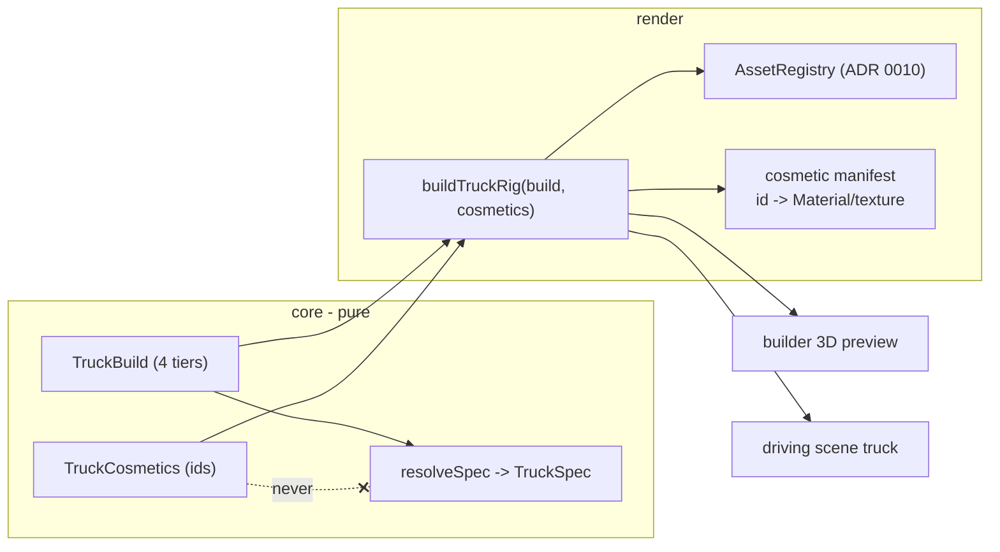

# ADR 0011 — Truck rendering: per-axis models and the cosmetic × tier variant strategy

Status: Proposed (Sprint 3)
Date: 2026-07-08
Related: `docs/requirements/vehicle-and-character-art.md` (per-axis art scope table; AC1-AC4), `docs/requirements/truck-cosmetics.md` (AC1-AC8 — cosmetics independent of tier); ADR 0002 (the `TruckSpec`/`TruckBuild` tier data model this must not touch); ADR 0006 (builder purchase-flow UI the cosmetic UI sits beside); ADR 0010 (the asset pipeline / `AssetRegistry` this consumes). Sits under ADR 0010's pipeline.

## Context

The truck is one primitive box today (`scene.ts`). Sprint 3 gives it real art across two axes that get distinct externally-visible models — **body** (3 tiers) and **wheels** (3 tiers) — plus small attached cues for engine and gas-tank tiers, per vehicle-art's per-axis scope table. On top of that, `truck-cosmetics.md` confirms (human, final) that **cosmetic choice — body paint colour/design and wheel look — is independent of functional tier**: any cosmetic on any owned tier, never tier-locked.

That independence is the crux. Naively, "a look per tier per cosmetic" multiplies: 3 body tiers × *N* colours × *M* designs, times the same for wheels — a combinatorial asset explosion. The requirements already point at the answer (material/texture swaps on shared geometry) but explicitly leave the decision and its justification to this ADR. Two hard constraints frame it: cosmetics must **never** read into or mutate `TruckSpec` (cosmetics AC1), and `core/` must stay pure (ADR 0001 §4).

## Decisions

### 1. Per-axis geometry: 3 body models + 3 wheel models; engine/gas-tank as small attachable prop meshes

Matches vehicle-art's scope table exactly — no reinterpretation:
- **Body:** 3 distinct `.glb` models, one per body tier (AC1).
- **Wheels:** 3 distinct `.glb` wheel/tire models, one per wheel tier (AC2), instanced 4× per truck.
- **Engine / gas-tank:** *not* distinct chassis. One small attachable prop mesh set per axis (e.g. hood-scoop/exhaust for engine, a tank prop for gas), swapped by tier as a glance-check cue (AC3). Attached at a named socket on the body model (see §4).

### 2. Cosmetics = material/texture swaps on the shared per-tier geometry — never baked per-combination geometry

**This is the load-bearing decision.** A cosmetic selection is data — `{ bodyColorId, bodyDesignId, wheelLookId }` — resolved at render time into a `THREE.Material` (or a material + texture) applied to the *existing* per-tier geometry. No new geometry is produced per cosmetic-tier combination.

Why:
- **Cost stays additive, not multiplicative.** Geometry count is fixed at 3 bodies + 3 wheels regardless of how many colours/designs/wheel-looks we offer. Adding a paint colour is one material entry, not six new models. This is precisely what cosmetics' Constraints section demands ("material/texture swaps … not new geometry per combination").
- **It is idiomatic Three.js.** Clone the cached geometry from the `AssetRegistry` (ADR 0010), assign `mesh.material`. Standard, cheap, well-trodden.
- **Carry-over across tier changes falls out for free (AC7).** Because the paint palette is a **shared set of materials applied to all three body models** (not per-model bespoke skins), a chosen colour re-applies trivially when the player equips a different body tier — the same material id is valid on any body model. AC7's "reapply if a matching variant exists, else default" reduces to "always reapply" for shared-palette colours, and only genuinely model-specific designs (if any) need the default-reset branch. **Recommendation: keep the paint palette a shared colour/material set precisely so carry-over is always clean.**

Rejected: **baked per-combination models** — correct to reject explicitly. It multiplies asset count and download by the palette size, blows ADR 0010's 1.5 MB budget, and makes adding a colour an art task instead of a data edit. The only thing it would buy is per-combination baked detail (e.g. a decal that wraps geometry-specifically), which the stylized/low-poly direction does not need.

**Textures vs flat colour:** prefer **flat vertex-colour / plain-colour materials** for paint (near-zero download, on-brand for low-poly). Reserve actual texture maps for wheel "looks" that genuinely need a tread/rim pattern — a handful of small shared textures, counted against ADR 0010's budget.

### 3. Cosmetic state lives beside `TruckBuild`, wholly separate from `TruckSpec` (AC1)

- Add a **`TruckCosmetics`** plain-data type in `core/types.ts`: `{ bodyColor: string; bodyDesign: string; wheelLook: string }` (ids, not `THREE` objects — `core/` stays pure).
- `GameStore` holds the current `_cosmetics` selection next to `_build`, with its own `selectCosmetic(part, id)` mutator and getter, mirroring the existing `selectTier` shape.
- **`resolveSpec()` and every gameplay system never read `_cosmetics`.** Stat resolution stays a pure function of the four functional tiers, exactly as today. This is what makes AC1 ("cosmetic choice never reads into or mutates `TruckSpec`") a structural guarantee: cosmetics are simply not on the code path that produces `TruckSpec`.
- The id→`THREE.Material` mapping lives in `render/` (a cosmetic manifest), same key→asset pattern as ADR 0010.

### 4. Truck assembly: a composed rig, not one monolithic model

The truck is assembled at render time from parts so the four axes vary independently:

```
TruckRig (THREE.Group)
 ├─ body        = clone(bodyModel[bodyTier]);  material = paint(bodyColor, bodyDesign)
 ├─ wheels[0..3]= clone(wheelModel[wheelTier]); material = wheelLook;  placed at body's 4 wheel sockets
 ├─ engineCue   = clone(engineProp[engineTier]);  attached at body's engine socket
 └─ gasTankCue  = clone(gasProp[gasTank]);         attached at body's tank socket
```

Sockets (wheel mount points, engine/tank attach points) are read from named empties/nodes in the body `.glb` if the pack provides them, else from a small per-body-model offset table in `render/` (a data constant, authored once). A `buildTruckRig(build, cosmetics)` factory in `render/` produces the assembled `THREE.Group`; `scene.ts`'s `setTruckTransform` moves that group instead of the current single box.

### 5. Builder gets a live 3D preview (AC4, AC8) — new, currently DOM-only

The builder is pure DOM today with no 3D. AC1/AC4 require the *same* truck model shown in the builder preview and spawned in driving ("no mismatch between what a player picks and what they drive"). So the builder needs a small preview canvas:
- A compact `THREE` preview panel inside the builder overlay, its own tiny renderer + camera, rendering the same `buildTruckRig(store.build, store.cosmetics)` output, rebuilt on any tier/cosmetic change (the builder already re-renders on every `store` emit — hook the rig rebuild into that).
- It consumes the shared `AssetRegistry`, so no extra downloads; it upgrades from a primitive rig in place per ADR 0010 §4 (builder never blocks — AC11).
- Because both the preview and the driving scene call the *same* `buildTruckRig` with the *same* store state, the "preview matches driving" guarantee (AC4, cosmetics AC8) holds by construction — there is only one assembly path.

### 6. Cosmetic builder UI (cosmetics AC2/AC3)

- A **structurally distinct section** in the builder, separate heading and grouping from the four-axis functional picker — never interleaved row-by-row (AC2), so a child never confuses "how it looks" with "what it does."
- **Keyboard-operable** on the existing Up/Down/Left/Right/Space scheme (AC3) — reuse `builder.ts`'s established navigation model; the cosmetic section is just additional focusable rows (body-colour row, body-design row, wheel-look row) below the functional rows.
- **Free to select by default** (cosmetics Open Q1) — cosmetics are not a power axis, so no owned/locked/coin treatment. Flagged as the recommended default; if the human later wants them gated, it mirrors ADR 0006 §5's owned/locked visual treatment. Documented as an open item, not a blocker.

## Component / data design



Note the crossed edge: `TruckCosmetics` has **no path** to `TruckSpec` — AC1 as an architectural invariant, not a runtime check.

## Consequences

- Adding a paint colour or wheel look is a **data edit** (one manifest entry), not an art/geometry task — the whole point of the material-swap decision, and it keeps the combinatorial cost linear.
- The builder gains real 3D for the first time (a preview canvas). This is genuinely new surface area — a second small renderer, and the discipline that it and the driving scene share one `buildTruckRig` path so they can never diverge (AC4).
- The single-assembly-path guarantee means a bug in `buildTruckRig` shows up identically in preview and driving — easier to catch, but also means it can't be "fixed in one place only."
- Per-session rig clones must be disposed with the scene while the `AssetRegistry`'s shared source geometry/materials persist (ADR 0010 §6). The rig factory clones geometry and *shares or clones* materials deliberately: shared read-only paint materials are fine to reuse; if a material is mutated per-truck it must be cloned to avoid cross-truck bleed. Called out so the developer picks the right clone granularity.
- Engine/gas cues are cosmetically minor by design (AC3) — accepted trade-off: a child reads engine tier from a small prop, not a full silhouette change, in exchange for not tripling body-model production.

## Risks

- **Socket mismatch across the 3 body models** (wheel/engine/tank mounts land in different local positions per model). Detected the first time a higher-tier body is previewed with wheels floating/clipping. Mitigation: the per-body socket offset table in §4, authored once per body model.
- **Material mutation bleed** — reusing one shared paint material instance and mutating its colour per-truck would recolour every truck (and the preview) at once. Detected in preview-vs-driving colour tests. Mitigation: clone materials that are mutated; share only read-only ones (§Consequences).
- **Preview renderer cost** — a second live `THREE` renderer in the builder could stutter on a weak device. Detected in builder playtest. Mitigation: render the preview on-demand (only on change / a slow idle spin), not in a full rAF loop; it is a static-ish object, not a game scene.
- **Cosmetic palette carry-over edge case (AC7)** if any design is model-specific rather than shared-palette. Mitigation: keep paint a shared palette (§2) so carry-over is always valid; only opt into model-specific designs if a specific one is wanted, and give it an explicit default-reset.
