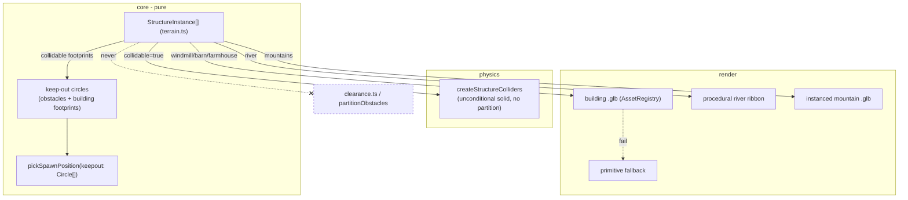

# ADR 0012 — Environment dressing: buildings, river, mountains, and spawn integration

Status: Proposed (Sprint 3)
Date: 2026-07-08
Related: `docs/requirements/environment-dressing.md` (AC1-AC9); ADR 0001 §7 (obstacle clearance, spawn placement), ADR 0002 (wheel-tier clearance table — must not be disturbed), ADR 0010 (asset pipeline / fallback), ADR 0011 (shared art direction). Sits under ADR 0010's pipeline.

## Context

The farm renders as a bare green plane with three primitive obstacles. Sprint 3 adds a windmill, barn, farmhouse, river, and mountains — decorative, not a gameplay rebalance. The requirements doc makes the behavioural calls itself and they are firm:

- **Windmill / barn / farmhouse:** always-solid scenery that blocks the truck **regardless of wheel tier**, with no damage/hit/fail (same no-fail pattern as existing obstacle blocking). They are *not* a new tier-gated obstacle class (AC2, AC5).
- **Mountains:** non-collidable backdrop **outside** `TERRAIN_BOUNDS`, never reachable — they *are* the visible-edge treatment for the soft boundary (AC3).
- **River:** non-collidable decorative terrain feature, zero mechanical effect on movement/gas/coins (AC4).
- **Existing wheel-tier clearance (bush/rock/derelict car) must be left completely untouched** (AC5).
- **Spawn systems must not place animals/farmer/fuel inside the new solid structures** (AC6).
- **Static is acceptable** (no required animation, AC8); **asset failure must not crash** (AC7).

The two things the doc leaves to me: how the structures are represented so clearance stays untouched, and how river/mountains are produced (authored vs procedural vs hybrid).

## Decisions

### 1. Structures are a new `StructureInstance` type, entirely separate from `ObstacleInstance` — clearance is never touched

This is the decision that satisfies AC5 structurally. The tier-gated clearance path (`ObstacleClass`, `canClear`, `partitionObstacles`) is for bush/rock/derelict car and must not gain a fourth class or change behaviour. So the new structures do **not** become `ObstacleInstance`s and **never enter `partitionObstacles`**.

Add to `core/terrain.ts` (pure data):

```ts
type StructureKind = 'windmill' | 'barn' | 'farmhouse' | 'river' | 'mountains';

interface StructureInstance {
  id: string;
  kind: StructureKind;
  position: Vec2;
  footprintRadius: number;   // used for the solid collider AND spawn keep-out
  collidable: boolean;       // windmill/barn/farmhouse = true; river/mountains = false
}
```

`clearance.ts` is not imported, extended, or read by any of this — AC5 holds because the new code simply lives on a different path. The collidable buildings get an **unconditional solid collider** built via the existing `createObstacleColliders`-style fixed-collider helper in `physics/world.ts` (a sibling helper `createStructureColliders`, or the same one fed the building footprints), added once per driving session *outside* the clearance partition. Because they're always solid, there's no per-run partitioning — simpler than obstacles, not more complex.

**Architectural soundness of "unconditionally solid regardless of wheel tier" (the doc asked me to confirm):** confirmed, no conflict. Clearance is a property of the tier-gated *obstacle* system; buildings opting out of it is not a special case that system has to handle — it's the *absence* of that system. The truck's kinematic character controller (ADR 0001 §2) slides along any solid collider with no damage/fail, so building-blocking automatically inherits the existing no-fail behaviour (AC2) with zero new logic. The only thing to verify in playtest is footprint sizing so a child isn't wedged; that's a tuning constant, not an architecture risk.

### 2. Buildings: authored low-poly `.glb`, solid collider sized to a simplified footprint

- **Visual:** authored low-poly `.glb` per building (windmill, barn, farmhouse) from the CC0 packs (ADR 0010 §2), in the shared art direction (AC9), loaded through the `AssetRegistry`, primitive-fallback on failure (AC7 → reuse the existing box/cylinder placeholders).
- **Collider:** a **simplified** solid shape (cylinder or cuboid sized to `footprintRadius`), *not* the visual mesh's exact geometry. Low-poly is already cheap, but matching a windmill's blades or a barn's roofline as a collider is needless and would make sliding feel catchy. A simple footprint is kinder to a young driver and cheaper for Rapier.
- **Animation (AC8):** static is fine. A subtle windmill-blade spin is an allowed, cheap nice-to-have (a per-frame rotation on the blade sub-node if the model separates it) — render-only, never touches the collider or sim.

### 3. River: procedural flat geometry, non-collidable, near-zero download

The river is a procedural ribbon — a flat mesh strip laid on the ground along a simple polyline/spline, with a stylized flat-blue (optionally slightly translucent) material. No collider, no physics body, no `StructureInstance.collidable`. Rationale:
- Authored river `.glb`s are awkward to fit an arbitrary flat terrain; a generated ground-hugging strip fits exactly and costs ~0 KB download (built in `render/` from a handful of points).
- Satisfies AC4 (purely decorative, zero mechanical effect — it isn't in physics or spawn keep-out at all) and AC8 (static water is fine; a cheap UV scroll is an optional enhancement).
- It is fine for an animal/fuel to spawn "on" the river — the river has zero mechanical meaning, so it is deliberately excluded from spawn keep-out (§5).

### 4. Mountains: instanced authored low-poly, placed outside `TERRAIN_BOUNDS`, no collider

- One (or a few) low-poly mountain `.glb`(s) from the CC0 packs, **instanced/reused** around the perimeter — rotated/scaled repetitions of one small model form the range, so download is one small asset, not a bespoke ring (ADR 0010 budget).
- Placed strictly **outside `TERRAIN_BOUNDS`** and never given a collider — they are backdrop only (AC3), and being outside the drivable bounds they can never be reached (the soft boundary already keeps the truck inside). They double as the answer to the older "visible edge, not an invisible wall" question.
- Fallback (AC7): on load failure, omit them (or a flat far-plane silhouette) — the soft boundary still functions, so their absence is purely cosmetic.
- **Recommendation is authored-instanced over fully procedural** for art-direction consistency (AC9 — a procedural noise mountain risks looking off-style), but a procedural low-poly cone range is the acceptable fallback if no suitable asset is found. Hence "hybrid" in the sense that authored is preferred with a procedural safety net, not a mix in the final scene.

### 5. Spawn-avoidance integration (AC6): generalize spawn-position's keep-out input

The animal/farmer/fuel spawn systems must not place entities inside a solid structure. Today `pickSpawnPosition` (`core/spawn/spawn-position.ts`) takes `obstacles: ObstacleInstance[]` but — verified by reading it — its `isValid` only ever touches `obstacle.position` and `obstacle.radius`. So the integration is a small, clean, pure change:

- **Widen the keep-out parameter to a minimal structural type** `{ position: Vec2; radius: number }[]` (call it `Keepout` / `Circle`) instead of the concrete `ObstacleInstance[]`. `ObstacleInstance` already satisfies it, so existing callers are unaffected.
- Feed the combined keep-out set: the existing obstacles **plus the collidable buildings' footprints** (windmill/barn/farmhouse → `{ position, footprintRadius }`). River and mountains are **excluded** (river is decorative/spawnable-over; mountains are outside bounds and thus never selected anyway).
- This extends the existing "not inside an obstacle" rule to cover the new solids exactly as AC6 requires, without bypassing or rewriting it. It stays pure and unit-testable (the RNG is already injected).

`core/` gains only plain-data structure definitions and a slightly more general keep-out type — no `three`, no async, boundary intact.

## Component / data design



The crossed edge is the AC5 invariant: structures never reach the clearance system.

## Consequences

- Clearance (AC5) is protected structurally: the new structures live on a separate data path and never enter `partitionObstacles`, so bush/rock/derelict-car behaviour cannot be perturbed by this work.
- Buildings are simpler than tier-gated obstacles (always solid, no per-run partition) — less code, not more.
- River and mountains carry ~0 download weight (procedural / one instanced asset), keeping well inside ADR 0010's budget and leaving that budget for the truck/farmer/chicken art that actually needs it.
- Widening `pickSpawnPosition`'s parameter is a tiny, backward-compatible pure change — but every current call site that passes obstacles should be reviewed to also pass building footprints, or a building could get an entity spawned inside it. Called out as a concrete developer checklist item.
- Simplified footprint colliders mean the *visible* mesh may slightly overhang its collider (e.g. a barn's eaves); acceptable and even desirable (forgiving) for a child, but noted so it isn't mistaken for a bug.
- Accepting authored-instanced mountains ties their look to pack availability; the procedural fallback keeps this from being a blocker.

## Risks

- **A building footprint spawns wedge the truck** (footprint too large / placed in a pinch point). Detected in playtest. Mitigation: footprints and placements are tunable constants in `core/terrain.ts`, same as the existing stub obstacles; keep buildings away from the truck start and boundary pinch points.
- **A spawn call site missed** in the keep-out widening → entity inside a barn. Detected by the existing spawn tests (extend them with a building-footprint case) and visual playtest. Mitigation: the review-all-call-sites note above; the injected-RNG unit test can assert no point lands within a footprint.
- **Mountains accidentally placed at/inside `TERRAIN_BOUNDS`** → reachable, violating AC3. Detected by a bounds assertion in a test or review. Mitigation: assert mountain positions lie outside `TERRAIN_BOUNDS` in the terrain data test.
- **Art-style mismatch** if a building model comes from a different pack than the truck/characters (AC9's "one world, not a mix"). Detected in review. Mitigation: source all environment + vehicle + character assets from the same CC0 pack family (ADR 0010 §2).
