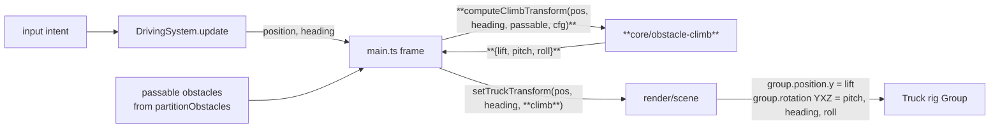

# ADR 0013 — Obstacle climb: a stateless, position-derived visual lift/tilt

Status: Proposed
Date: 2026-07-09
Related: `docs/requirements/truck-obstacle-climbing.md` (issue #42, AC1-AC6); `docs/requirements/truck-wheel-motion.md` (issue #40, developed in parallel — see §Composition with #40); ADR 0001 §2 (kinematic-only physics), §4 (`core/` purity boundary), §8 (testable seam); `docs/architecture/0011-truck-model-and-cosmetic-variants.md` (the truck rig this animates).

## Context

The truck currently drives through `passable` obstacles (those at/below its wheel clearance) at a constant height, because those obstacles get no Rapier collider at all (`physics/world.ts` `createObstacleColliders`) and the truck has no vertical axis anywhere — `TRUCK_HALF_HEIGHT` is a hardcoded constant. The human has already resolved the approach (Open Question 1): a **lightweight visual approximation**, not real vertical physics. This ADR designs only the *mechanism* (Open Question 2), against a hard boundary: `core/clearance.ts` (`canClear`/`partitionObstacles`) and all `blocking`-obstacle behavior must stay exactly as-is, and this project's physics tick has real scar tissue (issues #16/#21/#31 were double-`step()`/collider-desync bugs) so the design must not touch the physics tick at all.

The dominant forces: the response must be forgiving and never chaotic (AC3, young-child bias), must never slow forward progress or read as blocking (AC2), must work for every tier/obstacle-class pairing (AC5), and must share the per-frame truck-rig update path with the parallel wheel-motion work (#40) without the two fighting.

## Decision

Compute the climb as a **pure, stateless function of the truck's current XZ position** relative to the known `passable` obstacle footprints, producing three plain numbers — `lift` (Y offset), `pitch`, `roll` — that `render/` applies to the truck rig `THREE.Group`. Nothing is time-integrated, nothing is stored frame-to-frame, and nothing touches the Rapier collider or the physics `step()`.

Concretely:

1. **Footprint detection (pure `core/` geometry).** For each `passable` obstacle, `combinedRadius = obstacle.radius + TRUCK_CONTACT_RADIUS` and `dist = |truckPos − obstacle.center|` (XZ). The truck is "over" that obstacle when `dist < combinedRadius`. This reuses `TRUCK_CONTACT_RADIUS` (`core/driving/config.ts`) as the truck's single footprint radius, consistent with issue #15's one-source-of-truth rule. No `three`/Rapier types — plain `Vec2` math, honoring ADR 0001 §4.

2. **Curve: a raised-cosine hump keyed to distance-from-center.** For an obstacle in range,

   ```
   peak = min(config.maxLift, config.liftScale * obstacle.radius)
   lift_i = peak * 0.5 * (1 + cos(π * dist / combinedRadius))
   ```

   This is `peak` when the truck center is over the obstacle center and eases to exactly `0` at the footprint edge, with **zero slope at both ends** (C¹-smooth) — so entering/leaving a footprint never pops the truck's height, and cresting the middle is a smooth apex, not a spike. Because `peak` scales with `obstacle.radius` (bush 0.6 → rock 1.0 → derelict car 1.8), a bigger obstacle produces a visibly bigger bump automatically, satisfying AC1/AC5's per-class sizing without a hand-maintained per-class table (a per-class override table is available in config if playtest wants it — see Tuning knobs).

3. **Tilt derived from the spatial gradient of the same hump.** Pitch is the slope of the lift field along the truck's heading; roll is the slope along the truck's right axis. Let `outward = (truckPos − center)/dist` (unit), `dLift/dDist = peak * 0.5 * (−π/combinedRadius) * sin(π*dist/combinedRadius)`. Then along-heading slope `= (dLift/dDist) * dot(outward, forward)` and lateral slope `= (dLift/dDist) * dot(outward, right)`, with `forward = (sin h, cos h)`, `right = (cos h, −sin h)`. `pitch = clamp(−alongSlope * config.tiltGain, ±maxPitch)`, `roll = clamp(−lateralSlope * config.tiltGain, ±maxRoll)`. The sign is chosen so the nose rises while climbing and dips while descending; the exact sign is a render-convention detail confirmed against the visual reference below. Because pitch/roll come from the *gradient*, they are also stateless and speed-independent. Roll defaults conservatively (small/zero cap) to protect AC3; lift+pitch are the core of the effect.

4. **Multiple overlapping footprints (AC3).** `lift = max_i(lift_i)` — the truck rests on the tallest thing under it, never the *sum* (summing could stack two humps into a chaotic tall spike). The max of C¹ humps is continuous, so no jerk at the crossover. Pitch/roll are the **lift-weighted average** of each obstacle's contribution (`Σ lift_i · tilt_i / Σ lift_i`), which stays smooth even at the instant the dominant obstacle changes. With no obstacle in range the result is exactly `{0,0,0}`.

5. **Where it lives and how it's wired.** New pure module `src/core/driving/obstacle-climb.ts` exporting `computeClimbTransform(truckPos, heading, passable, config) → { lift, pitch, roll }`, mirroring `truck-motion.ts` (pure math in `core/`, applied to the actual `THREE.Group` in `render/`). Constants live in `core/driving/config.ts` as `DEFAULT_CLIMB_CONFIG`, matching the existing `DEFAULT_DRIVING_CONFIG` pattern. The per-frame call is added in `main.ts`'s driving loop (the systems-wiring layer), which already holds the truck `position`/`heading` and the obstacle partition; `render/scene.ts`'s `setTruckTransform` gains an optional third `climb` argument and applies it. Render stays a dumb adapter — it applies numbers it's handed, it does not compute them or hold obstacle data.

## Alternatives considered

- **Time/animation-driven bump (trigger a scripted rise-then-fall clip on footprint entry, keyed to speed).** Rejected: needs per-obstacle in-flight state and speed coupling, can desync from actual position if the truck stops/reverses mid-crossing, and re-introduces exactly the "requires timing" fragility AC3 forbids. The position-derived hump is stateless and Just Works for stop/reverse/re-entry.
- **Sum overlapping lifts.** Rejected: two overlapping passable footprints could stack into an unbounded, chaotic spike (AC3). `max` is bounded and physically reads as "resting on the tallest surface."
- **Linear cone `lift = peak·(1 − dist/combinedRadius)`.** Rejected: slope discontinuities at the apex and footprint edge cause a visible jerk on entry/exit; the raised cosine removes both.
- **Compute the lift inside `render/setTruckTransform`.** Rejected: it would pull gameplay obstacle data and clearance-derived state into the render adapter, eroding ADR 0001 §4. The math belongs in `core/`, applied in `render/`.
- **Real vertical physics / ground-follow.** Already rejected by the human in Open Question 1; out of scope.

## Consequences

- **Testable in Vitest with zero engine deps** (ADR 0001 §8 seam): assert `lift=0` outside every footprint, monotonic rise to the center, `peak` scaling with radius, `max`-not-sum for overlaps, and `{0,0,0}` for an empty list — all plain-number assertions.
- **Zero physics risk.** The effect writes only `group.position.y` and `group.rotation.x/z` on the render rig. It never calls `moveBy`/`setPosition`/`step`, never moves the Rapier collider, and never changes the XZ path — so it structurally cannot regress issues #16/#21/#31 or AC2 (forward progress is untouched; speed only affects how fast you traverse the fixed spatial hump, which is physically correct).
- **Accepted approximation:** the whole rig lifts/tilts as a unit; wheels are not individually planted on the obstacle surface. During a crossing the wheels can visibly ride above the obstacle mesh. This is the "lightweight visual approximation" the human chose and matches #40's explicit non-goal of per-wheel ground conforming. It is the trade for not touching the physics model.
- **What becomes harder:** if a future story *does* want per-wheel suspension/contact, this stateless whole-rig lift is not a foundation for it — that work would replace this, not extend it. Documented so it isn't mistaken for a suspension seam.

## Component / data design

New and touched pieces:

| Location | Change | Responsibility |
|---|---|---|
| `src/core/driving/obstacle-climb.ts` *(new)* | `computeClimbTransform(truckPos, heading, passable, config)` | Pure geometry → `{lift, pitch, roll}`. No `three`/Rapier. |
| `src/core/driving/config.ts` | add `ClimbConfig` + `DEFAULT_CLIMB_CONFIG` | Tuning constants, colocated with `DEFAULT_DRIVING_CONFIG`. |
| `src/main.ts` (driving loop) | capture `passable` from the existing `partitionObstacles` call; call `computeClimbTransform` each frame; pass result to `setTruckTransform` | Systems-wiring seam. |
| `src/render/scene.ts` | `setTruckTransform(position, heading, climb?)` applies lift/tilt | Dumb adapter: applies given numbers. |

`ClimbTransform` and the obstacle footprint are plain data — `computeClimbTransform` takes the existing `ObstacleInstance[]` `passable` list directly (it only reads `position`/`radius`), so no new cross-layer type is introduced.

Data flow per frame (additions in **bold**):



Render application detail: replace the current `group.position.set(x, 0, z)` / `group.rotation.y = heading` with `group.position.set(x, climb.lift, z)` and `group.rotation.set(climb.pitch, heading, climb.roll, 'YXZ')`. The `'YXZ'` Euler order applies heading first, then pitch about the truck's *local* (already-yawed) X axis, then roll — so the tilt reads correctly in the truck's body frame at any heading. When `climb` is omitted (default), it is `{0,0,0}` and behavior is identical to today (keeps the builder-preview path and any other caller unaffected).

### Composition with #40 (wheel motion) — verified non-conflicting

#40 adds individual wheel objects **inside** the rig group and animates them via **child-local** transforms: roll about each wheel's own axle, and yaw on the two front wheels. This ADR writes only **group-level** transforms: `group.position.y` and `group.rotation.x`/`.z`. The two write **disjoint objects**:

- `group.position.y` (this ADR) vs. wheel-child local rotation (#40) — different objects.
- `group.rotation.x/.z` = pitch/roll of the whole rig (this ADR) vs. wheel-child yaw/roll (#40) — different objects; a child wheel's local rotation is unaffected by its parent's Euler order.
- `group.rotation.y` = heading is set once by the existing code; neither feature contends for it (#40's front-wheel steer is a *child* yaw, not the group heading).

They compose correctly by construction: the rig tilts/lifts as a unit while each wheel keeps spinning in the rig's local frame — a wheel visually rolling while the whole truck climbs over a rock looks right, not fighting. The only shared surface is the `setTruckTransform` seam itself; #40 extends `TruckRigResult` to expose wheel handles, which this ADR does not touch. No merge conflict beyond both editing the same function body, which is trivial to reconcile.

## Visual design (reference for later acceptance check)

No human mockup supplied; written state spec. The truck rig is the same assembled model as today — only its Y offset and pitch/roll change. Distinct states to verify against a screenshot/clip:

- **Flat ground (no footprint under the truck):** rig sits at `y = 0`, wheels on the ground plane, no pitch/roll — identical to current behavior. This is the default and must be pixel-unchanged when away from obstacles.
- **Approaching a passable obstacle (truck center inside the footprint, before the center):** the rig has risen partway and the **nose is pitched up** — the truck is visibly climbing, with the obstacle mesh (bush/rock/derelict car) still visible underneath/ahead.
- **Cresting (truck center over obstacle center):** rig at **peak lift for that obstacle** (visibly higher for the derelict car than for a bush — the bump size tracks obstacle size), body roughly level (pitch passes through ~0 at the apex), obstacle mesh directly beneath the truck. The obstacle reads as physically under the truck, not see-through (AC1).
- **Leaving (past the center, still inside the footprint):** rig descending, **nose pitched down**, easing back toward flat.
- **Exit (at/beyond the footprint edge):** rig smoothly back to `y = 0`, level — no snap or pop at the boundary.
- **Blocking obstacle (above clearance):** unchanged — the truck stops/slides, never lifts or tilts (AC6). A blocking obstacle must show *no* climb response.
- **Two overlapping passable obstacles:** a single smooth lift that follows the taller footprint, never a doubled/spiky jump.

## Risks

- **Wrong tilt sign** (nose dips going up instead of down) — most likely defect, purely a three.js rotation-convention mismatch. Noticed immediately in the visual acceptance check (the state spec above pins the expected nose direction). Low blast radius: a single sign flip in `render`, no logic change.
- **Lift too tall → wheels float conspicuously** above the obstacle. Noticed in playtest; mitigated by `maxLift` cap and `liftScale` tuned so peak ≈ the obstacle's visible height. Both live in `DEFAULT_CLIMB_CONFIG` for one-line tuning (ADR 0001's "movement feel in one config module" principle).
- **Footprint radius too generous → truck starts lifting before it visually reaches the obstacle.** Noticed in playtest; mitigated via `TRUCK_CONTACT_RADIUS` reuse (already the game's tuned contact size) and, if needed, a `footprintScale` knob. Because lift eases to 0 at the edge with zero slope, an over-large footprint reads as "too early/floaty," not as a snap — a soft, tunable failure, not a broken one.
- **Merge overlap with #40** on `setTruckTransform`/the frame loop. Both edit the same function body; the changes are on disjoint transforms (see §Composition) so reconciliation is mechanical. Coordinate ordering so whichever lands second rebases rather than clobbers.

### Tuning knobs (`DEFAULT_CLIMB_CONFIG`, `core/driving/config.ts`)

- `liftScale` — fraction of `obstacle.radius` that becomes peak lift (auto-sizes per class).
- `maxLift` — absolute cap on peak lift, so no obstacle floats the truck absurdly.
- `tiltGain` — slope→radians multiplier for pitch/roll.
- `maxPitch`, `maxRoll` — hard caps (radians); `maxRoll` defaults small/zero to protect AC3.
- *(optional)* `maxLiftByClass` override table and/or `footprintScale`, if playtest wants per-class hand-tuning instead of the radius-derived default. Deferred to playtest, same spirit as the other deferred movement constants (ADR 0001 Risks).
