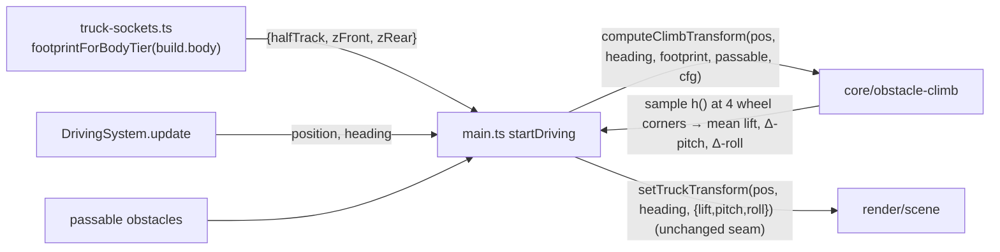

# ADR 0014 — Obstacle climb: four-corner (per-wheel) height sampling

Status: Proposed
Date: 2026-07-09
Related: ADR 0013 (the design this revises — single-center-point sampling); `docs/requirements/truck-obstacle-climbing.md` (issue #42, AC1-AC6); ADR 0001 §4 (`core/` purity boundary), §8 (testable seam); ADR 0011 / `src/render/truck-sockets.ts` (per-tier wheel positions this now reads); ADR 0012 / `core/terrain` + `render/scene.ts` `buildObstacleGeometry` (the obstacle rendered heights the lift is tuned against).
Supersedes: ADR 0013 (its Decision steps 2-4 — the hump *height field* survives; the single-point *sampling* and gradient-derived tilt are replaced).

Addendum pointer (2026-07-11, ADR 0017 — shared-tunable reconciliation): ADR 0017 (terrain expansion + visual hills, issue #49) feeds a *second* height source — terrain hill height — into this same four-corner lift/tilt, added to each corner alongside the obstacle hump. Left unchecked that would stack heights under an obstacle and could re-break the rock cab-clipping fix `DEFAULT_CLIMB_CONFIG` is tuned for (the Sprint-1 fairness-retro class of interaction). ADR 0017 reconciles it by flattening the hill field to ~0 within each obstacle's footprint (its §Decision-4), so there is **no interaction today** — the corner-height sum collapses to the pure obstacle hump over bush/rock/derelict-car and this config needs no re-tuning. **If a future change shrinks/removes an obstacle's flatten radius (letting nonzero terrain height sit under it), re-check `DEFAULT_CLIMB_CONFIG` against live obstacle-crossing screenshots.**

## Context

ADR 0013 shipped and was retuned once (`DEFAULT_CLIMB_CONFIG` in `core/driving/config.ts`). That tuning fixed the bush and derelict-car obstacles but **the rock still reads as broken**: acceptance screenshots show the static rock mesh cutting through the truck's cab/windshield — "plowing into" rather than "climbing over."

Root cause (confirmed against how arcade vehicle games solve this — Mario-Kart-style "raycast suspension"): `computeClimbTransform` samples the obstacle-height field at exactly **one point** (the truck's center) and applies one uniform `{lift, pitch, roll}` to the whole rig. Tilt is derived from the analytic *gradient* of the hump at that single point. This can't represent the state that actually matters for a wide obstacle — "front two wheels are up on the rock's slope, rear two are still on flat ground." The single center evaluation either lifts the whole rig by where its center happens to sit (too much where it shouldn't be, too little where it should), so the never-moving rock geometry ends up overlapping the cab. This bites hardest on the rock because it has the largest footprint-to-truck-length ratio of the three stub obstacles.

The constraints from ADR 0013 all still hold: forgiving and never chaotic (AC3), never slow forward progress or read as blocking (AC2), work for every tier/obstacle pairing (AC5), no Rapier / physics-`step()` involvement (issues #16/#21/#31 scar tissue), no touching `core/clearance.ts`'s blocking/passable rule, and compose cleanly with #40's wheel-motion (still disjoint). This ADR changes **only** how the three output numbers are computed; the output shape `{lift, pitch, roll}` and everything downstream of it are unchanged.

## Decision

Move from **one center sample** to **four per-wheel samples**. Keep ADR 0013's per-obstacle raised-cosine hump as a *scalar height field* `h(point)` — it was never the defect — but evaluate it once at each of the four wheel world-positions (front-left, front-right, rear-left, rear-right) and derive lift and tilt from those four samples by finite difference, the standard technique.

### 1. The height field is unchanged, only where it is sampled changes

For a single obstacle and an arbitrary sample point `p` (XZ):

```
dist          = |p − obstacle.center|
combinedRadius = obstacle.radius + TRUCK_CONTACT_RADIUS
peak          = min(maxLiftForClass(obstacle.sizeClass), liftScale * obstacle.radius)   // as today
h_obstacle(p) = dist >= combinedRadius ? 0
                                       : peak * 0.5 * (1 + cos(π * dist / combinedRadius))
```

This is byte-for-byte the ADR 0013 hump (raised cosine, C¹-smooth, `peak` at center → `0` at the footprint edge, `maxLiftByClass` override retained). It is now a pure `h(point, obstacle, config) → number` helper instead of being evaluated only at the truck center.

### 2. Four wheel samples, max across obstacles per corner

The truck's four wheel world-positions are derived from a **plain-number footprint** `{ halfTrack, zFront, zRear }` (see §Layering) rotated into world space by `heading` and offset from `truckPos`. For each corner `c`:

```
cornerHeight[c] = max over passable obstacles of h_obstacle(cornerWorldPos[c])
```

`max` (not sum) across obstacles is kept per corner — ADR 0013's AC3 anti-stacking rule, now applied at each wheel.

### 3. Lift = mean of the four corner heights

```
lift = (cornerHeight[FL] + cornerHeight[FR] + cornerHeight[RL] + cornerHeight[RR]) / 4
```

A **straight average** is the chosen combination (the standard raycast-suspension body-height rule). Rationale for this game specifically: when only the front two wheels are up on the rock, a straight average lifts the body ~halfway *and* the front/rear imbalance feeds pitch (§4) — together that reads as "riding up onto it," which is the visual goal, not physical accuracy. (Alternatives weighed below.)

### 4. Pitch and roll = finite differences between the wheel pairs

```
frontAvg = (cornerHeight[FL] + cornerHeight[FR]) / 2
rearAvg  = (cornerHeight[RL] + cornerHeight[RR]) / 2
leftAvg  = (cornerHeight[FL] + cornerHeight[RL]) / 2
rightAvg = (cornerHeight[FR] + cornerHeight[RR]) / 2
wheelbase = zFront − zRear          // front-to-rear span (tier-2 is asymmetric; use the true span)
track     = 2 * halfTrack

pitch = clamp(atan2(rearAvg  − frontAvg, wheelbase) * tiltGain, ±maxPitch)
roll  = clamp(atan2(rightAvg − leftAvg,  track)     * tiltGain, ±maxRoll)
```

The gradient block (`dLiftDDist`, `outward·forward`, `outward·right`) from ADR 0013 is **removed** — tilt now comes from the same four samples that produce lift, which is both simpler and correct for the front-up/rear-down case the gradient couldn't express.

Sign is pinned by ADR 0013's already-established render convention (`group.rotation.set(pitch, heading, roll, 'YXZ')`, applied verbatim): front higher → nose-up → negative `pitch`; obstacle under the truck's right side → positive `roll`. `atan2(rearAvg − frontAvg, …)` gives negative when the front is higher, matching. `left`/`right` are the truck's **body-frame** ±`halfTrack` corners (same `right = (cos h, −sin h)` convention as `core/driving`), so the roll sign stays in the body frame at any heading — the existing roll tests pin it.

`tiltGain` changes meaning: because `atan2` already yields a true geometric angle, `tiltGain` is now a pure **exaggeration dial** (≈1 = geometric truth, >1 = more dramatic), no longer a slope→radian converter. `maxPitch`/`maxRoll` clamps and `maxRoll` defaulting to 0 (AC3) are unchanged.

## Layering: how pure `core/` gets wheelbase/track without `three` or a tier table it shouldn't own

Chosen: **(b) — `main.ts` passes tier-specific footprint numbers into `computeClimbTransform`**, sourced from `truck-sockets.ts`.

I read the per-tier variance in `BODY_TIER_SOCKETS` before choosing, and it is too large to approximate away:

| tier | halfTrack (`wheelX`) | zFront | zRear | wheelbase | track |
|---|---|---|---|---|---|
| 0 | 0.556 | 0.558 | −0.558 | 1.116 | 1.111 |
| 1 | 0.713 | 0.636 | −0.636 | 1.271 | 1.427 |
| 2 | 0.933 | 0.479 | −0.885 | 1.364 | 1.866 |

Track width varies **68%** tier-0→tier-2 and tier-2's wheelbase is asymmetric (front `+0.479`, rear `−0.885`). Because the whole point of this fix is faithful sampling over an obstacle whose size is comparable to the truck, *where the corners actually are* materially changes which corners sit on the rock. Option (a) — a single `core` constant like `TRUCK_CONTACT_RADIUS` — would throw that away and re-introduce a milder version of the same "one-size lift" defect on the widest tier. The accuracy is worth the small extra coupling.

To keep `core/` `three`-free (ADR 0001 §4), `truck-sockets.ts` (which already owns the data and already imports `three`) exports a small **plain-number** extractor; `computeClimbTransform` receives primitives only:

```ts
// truck-sockets.ts (render layer — already owns BODY_TIER_SOCKETS)
export interface TruckFootprint { halfTrack: number; zFront: number; zRear: number; }
export function footprintForBodyTier(tier: number): TruckFootprint {
  const s = socketsForBodyTier(tier);        // existing THREE.Vector3 table
  return { halfTrack: Math.abs(s.wheels[0].x), zFront: s.wheels[0].z, zRear: s.wheels[2].z };
}
```

`main.ts` (the systems-wiring layer, which already imports both `core/` and `render/`) computes the footprint **once per driving session** from `footprintForBodyTier(build.body)` (the body tier is fixed for a run) and passes it each frame:

```ts
const footprint = footprintForBodyTier(build.body);            // once, in startDriving
// per frame:
const climb = computeClimbTransform(position, heading, footprint, passable, DEFAULT_CLIMB_CONFIG);
```

`core/` never sees a `THREE.Vector3`; it never duplicates the tier table; `truck-sockets.ts` owns the one place `three` types are unwrapped into plain numbers.

## Alternatives considered

- **Keep single-center sampling, just tune harder.** Already tried (the retuning pass). No scalar lift/tilt derived from one point can represent front-up/rear-down; the rock defect is structural, not a tuning value.
- **`lift = max` of the four corner heights** (instead of mean). Rejected: over a wide obstacle where only two wheels are up, `max` lifts the whole body to the raised pair's height — floaty, and it flattens the very front/rear imbalance that should read as pitch.
- **`lift = max(frontAvg, rearAvg)`** (average each axle, take the higher). Rejected: same over-lift as `max`-of-corners in the front-up case, and it discards the rear samples that keep the body honest.
- **Option (a): one representative wheelbase/track constant in `core/config`.** Rejected given the 68% track variance above — it would re-introduce a milder "one-size lift" error on the widest tier, the exact class of bug being fixed.
- **Sample more than four points (e.g. a grid / belly ray).** Rejected as over-engineering for a young-child visual approximation; four corners is the established technique and enough to kill the defect.

## Consequences

- **The tuned `DEFAULT_CLIMB_CONFIG` values must be re-tuned — this is not optional.** Under four-corner averaging the realized `lift` is the *mean* of four samples that are each below a single obstacle's `peak` (no corner ever sits exactly at the obstacle center), so the same config produces **systematically less lift** than single-center sampling did. `liftScale`, `maxLift`, and `maxLiftByClass.large` will read low until re-tuned upward against live rock/bush/derelict-car screenshots. The knobs and their meanings stay; only the numbers move. Flag this to the developer and expect a screenshot-driven tuning pass (the CLAUDE.md "always take live screenshots" rule applies — the original defect escaped unit tests and code review).
- **Slightly more coupling at the call site**: `main.ts` now threads a `TruckFootprint` into the climb call. Contained to one already-cross-layer file, computed once per run.
- **Pitch now genuinely reads as climbing** over wide obstacles — the target fix. Roll stays defaulted-off (AC3).
- **Zero physics risk, unchanged.** Still writes only `group.position.y` / `group.rotation.x/.z`, never `moveBy`/`setPosition`/`step`, never the Rapier collider, never the XZ path. `render/scene.ts`'s `setTruckTransform` is **untouched** — the output shape `{lift, pitch, roll}` is identical.
- **Still a whole-rig approximation.** The body lifts/tilts as a unit; wheels are still not individually planted on the mesh (ADR 0013's accepted trade, and #40's explicit non-goal). Four samples drive the body; they don't pin each wheel. If a future story wants real per-wheel contact, this remains a replacement seam, not a foundation.
- **Cross-ADR coupling to document (per Sprint-1 retro guidance, not a contradiction to reconcile):** the climb `lift` is tuned against the obstacles' *rendered heights* (`render/scene.ts` `buildObstacleGeometry`, radii from `core/terrain` `STUB_OBSTACLES` — ADR 0012's territory). Those heights are a **shared tunable** between this design and ADR 0012: if a future ADR-0012 change alters an obstacle's rendered height independently, this climb tuning silently drifts (the same shape as the Sprint-1 farmer/limp fairness bug — two individually-reasonable numbers decided apart). There is no conflict *today*; I checked and the current heights (bush ~1.2, rock ~2.0, derelictCar fixed 1.2) are what the config comments already tune against. Recorded here and cross-referenced from ADR 0012 so a future height change knows to re-check the climb config. See also §Risks.

## Component / data design

| Location | Change | Responsibility |
|---|---|---|
| `src/render/truck-sockets.ts` | add `TruckFootprint` + `footprintForBodyTier(tier)` | Unwrap the per-tier `THREE.Vector3` wheel data into plain `{halfTrack, zFront, zRear}`. Keeps `three` on the render side of the boundary. |
| `src/core/driving/obstacle-climb.ts` | new signature `computeClimbTransform(truckPos, heading, footprint, passable, config)`; extract `h_obstacle(point, obstacle, config)`; sample 4 corners; finite-difference tilt; **delete** the gradient block | Pure geometry, no `three`. |
| `src/core/driving/config.ts` | re-tune `liftScale`/`maxLift`/`maxLiftByClass` (screenshot-driven); update `tiltGain` doc to "exaggeration dial" | Tuning constants. Shape unchanged. |
| `src/main.ts` | compute `footprint = footprintForBodyTier(build.body)` once in `startDriving`; pass it into the per-frame `computeClimbTransform` call | Systems-wiring seam. |
| `src/render/scene.ts` | **none** — `setTruckTransform` already consumes `{lift, pitch, roll}` | — |



### Composition with #40 (wheel motion) — still non-conflicting

Unchanged from ADR 0013 §Composition. This ADR still writes only **group-level** `position.y` / `rotation.x/.z`; #40 still writes **child-local** wheel rotations. Reading the four wheel *positions* here is read-only geometry — it does not touch the wheel child objects #40 animates. The two remain disjoint; the rig tilts/lifts as a unit while each wheel keeps spinning in the rig's local frame.

## Test / verification implications

`obstacle-climb.test.ts` needs rework for the new signature and behavior (exact tests are the developer's job; this is the shape):

- **Signature**: every call now passes a `footprint`. A shared test fixture (e.g. tier-0 `{halfTrack:0.556, zFront:0.558, zRear:-0.558}`) keeps cases readable.
- **Survives as-is (adapt args)**: empty list → `{0,0,0}`; truck fully outside every footprint → `{0,0,0}`; `maxLiftByClass` override still caps `large`; a class with no override falls back to `maxLift`; pitch/roll clamp to `maxPitch`/`maxRoll` under aggressive `tiltGain`; roll defaults to 0 under `DEFAULT_CLIMB_CONFIG`; the "function only reads position/radius, no blocking notion" invariant.
- **Changes meaning — must be rewritten**: the "`center.lift ≈ peak`" assertion is now false. Replace with: centered over an obstacle → `lift > 0` but **strictly below** that obstacle's single-obstacle `peak` (because it's a 4-corner mean), with `pitch ≈ 0` and `roll ≈ 0` by symmetry.
- **New — the actual regression guard for this defect**: a rock-sized obstacle positioned so it sits under the **front axle only** (front corners inside the footprint, rear corners outside) must produce **nose-up pitch** (negative) and a **moderate, non-peak lift** — the front-up/rear-down state single-center sampling couldn't represent. This is the test that would have caught the rock defect.
- **New — belly-clip guard**: an obstacle centered exactly under the truck (smaller than the wheel spread) still lifts the body (`lift > 0`), because the corners fall inside `combinedRadius`. Guards against the "average goes to ~0, mesh pokes through the belly" failure mode.
- **New — tier sensitivity**: the same obstacle at the same position under a tier-0 vs tier-2 footprint produces different lift/pitch — documents that footprint is load-bearing and justifies layering option (b).
- **Roll math** (with `maxRoll` overridden nonzero, as today): lateral-only offset → equal-and-opposite roll for left vs right, `pitch ≈ 0`, and the sign convention holds under a rotated heading (body-frame, not world X).
- **Live-screenshot verification is mandatory** (not just Vitest): re-shoot the rock crossing and confirm the cab no longer intersects the mesh, plus bush/derelict-car for regressions, at the tier that renders each — the unit suite cannot see the clipping.

## Risks

- **Under-lift until re-tuned** (see Consequences #1) — the most likely post-merge surprise. Noticed immediately in the screenshot pass: everything will look too low/floaty-underneath. Mitigation: re-tune `liftScale`/`maxLift`/`maxLiftByClass` against live renders; the knobs are one-line.
- **Roll sign flip / left-right corner mix-up** — the corner-ordering and body-frame `right` convention must match ADR 0013's `'YXZ'` sign. Low blast radius (roll defaults to 0 at ship), and the roll tests pin it. Noticed in the roll unit tests + any nonzero-roll playtest.
- **Pitch feels too strong/weak** — `tiltGain` is now an exaggeration dial on a true geometric angle; ~1 is honest, tune from there. Noticed in screenshots.
- **Shared obstacle-height coupling with ADR 0012** — if an obstacle's rendered height later changes in ADR-0012 territory without re-checking this config, the climb lift silently mistunes (Sprint-1-retro class of bug). Mitigation: cross-referenced in both directions (this ADR + a pointer added to ADR 0012); the screenshot verification would catch a gross drift, but the coupling is documented so it doesn't rely on that.
- **Footprint plumbing regressions** for an out-of-range/unexpected `build.body` — `footprintForBodyTier` must fall back like `socketsForBodyTier` does (`DEFAULT_SOCKETS`), never crash (ADR 0010 §7 forgiving-fallback). Noticed by a fallback-tier unit test.
