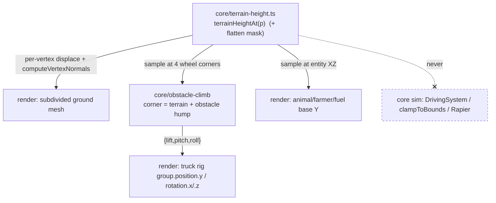

# ADR 0017 — Terrain expansion (~6×) and visual-only rolling hills

Status: Proposed (Sprint 5)
Date: 2026-07-11
Related: `docs/requirements/terrain-expansion-and-hills.md` (issue #49, AC1-AC10 + 5 open questions); ADR 0001 §2 (kinematic-only physics — the safety invariant this doc preserves), §4 (`core/` purity boundary), §5/§7 (systems wiring); ADR 0013/0014 (obstacle-climb four-corner sampling — extended here to add terrain height); ADR 0012 (environment dressing — the river/mountain/structures this doc must leave functional, and the obstacle-rendered-height↔climb shared tunable it introduced); `src/core/terrain.ts`, `src/core/driving/boundary.ts`, `src/core/driving/obstacle-climb.ts`, `src/render/scene.ts`.
Cross-reference (shared-tunable interaction, per the Sprint-1 fairness retro): this ADR feeds a second height source (terrain hills) into the *same* four-corner climb lift/tilt that ADR 0014's `DEFAULT_CLIMB_CONFIG` is tuned against for bush/rock/derelict-car. That coupling is reconciled in §Decision-4 and §Risks, and a pointer is added to ADR 0014.

## Context

The ground today is a single flat 40×40 quad (`TERRAIN_BOUNDS` −20..20, one `PlaneGeometry(width,depth)` with no subdivision) and every part of the truck's movement is pure 2D (`DrivingSystem` operates on `Vec2` x/z only; there is no Y axis anywhere in the sim). The player asked for a bigger map "with hill and slope, like a typical golf course." Issue #49 asks for two things: expand the drivable area ~6× and give the ground a gently rolling, visual-only character — while keeping the truck's real movement/collision math byte-for-byte unchanged (AC8 hard safety constraint, a deliberate preservation of ADR 0001 §2's no-rigid-body-dynamics decision, because an unpredictable/flippable truck is wrong for this young-child audience). Existing content (three obstacles, four structures incl. the mountain landmark, the river) must stay put and keep working (AC3). The hill "rise/tilt" of the truck must reuse the existing obstacle-climb visual language (AC7), not invent a new one. This is explicitly *not* a physics change and *not* a re-layout of existing content.

## Decision

### 1. Hill authoring: a pure analytic sum-of-sines height field in `core/`, the single source of truth for both rendering and truck lift

Add a new pure module `src/core/terrain-height.ts` exporting `terrainHeightAt(p: Vec2): number` — a deterministic, stateless, closed-form height field built from a small sum of low-frequency sinusoids (2–3 "octaves", broad wavelengths, small amplitude). No `three`, no Rapier, no data files, no RNG — plain math, honoring ADR 0001 §4.

```
// illustrative shape; exact constants are DEFAULT_HILL_CONFIG tuning (§Open questions Q5)
rawHeight(x,z) = A1*sin(x/λ1)*cos(z/λ1) + A2*sin(x/λ2 + φ)*cos(z/λ3) + …
terrainHeightAt(p) = flattenMask(p) * rawHeight(p.x, p.z)
```

This is the key architectural decision: **one pure function is the authoritative hill surface, sampled in two places that must agree** — the render layer displaces the ground mesh with it, and the `core/` climb sampler lifts the truck rig with it. Because it is a single pure function, the rendered hills and the truck's climb response are guaranteed identical by construction (the truck can never float above or sink into a hill it's supposedly driving over — a class of bug that two independent height sources would invite).

**Why analytic sum-of-sines** over the alternatives (see §Alternatives): it is a pure function samplable at *any* XZ point (exactly what the four-corner climb sampler needs), it is C¹-smooth everywhere so hills are inherently gentle/rounded/golf-course-like with no popping, it produces continuous rolling terrain across the *whole* 100×100 rather than discrete mounds, and it costs zero download and no asset dependency.

Amplitude is deliberately small — peak hill height on the order of ~1–1.5 units, an order of magnitude below the mountain landmark's ~16.3-unit rendered height (ADR 0012 addendum) — satisfying AC6 (hills are clearly a smaller scale than the one dramatic mountain) by construction.

### 2. Rendering the hills: subdivide the ground plane, displace by the field, recompute normals

`render/scene.ts`'s ground mesh changes from `PlaneGeometry(width, depth)` (2 triangles) to a subdivided `PlaneGeometry(width, depth, segX, segZ)` whose vertices are displaced in Y by `terrainHeightAt`. Build steps (one-time, at scene creation):

1. Create the subdivided plane, rotate flat as today (`rotation.x = -π/2`).
2. For each vertex, set its height from `terrainHeightAt({x, z})` (in world XZ, accounting for the plane's rotation/offset).
3. Call `geometry.computeVertexNormals()` — **required**: without recomputed normals a displaced plane still shades like a flat sheet and the hills are invisible under the directional sun (this is the AC10 "visible from ordinary driving positions" mechanism — lit contour shading is what makes gentle hills read; the existing `MeshStandardMaterial` + `DirectionalLight` already provide the shading once normals are correct).

Subdivision density is a perf/fidelity tuning knob (recommend ~128×128 segments ≈ 16k verts / 33k tris as a starting point — enough to represent the broad wavelengths smoothly, trivially cheap as a *static* mesh built once, zero download). The requirements doc correctly flagged a materially larger mesh as a real cost to size, not assume free; sized here, it is a one-time build with negligible per-frame cost and no bandwidth cost (procedural).

### 3. Extending the four-corner climb sampler to read terrain height (AC7)

The truck's hill rise/tilt reuses ADR 0014's existing four-corner sampler verbatim in shape — I add terrain height into the per-corner height, nothing downstream changes. `computeClimbTransform` gains one injected parameter, a terrain sampler:

```ts
computeClimbTransform(
  truckPos, heading, footprint, passable, config,
  sampleTerrainHeight: (p: Vec2) => number,   // NEW — injected, pure
): ClimbTransform
```

Per corner, the sampled height becomes the sum of the terrain surface and the tallest obstacle hump under that corner:

```
cornerHeight[c] = sampleTerrainHeight(cornerWorldPos[c])
                  + max over passable obstacles of heightField(cornerWorldPos[c], obstacle, config)
```

`lift = mean(4 corners)` and `pitch`/`roll = finite differences between the front/rear and left/right pairs` are **completely unchanged** — they already turn "four corner heights" into `{lift,pitch,roll}`, and they don't care whether a corner's height came from an obstacle hump or a hill. So driving over a hill produces exactly the same lift + nose-pitch response the truck already gives over a passable obstacle (AC7), in the same visual language, through the same code path. `main.ts` passes `terrainHeightAt` as the sampler; the output `{lift,pitch,roll}` still feeds `setTruckTransform`'s existing render-only application (`group.position.y`, `group.rotation.x/.z`).

**Injecting the sampler (rather than importing `terrainHeightAt` directly inside the module) is deliberate** — it preserves ADR 0014's "everything the sampler needs is passed in, unit-testable with stubs" character, and it is what makes the AC8 regression test cheap: a test passing `() => 0` proves the terrain extension is byte-identical to today's obstacle-only behavior (§Testing).

**#52 (truck suspension) extension point — kept clean, not built:** the sampler seam is the obvious place #52's per-wheel suspension work will hook. #52 changes *how* the four corner heights map to the rig (per-wheel travel vs. the current whole-rig mean/tilt); this ADR changes only *what feeds* a corner's height (now terrain + obstacle). Those are orthogonal — #52 rewrites the mean/finite-difference block, this doc leaves it untouched and only widens the height input. No suspension state, no per-wheel planting, is introduced here (still a whole-rig approximation, ADR 0013/0014's accepted trade).

### 4. Expanded bounds + preserving existing content: flatten the hill field around everything with a collider or a fixed y=0 placement

`TERRAIN_BOUNDS` expands to **−50..50 on both axes (100×100 = 6.25× the old 40×40 area)**, satisfying AC1's "~6×." Because bounds flow through as constants, most of the expansion is free:

- **Soft boundary (AC2):** `clampToBounds` / `clampCameraToBounds` are pure min/max on X/Z — behavior is identical at any extent, just a farther edge. No code change, no doc change to the clamp mechanic (it stays the invisible soft wall; Q3 already resolved to keep it invisible). Confirmed sensible at the new size.
- **Ground mesh:** already sized from `bounds` width/depth — grows automatically.
- **Spawns (AC4):** `pickSpawnPosition` samples uniformly across `bounds` and every spawn system already reads `TERRAIN_BOUNDS`, so spawns use the full new area the moment the constant changes, while `structureKeepouts` + obstacle keep-outs continue to apply. No spawn *bounds* code change needed (spawn *rate* rebalancing is out of scope — Q4).
- **Camera far plane:** currently 200; a 100-unit map's diagonal (~141) plus the far mountain fits, but verify in-scene (see §Risks). Optional distance fog is a cheap enhancement that both improves hill depth-reading and softens the far edge without a hard visible wall (consistent with Q3's invisible-boundary resolution) — recommended, not required.

**Existing content stays at its current coordinates (Q1: recommend leave in place).** The mechanism that keeps it functional is a **flatten mask** in `terrainHeightAt`: the field is smoothly damped to ~0 within a keep-clear radius of every obstacle, every structure, the river route, and the truck start (0,6), blending to full amplitude outside. This single decision buys three things at once:

1. **Planting for free (AC3):** obstacles/structures/river/truck-start sit on flat ground at y=0 exactly as today — no per-object Y adjustment, and their flat 2D colliders (kinematic character, structure cylinders, all on the y=0 plane) stay aligned with their visuals. No collider mismatch a hill under a barn would otherwise cause.
2. **Protects the ADR 0014 climb tuning (the cross-mechanic reconciliation):** because `terrainHeightAt ≈ 0` at every obstacle footprint, the extended corner-height sum reduces to the pure obstacle hump over bush/rock/derelict-car — so `DEFAULT_CLIMB_CONFIG`'s carefully screenshot-tuned rock-clipping fix is **not perturbed**. Had terrain height been nonzero under the rock, it would stack onto the obstacle hump and could re-introduce over-lift/over-tilt (clipping or exaggerated pitch) — precisely the Sprint-1-class "two individually-reasonable numbers decided apart" interaction. Flattening around obstacles keeps the two mechanics decoupled where they meet. (See §Risks and the pointer added to ADR 0014.)
3. **Reachability:** everything remains driveable-to across flat approaches; the surrounding new area is empty and rolling.

**Dynamic entities (animals, farmer, fuel pickups) are grounded by sampling the same field.** They spawn anywhere in the now-hilly 100×100, so their render placement samples `terrainHeightAt(pos)` for base Y (per frame for the moving ones — cheap, pure) so they sit on hills instead of floating/sinking. This is a small, necessary render-layer addition for AC5/AC10 to actually look right (a half-buried cow on a hillside would be an obvious defect), and it reuses the exact same pure function — no new mechanism. **Scope boundary:** grounding adjusts only their Y (translation); it does *not* pitch/roll them to the slope, and does not touch their existing facing/yaw logic. Slope-matching orientation for animals is a possible future nicety, explicitly out of scope here.

### 5. Spatial orientation is designed as its own concern (per the Sprint-4 retro convention)

The truck is a moving visual entity, so its orientation is designed separately from "what it looks like":
- **Yaw (facing its direction of travel):** unchanged, owned by existing driving math — `group.rotation.y = heading` from `DrivingSystem`. Hills do not touch it.
- **Pitch/roll (conforming to the terrain contour under it):** owned by this ADR's climb transform, computed from the four-corner terrain+obstacle samples, applied render-only on the rig group. This is the "tilt to follow the hill" of AC7, kept entirely distinct from yaw and from the wheel-spin animation (#40, child-local, disjoint per ADR 0013/0014 §Composition).

There is no ambiguity here to leave undesigned: the truck already turns to face travel (yaw), and hills add contour pitch/roll on top, both explicitly accounted for.

## Alternatives considered

- **Placed decorative mesh mounds** (discrete hill objects, like obstacles/structures). Rejected: the climb sampler would need each mound's position/shape as data (re-deriving a per-mound height field), it reads as scattered bumps rather than continuous rolling terrain, and it duplicates the "shape data" problem the analytic field avoids. The sum-of-sines gives whole-map rolling for free.
- **Baked heightmap texture (image → displacement).** Rejected: adds download weight (against ADR 0010's budget), needs a bilinear sampler duplicated in `core/` to keep render/sim agreement, and is harder to guarantee C¹-smooth/gentle than a closed-form field. No upside for a stylized golf-course look.
- **Perlin/simplex procedural noise.** Rejected as mild over-engineering: a 2–3 term sine sum is enough for "gentle rolling," is trivially C¹ and bounded, and is easier to reason about/flatten-mask than layered gradient noise. Noise is a drop-in later if the look wants more variety (same seam).
- **Real slope physics / ground-follow on the collider.** Explicitly rejected by AC8 and ADR 0001 §2 — out of scope, would reintroduce flip/stuck risk for a young child.
- **Per-object Y placement instead of a flatten mask around existing content.** Rejected for static/collidable content: it leaves structure colliders (flat, y=0) mismatched with a tilted visual, and — critically — it puts nonzero terrain height under the obstacles, perturbing the ADR 0014 climb tuning. The flatten mask sidesteps both. (Dynamic entities *do* use per-object Y sampling, where there's no collider-alignment or climb-tuning concern.)

## Consequences

- **The hills are guaranteed to match the truck's climb because both read one pure function** — the load-bearing property. The cost is a discipline note: any future change to `terrainHeightAt` (constants, mask) changes both the rendered surface and the truck lift together (which is what we want) — never fork it into a render-only copy.
- **`computeClimbTransform` gains one parameter.** Every call site and test passes a sampler. Contained to `main.ts` (one already-cross-layer call) and the unit suite. `render/scene.ts`'s `setTruckTransform` is untouched (output shape unchanged).
- **Zero physics risk, by the same structural argument as ADR 0013/0014, now extended.** Terrain height feeds *only* the render-rig transform (`group.position.y` / `rotation.x/.z`) and dynamic-entity render Y. It never reaches `integrateTruckMotion`, `moveBy`/`setPosition`/`step`, the Rapier collider, or `clampToBounds`. The sim has no Y axis and no terrain input — AC8 holds structurally, not by tuning.
- **Existing obstacle-climb behavior is preserved exactly** because the flatten mask zeroes terrain height at every obstacle footprint (the corner-height sum collapses to today's obstacle-only value there). ADR 0014's tuning does not need re-tuning for this change.
- **New render cost:** a ~16k-vert static ground mesh (one-time build, no per-frame or bandwidth cost) and a per-frame `terrainHeightAt` sample for each moving grounded entity (a few sinusoids each — negligible). Sized, not assumed free.
- **What becomes harder:** placing *new* static, collidable content in the future now requires either adding it to the flatten mask or accepting it sits on a slope (with the collider-alignment caveat). Documented so the farm-layout epic (which follows this) knows the mask is the hook for keeping new buildings planted.

## Component / data design

| Location | Change | Responsibility |
|---|---|---|
| `src/core/terrain-height.ts` *(new)* | `terrainHeightAt(p): number`; `DEFAULT_HILL_CONFIG` (amplitudes, wavelengths); the flatten mask keyed off the existing terrain data (obstacles/structures/river/truck-start) | Pure, authoritative hill surface. No `three`/Rapier. Single source of truth. |
| `src/core/terrain.ts` | `TERRAIN_BOUNDS` → −50..50 both axes. Content coordinates unchanged. | Bounds constant + existing placement data (also the flatten-mask input). |
| `src/core/driving/obstacle-climb.ts` | add injected `sampleTerrainHeight` param; add its value to each corner height before the existing mean/finite-difference block (which is unchanged) | Pure geometry; now terrain+obstacle corner heights → `{lift,pitch,roll}`. |
| `src/main.ts` | pass `terrainHeightAt` into the per-frame `computeClimbTransform` call | Systems-wiring seam. |
| `src/render/scene.ts` | subdivide + displace + `computeVertexNormals` the ground mesh; ground dynamic entities (animal/farmer/fuel) by sampling `terrainHeightAt` for base Y | Dumb adapter: renders the surface the core field defines. |



The crossed edge is the AC8 invariant: the hill field never reaches the sim.

## Risks

- **Render/sim height disagreement** — the failure this design exists to prevent (truck floats above / sinks into a hill). Mitigated structurally by the single pure function; the only way to break it is to fork the field. Noticed instantly in a live screenshot (the CLAUDE.md "always look at it" rule applies — this is the exact class of thing unit tests miss).
- **Shared climb tunable with ADR 0014/0012 (the Sprint-1-retro reconciliation).** Terrain height now feeds the same four-corner lift as the obstacle humps. Left unchecked, a hill under an obstacle would stack heights and could re-break the rock cab-clipping fix or over-tilt. Reconciled by the flatten mask zeroing terrain at every obstacle footprint (§Decision-4), so today there is no interaction. A pointer is added to ADR 0014 so a future change that *removes/shrinks* an obstacle's flatten radius knows to re-check `DEFAULT_CLIMB_CONFIG`. Noticed by the "flatten mask ≈ 0 at each obstacle" unit assertion and the rock-crossing screenshot.
- **Hills invisible despite displacement** if `computeVertexNormals` is forgotten — the plane displaces but shades flat. Noticed immediately in-scene; called out as a required step, not optional.
- **Flatten radius too small → an obstacle/structure ends up on a visible slope** (collider/visual mismatch, or climb-tuning drift). Noticed in screenshots; mitigated by sizing each mask radius from the object's footprint + margin, tunable in one place.
- **Chaotic tilt from hills** — guarded by the existing `maxPitch`/`maxRoll` clamps the terrain tilt flows through, plus the deliberately small hill amplitude and long wavelengths (gentle slopes → small finite-difference angles). `maxRoll` currently defaults to 0; see Open questions Q5 note — raising it to let hills roll the truck also enables roll over obstacles (shared knob), so any change must be validated against both.
- **Camera far plane / far-edge readability** at 100×100. Noticed if the far mountain or hills clip out. Mitigated by verifying/raising `far` and/or adding distance fog.
- **Grounded moving entity jitter** if `terrainHeightAt` were ever non-smooth. Mitigated by the C¹ field; noticed as popping in playtest.

## Testing / verifying AC8 (truck can't get stuck/flip), given the kinematic model

The strongest guarantee is structural (terrain never enters the sim), backed by explicit guards:

- **Regression guard (the important one):** `computeClimbTransform` with `sampleTerrainHeight = () => 0` produces **byte-identical** `{lift,pitch,roll}` to the pre-#49 obstacle-only path, across the existing obstacle-climb test cases. Proves the extension can't perturb existing obstacle behavior or the ADR 0014 tuning.
- **Movement-isolation guard (AC8 direct):** a property/parameterized test asserting the truck's XZ position and velocity trajectory over a batch of random input sequences is identical whether or not hill data exists. Trivially true today (no coupling) — asserted anyway so a future dev cannot wire terrain into movement without a failing test. This is AC8's "simulated position/velocity identical whether or not hill data is present" made literal.
- **Hill lift/tilt is bounded (chaos guard):** with a hill sampler and empty obstacles, `lift > 0` over a rise, `pitch` never exceeds `maxPitch`, `roll` never exceeds `maxRoll`, for gentle slopes at every approach heading — the truck can't be thrown into an orientation flat ground couldn't produce (AC8c).
- **Field invariants:** `terrainHeightAt` is bounded within `[−A, +A]`, continuous, and `≈ 0` at each obstacle/structure/river/truck-start coordinate (assert against the actual terrain data — this is also the flatten-mask/ADR-0014 protection guard).
- **Boundary at new size:** `clampToBounds` keeps the truck inside −50..50 and never leaves it stuck at the edge (extend existing `boundary.test.ts` with the new extent).
- **Live verification (mandatory, per CLAUDE.md):** drive over multiple hills at varied angles and speeds and confirm (a) visible rise + nose-pitch matching the contour, (b) the truck never stalls, wedges, flips, or launches, (c) it reads as real terrain under the truck, (d) obstacles/structures/river/animals all sit planted (no floating/burying), (e) bush/rock/derelict-car crossings are unregressed. The unit suite cannot see clipping or planting — a second independent screenshot pass is required.

## Open questions — answers / referrals

- **Q1 (reposition existing content):** *Product call — referred to human.* Technically, leaving content in place is clean and fully supported by the flatten mask (recommended, matches the requirements doc). A partial re-layout would widen scope and is better left to the farm-layout epic that follows.
- **Q2 (literal golf fairway/mowed texturing):** *Product call — referred to human.* Technically out of scope here; the sine field delivers the *shape*. Color banding / fairway theming is a separable render nicety (a material/shader pass) that can layer on later with no change to this design.
- **Q3 (visible edge treatment):** already resolved to keep the boundary invisible. This design keeps the soft clamp unchanged; optional distance fog softens the far edge without a hard wall. No clamp doc change needed.
- **Q4 (spawn rate/density scaling for the bigger map):** *Product call — referred to human.* Technically, AC4 only requires spawns to *use* the full area (satisfied for free). At 6.25× area with today's tuning, encounters will feel sparser; recommend a small follow-up story to retune intervals/counts once the bigger map is playable and can be *felt*, not guessed.
- **Q5 (hill count/size/height range):** *Mostly technical/tuning — recommended defaults, final look is a screenshot + taste call.* Recommend: peak amplitude ~1.0–1.5 units (≈1/10 of the mountain's ~16.3, satisfying AC6), wavelengths ~18–35 units (broad, gentle), 2–3 sine terms, in `DEFAULT_HILL_CONFIG` for one-line tuning. `maxRoll` stays 0 initially (lift + pitch already read as terrain and are the safest choice for AC3/AC8); raising it is a shared knob that also affects obstacle crossings and must be validated against both. Final amplitude/wavelength are a live-screenshot tuning pass, same spirit as the other deferred playtest constants.

## Addendum (2026-07-12) — dramatic cliff/canyon zones + chase camera now tracks truck lift (issue #54)

The #54 reference-art redesign (see `docs/architecture/0019-farmstead-layout-and-breakable-fences.md` §Amendment
(2026-07-12) §A2) extends this ADR's `core/terrain-height.ts` height field with a **zone-gated dramatic-relief term**
(larger-amplitude, still-C¹ sum-of-sines, gated to authored `DRAMATIC_ZONES` in the map's empty peripheral pockets),
so some regions read as steep mesas/canyons while the drivable core stays the gentle golf-course field this ADR
designed. It remains visual-only — the AC8 invariant (terrain height never reaches the sim) and the flatten-mask
protection of the ADR 0014 climb tuning are both preserved unchanged.

**One decision in this ADR is superseded:** §Decision-4 and the §Risks note left the chase camera's *fixed* height
(`CAMERA_CHASE_HEIGHT`, issue #17) alone because the hills were ~1.4 units tall — the truck barely leaves y≈0. With
#54's dramatic elevation the truck rig can lift many units, which would push it out of the top of a fixed-height
frame. **Superseded 2026-07-12:** the chase camera now tracks the truck's terrain lift in Y
(`camera.position.y = CAMERA_CHASE_HEIGHT + truckRig.group.position.y`, look-target lifted to match). This is the
Sprint-1-retro-class reconciliation for #54 — see ADR 0019 §Amendment §A2 point 4 for the full rationale.
