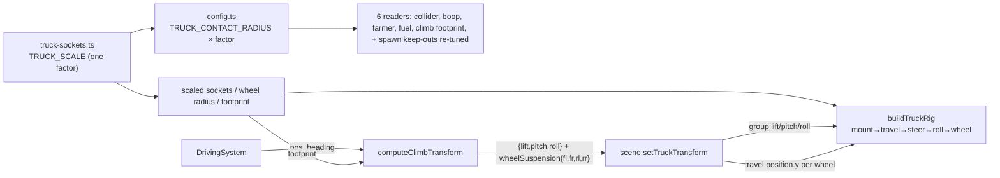

# ADR 0018 — Bigger truck (proportional hitbox) + independent per-wheel suspension

Status: Proposed
Date: 2026-07-11
Related: `docs/requirements/truck-scale-and-suspension.md` (issue #52, AC1-AC12 — source of truth); ADR 0001 §2 (kinematic-only physics), §4 (`core/` purity boundary); ADR 0011 §4 (single `buildTruckRig()` invariant) / `src/render/truck-sockets.ts` (per-tier scale/socket data — the seam this lands in); ADR 0013/0014 (obstacle-climb four-corner sampling this suspension extends); ADR 0017 (terrain hills — added the injected height source #52 builds on); `docs/requirements/truck-wheel-motion.md` (issue #40 wheel roll/steer-yaw this must coexist with).
Builds on (extends, does not supersede): ADR 0014's four-corner height sampler; ADR 0017's per-corner injected height source.
Shared-tunable cross-check (Sprint-1 retro discipline): `TRUCK_CONTACT_RADIUS` is a shared tunable read by the Rapier collider, three gameplay contact checks, and the climb footprint. Growing it interacts with the farmer-contact geometry of ADR 0003/0007 and the climb tuning of ADR 0014 — reconciled in §Consequences and §Risks; pointers added to ADR 0014 and ADR 0007.

## Context

Player feedback (roadmap ask #4): make the truck bigger and add a suspension effect when it climbs objects. Two decisions are already locked by the human in the requirements doc: (1) the collision hitbox scales *with* the visual size by the same factor, so every distance tuned against today's smaller hitbox must be re-checked (AC3/AC4); and (2) suspension is *true independent per-wheel* vertical travel layered on top of — not replacing — the existing whole-body lift/tilt (AC6/AC7). The hard constraint carried project-wide: this must stay inside the arcade-kinematic architecture (ADR 0001 §2) — no real vertical-physics axis on the collider — exactly like the whole-body tilt it extends. This ADR covers both halves because they share the four-corner sampler seam and their design decisions interlock, but see §Split recommendation — they are separable stories.

## Decision

### 1. Size increase — one global `TRUCK_SCALE`, folded into the per-tier data (not a group scale)

Introduce a single global constant `TRUCK_SCALE` (proposed default **1.35**, i.e. +35%; playtest range 1.25–1.5) and apply it **inside the per-tier data derivation in `truck-sockets.ts`**, not as a `group.scale` on the assembled rig. Concretely, every per-tier quantity `truck-sockets.ts` already owns is multiplied by `TRUCK_SCALE` at export time:

- `BODY_TIER_SOCKETS[*]` — `body`, all four `wheels`, `engine`, `gasTank` vectors, and `bodyScale`/`wheelScale`.
- `WHEEL_RADIUS_BY_TIER[*]`.

Because `TRUCK_SCALE` is a *single global* multiplier applied identically to all three tiers, the Tier 0 < Tier 1 < Tier 2 progression is preserved exactly (AC2) — it is a uniform enlargement, provably, not a per-tier retune. `footprintForBodyTier`, the wheel-roll circumference (`2π·WHEEL_RADIUS_BY_TIER`), camera framing, and the loaded-model corrective scales all read these tables and become correct with **zero call-site edits** — the factor lives in one place.

The truck's collision/contact radius is scaled by the *same* factor: `TRUCK_CONTACT_RADIUS` becomes `0.9 * TRUCK_SCALE` (kept a single shared value across tiers — see §Alternatives; a per-tier hitbox is deliberately *not* introduced, as it would change relative boop/bump reach between tiers and stray into the AC5 "no rebalance" line).

**Why fold into data rather than `group.scale.setScalar(TRUCK_SCALE)`:** the whole-body climb `lift` and the new per-wheel suspension offsets are computed in *world units* against obstacle rendered heights and applied to the rig group / its wheel pivots. If the group carried a non-unit scale, every such offset applied on a child node would be magnified by `TRUCK_SCALE` and would need dividing back out — an error-prone double-scale. Keeping `group.scale = 1` and enlarging via the data tables keeps world units honest for both the existing lift/tilt and the new suspension math. This is the deciding reason.

### 2. Downstream re-tuning ripple (AC4)

All six readers of `TRUCK_CONTACT_RADIUS` pick up the bigger value automatically (they read the one constant). "Becoming tier-aware" is therefore **not** the work — the work is re-checking the *neighbouring* constants each reader is tuned against, and confirming by human playtest (AC4 is explicitly playtest-verified, not code-inspection-verified):

| # | Call site | What the bigger radius does | Re-tuning action |
|---|---|---|---|
| 1 | `main.ts` `new TruckController(..., TRUCK_CONTACT_RADIUS, ...)` | Physics collider cylinder grows → truck collides with structures/blocking obstacles from further out; may fit through fence gaps / structure spacing less easily. **This is the only gameplay-affecting reader.** Still a bigger *static* collider, no new vertical axis (kinematic invariant intact). | Playtest: confirm the truck still traverses the map (fence gaps, structure spacing, river crossings) without newly getting stuck. If it does, widen the relevant gaps or accept — do **not** shrink the collider away from the visual size (that would re-break AC3). |
| 2 | `animal-system.ts` `isBoopContact` (reach = `truckRadius + animalRadius`) | Booping is easier; risk of contacting multiple animals in one pass that previously needed separate passes (AC4's "unintentionally easier"). | Playtest; if multi-boop-per-pass appears, raise `MIN_SPAWN_DISTANCE_FROM_TRUCK` and/or spacing. |
| 3 | `farmer-system.ts` `isFarmerContact` (reach = `truckRadius + FARMER_CONTACT_RADIUS`) | Farmer bump lands from further out → bumps connect more easily. Shared-tunable interaction with ADR 0003/0007 — see §Consequences. Does **not** break the "always outrunnable" *speed* guarantee (that is speed-based and unchanged). | Playtest for fairness feel; if bumps feel cheap, trim `FARMER_CONTACT_RADIUS` to hold the pre-change effective reach roughly constant. |
| 4 | `fuel-system.ts` `isFuelContact` (reach = `truckRadius + FUEL_CONTACT_RADIUS`) | Fuel pickups grabbed from further out (easier). | Usually benign/positive; playtest, trim `FUEL_CONTACT_RADIUS` only if it feels like auto-collect. |
| 5 | `obstacle-climb.ts` `combinedRadius = obstacle.radius + TRUCK_CONTACT_RADIUS` | Climb footprint widens → lift activates slightly earlier and the raised-cosine hump spreads over a larger area, marginally *lowering* realized per-corner lift at a given distance. | Re-check `DEFAULT_CLIMB_CONFIG` (`liftScale`/`maxLift`/`maxLiftByClass`) against live rock/bush/derelict-car screenshots, same discipline as ADR 0014's re-tune. |
| 6 | Spawn keep-outs (`MIN_SPAWN_DISTANCE_FROM_TRUCK=4`, `FARMER_MIN_SPAWN_DISTANCE_FROM_TRUCK=8`, `FUEL_MIN_SPAWN_DISTANCE_FROM_TRUCK=4`) — measured from truck **center**, not radius-adjusted | A spawn 4 units from center is now closer to the bigger truck's *edge* → things can appear "on top of" the larger truck (AC1 "not on top of the player" intent). | Raise each keep-out by roughly the contact-radius growth `Δ = 0.9·(TRUCK_SCALE − 1)` (~0.32 at 1.35). Keep `FARMER_MIN` change consistent with the `FARMER_CREEP_FLOOR·FARMER_CHASE_DURATION ≥ FARMER_MIN_SPAWN_DISTANCE` invariant test (10 ≥ 8 today; +0.32 → 10 ≥ 8.32 still holds — but the developer must re-run that assertion). |

Final magnitudes for #1–#6 are **tuning values confirmed by a dedicated human playtest pass against the pre-change baseline**, not fixed here (AC4).

**Addendum (2026-07-12, ADR 0019 pointer):** the breakable-fence mechanic (issue #54, ADR 0019) adds a **7th reader** of `TRUCK_CONTACT_RADIUS` — `isFenceContact`, the fence-collapse trigger. The bigger radius collapses fences from slightly further out, which is benign/positive (smashing through is the intended fantasy, not a fairness-sensitive bump). The interaction to watch from *this* ADR's side is reader #1's own note — the enlarged **collider getting wedged against a *standing* fence** in a pinch point; ADR 0019 §Layout adds a fence-gap/pinch clearance rule and a traversal playtest for exactly that. If `TRUCK_CONTACT_RADIUS` is retuned later, re-check `isFenceContact` alongside the six readers above.

### 3. Per-wheel suspension — decompose the four corner heights into a rigid plane + per-wheel residual

The four-corner sampler (ADR 0014, height source extended by ADR 0017) already computes four corner heights `h[FL,FR,RL,RR]` per frame and collapses them into one rigid `{lift, pitch, roll}`. A rigid plane (mean + front/rear gradient + left/right gradient) captures the mean and two tilts but **cannot** represent the fourth degree of freedom — the diagonal *warp* — and, because `maxRoll` defaults to `0` (the AC10 anti-chaos clamp), it also *suppresses the entire left/right tilt*. So today a single wheel corner going over an obstacle lifts and pitches the body but the two wheels on that axle move together and the cab never leans — there is no independent left-vs-right articulation. That gap is exactly what per-wheel suspension fills.

`computeClimbTransform` is extended to **also return a per-wheel vertical offset** `wheelSuspension: { fl, fr, rl, rr }`, computed as the residual of each corner height after the *actually-applied (clamped)* rigid plane is removed:

```
planeHeight[c] = lift + pitchComponentAt(c) + rollComponentAt(c)   // using the clamped pitch/roll this fn returns
wheelSuspension[c] = clamp( travelGain * (h[c] − planeHeight[c]),  maxTravel )
```

With `travelGain = 1.0` this makes each wheel plant *exactly* on its own sampled contact height while the body rides the average plane — the standard raycast-suspension look. The residual is small where the rigid plane already accounts for the height (e.g. an obstacle fully under the front axle: body pitches nose-up, front wheels get only the leftover), and carries the *full* articulation on the roll axis the chassis intentionally refuses to show (a wheel over a one-sided bump travels up on its own while the cab stays level — the safest, most kid-friendly reading of "each wheel moves independently", no side-to-side cab lean). The whole-body `{lift, pitch, roll}` is returned unchanged and applied exactly as today (AC7 — layered, not replaced).

New tuning block `SuspensionConfig` (analogue of `ClimbConfig.maxLift`/`tiltGain`):

- `travelGain` (default **1.0**) — multiplier on the residual; 1.0 = plant-on-contact, <1 damps, >1 exaggerates.
- `maxTravel` (default **≈0.25** world units, to re-confirm after `TRUCK_SCALE`) — hard clamp on each wheel's offset magnitude so no wheel can launch (AC10).

**Stateless, like the climb it extends.** The offset is a pure function of position (the height field is already C¹-smooth, easing to 0 at the footprint edge), so there is no time-integration, no idle bounce, and no stop/reverse/re-entry special-casing. On flat ground every `h[c] = 0` → `planeHeight = 0` → `wheelSuspension = 0`: no phantom motion (AC11) by construction. A critically-damped smoothing knob is noted as a *future* option if playtest wants a softer settle, but is deliberately not in the default design (keeps the ADR 0013/0014 statelessness).

### 4. Applying the offset without corrupting roll/steer-yaw (AC9)

The suspension offset is a **pure vertical translation** injected on a **new dedicated node** in the wheel pivot stack, above the existing steer/roll pivots:

```
group (scale = 1)
└─ mountPivot      position = socket (static, per-tier, TRUCK_SCALE-folded)
   └─ travelPivot  position.y = wheelSuspension[c]   ← NEW (suspension, per frame)
      └─ steerPivot rotation.y = steer-yaw            (issue #40, front wheels only)
         └─ rollPivot rotation.x = roll spin          (issue #40, every wheel)
            └─ wheelObject
```

`WheelPivots` gains a `travel: THREE.Group` alongside `steer`/`roll`. A parent translation and its children's rotations compose independently in a TRS node — translating `travelPivot` by Y moves the whole yaw/roll subtree rigidly, and the child rotations still happen in that translated frame, so roll still spins about the axle and steer still yaws about vertical. This is the *same* separation-of-concerns rationale the existing `WheelPivots` doc-comment already uses for keeping steer and roll on distinct nested nodes (so a later Euler rotation can't reorient an earlier axis) — extended by one node for translation. Because it is translation, not rotation, there is no Euler-order interaction at all. This is the concrete AC9 mitigation.

### 5. Orientation is a separate concern from suspension pose (project convention)

The truck is a moving visual entity, so its spatial orientation is designed as its own concern, distinct from the suspension "pose": the truck yaws to face its travel direction via `heading` on `group.rotation.set(pitch, heading, roll, 'YXZ')` (unchanged, ADR 0013 convention); front wheels yaw to steer and all wheels spin to roll (issue #40, unchanged). The new suspension is **translation-only** and adds *no* rotation to any entity — it does not touch heading, steer-yaw, or roll. Orientation-to-travel therefore remains correct and independent; suspension changes only vertical position. Nothing in this design alters what faces where.

### 6. Kinematic-only / visual-only confirmation

The suspension writes only Three.js node transforms (`travelPivot.position.y`) — the same category as the existing climb lift/tilt and the wheel roll/steer. It never calls `moveBy`/`setPosition`/`step`, never touches the Rapier collider, and never touches `core/clearance.ts`'s blocking/passable rule (AC12). The collider *radius* does grow with the truck (§1), but that is a bigger static cylinder, not a new vertical-physics axis — the controller stays kinematic and XZ-planar, consistent with ADR 0001 §2 and identical in spirit to ADR 0017's approach.

### 7. Builder-preview implication

The builder preview calls the same `buildTruckRig()` (ADR 0011 §4). It gets the bigger size for free because the size lives in the `truck-sockets.ts` data the preview already reads — no preview-specific change. Suspension motion is omitted: the preview has no driving/obstacle state, so `computeClimbTransform` is never called for it and every `travelPivot.position.y` stays 0 (same precedent as `truck-wheel-motion.md`'s non-goal for the preview). Single-rig invariant intact.

## Alternatives considered

- **`group.scale.setScalar(TRUCK_SCALE)` on the assembled rig.** Rejected: it leaves the socket/footprint/wheel-radius tables unscaled, so the factor leaks into ≥3 downstream consumers (climb footprint, roll circumference, camera) anyway, *and* it magnifies every child-node suspension/lift offset by the scale, forcing a divide-back-out. Folding into data is both fewer leaks and cleaner world-unit math.
- **Per-tier contact radius (a `truckContactRadius(tier)` replacement).** Rejected as default: today's radius is one shared compromise value across three differently-sized tiers; making it per-tier would give tier-2 a larger boop/bump reach than tier-0 — a relative-reach change that strays into AC5's "no rebalance." A single value scaled by the global factor satisfies AC3 ("same factor per tier") without that. Flagged as an open question in case the human wants per-tier hitboxes.
- **Suspension = separate per-wheel raycast against the physics world.** Rejected: that is a real vertical-physics axis, violating ADR 0001 §2 / the hard constraint. The residual-of-the-shared-height-field approach reuses the sampler already proven for climb and stays visual-only.
- **`wheelSuspension[c] = h[c]` directly (not the plane residual).** Rejected: double-counts the lift/pitch the body already applies, so wheels would rise by roughly twice the intended amount and fight the chassis. The residual is the correct decomposition.
- **Stateful, spring-damped suspension.** Rejected as default: adds frame-to-frame state, a settle/overshoot that risks reading as "chaotic" (AC10), and stop/reverse re-entry edge cases the stateless climb deliberately avoids. Left as a future knob.

## Consequences

- **`DEFAULT_CLIMB_CONFIG` and the new `SuspensionConfig` will need a screenshot-driven tuning pass**, and the AC4 re-tuning is a real, separate verification effort (six neighbouring constants + a human fairness/feel playtest), not a code-only change. This is the bulk of the size-half's risk.
- **Shared-tunable interaction with the farmer (ADR 0003/0007), reconciled here:** growing `TRUCK_CONTACT_RADIUS` widens `isFarmerContact`'s reach (`truckRadius + FARMER_CONTACT_RADIUS`), so farmer bumps land from further out. This is the Sprint-1-retro *class* of interaction (two individually-reasonable numbers decided in separate ADRs), so it is checked explicitly rather than left for review. It does **not** falsify ADR 0007's guarantee, which is a *speed* guarantee ("farmer speed capped at 1/3 the truck's, always outrunnable") independent of contact radius — a bigger radius only matters once the farmer is already adjacent. The bounded effect (bumps connect slightly easier) is in-scope AC4 tuning: trim `FARMER_CONTACT_RADIUS` to hold the pre-change effective reach if playtest finds bumps cheap. A dated pointer is added to ADR 0007.
- **Physics collider growth is the one genuine gameplay-adjacent change** (map traversal / fit). It stays kinematic, but must be playtested against fence gaps and structure spacing.
- **The suspension carries the roll-axis articulation the chassis suppresses** (`maxRoll=0`). This is a feature (independent per-wheel motion without cab lean), but means "how independent the wheels look" is governed by `travelGain`/`maxTravel`, not by the body roll — tune there.
- **The four-corner sampler is now a foundation, not just a replacement seam.** ADR 0014 called out that real per-wheel contact would be "a replacement seam, not a foundation" — this ADR instead *extends* it (adds a return field, reuses the existing corner heights) without disturbing the `{lift,pitch,roll}` math. A pointer is added to ADR 0014.

## Component / data design

| Location | Change | Responsibility |
|---|---|---|
| `src/render/truck-sockets.ts` | Introduce `TRUCK_SCALE`; multiply all `BODY_TIER_SOCKETS` vectors + `bodyScale`/`wheelScale` and `WHEEL_RADIUS_BY_TIER` by it at export (via a derivation wrapper, so the authored numbers stay readable). | One place owns the size factor; footprint/roll/camera read scaled data automatically. |
| `src/core/driving/config.ts` | `TRUCK_CONTACT_RADIUS = 0.9 * TRUCK_SCALE` (import the factor or mirror it — keep `core/` `three`-free; a plain numeric constant duplicated with a comment is acceptable, same pattern as `farmer/config.ts` re-deriving limp speed). Add `SuspensionConfig { travelGain, maxTravel }` + `DEFAULT_SUSPENSION_CONFIG`. Re-check `DEFAULT_CLIMB_CONFIG`. | Tuning constants. |
| `src/core/driving/obstacle-climb.ts` | Extend `ClimbTransform` with `wheelSuspension: {fl,fr,rl,rr}`; after computing clamped `{lift,pitch,roll}`, compute `planeHeight[c]` and the clamped residual per corner. Pure, `three`-free (ADR 0001 §4). | The decomposition; reuses the four corner heights already computed. |
| `src/render/truck-rig.ts` | Add `travel: THREE.Group` to `WheelPivots`, inserted as `mountPivot → travelPivot → steerPivot → rollPivot → wheel`; `mountPivot` holds the socket, `travelPivot` starts at `y=0`. `carryOverWheelRotations` also carries `travel.position.y` on rebuild. | The new orthogonal suspension node. |
| `src/render/scene.ts` | Apply `climb.wheelSuspension` to each wheel's `travel.position.y` (fold into `setTruckTransform`, which already receives the `climb` object and has `truckRig.wheels`; when `climb` is omitted → offsets 0 → preview/other callers unaffected). Update `carryOverWheelRotations`. | Dumb adapter over numbers, no obstacle logic (unchanged pattern). |
| `src/main.ts` | No structural change — already calls `computeClimbTransform` each frame and passes `climb` to `setTruckTransform`; `climb` now also carries `wheelSuspension`. | Wiring seam unchanged. |
| Spawn/contact configs | Re-tune per §2 table (playtest). | AC4. |



## Risks

- **Under/over-lift after the widened climb footprint** — most likely surprise; caught in the mandatory climb screenshot pass (bush/rock/derelict-car), re-tune `DEFAULT_CLIMB_CONFIG`.
- **Truck gets stuck / can't fit** through fence gaps or structure spacing with the bigger collider — caught by a traversal playtest; widen gaps or accept, never shrink the collider off the visual size.
- **Double-count / sign error in the plane residual** — a wheel that rises by ~2× or sinks below ground signals `planeHeight[c]` sign wired wrong (pitch/roll conventions are the ADR 0013 `'YXZ'` ones; pin with unit tests: single-front-corner obstacle → that front wheel `travel.y > 0`, its rear counterpart ≈ 0; flat ground → all 0; obstacle fully centered → symmetric small positive). Also mandatory live screenshots — the ADR 0014 rock defect escaped unit tests and code review.
- **Suspension corrupting roll/steer** (AC9) — would show as wheels wobbling/tilting instead of translating; guarded structurally by the dedicated translation node, and by keeping the offset a pure `position.y`. Verify in a driving screenshot with the truck simultaneously steering and crossing an obstacle.
- **Farmer bumps feel cheap** with the wider contact reach — caught in the fairness playtest (§Consequences); trim `FARMER_CONTACT_RADIUS`.
- **`FARMER_MIN_SPAWN_DISTANCE` re-tune silently violating** the `FARMER_CREEP_FLOOR·FARMER_CHASE_DURATION ≥ FARMER_MIN_SPAWN_DISTANCE` invariant — the existing assertion test (10 ≥ 8) is the guard; the developer must re-run it after bumping the keep-out.

## Open questions (surfaced to the human — all tuning, non-blocking)

1. **`TRUCK_SCALE` magnitude.** Proposed **1.35** (+35%; tier lengths ~1.8/2.05/2.3 → ~2.43/2.77/3.11, contact radius 0.9 → ~1.22). Range 1.25–1.5. Confirm by playtest, same as #49's hill defaults.
2. **Suspension `travelGain`/`maxTravel`.** Proposed **1.0** / **≈0.25** world units. Confirm by playtest.
3. **Single vs. per-tier contact radius.** Recommend **single, scaled by the global factor** (satisfies AC3, avoids an AC5-adjacent relative-reach change). Flag only in case the human specifically wants tier-2 to boop/bump from further out than tier-0.
4. **AC4 neighbouring-constant magnitudes** (spawn keep-outs, `FARMER_/FUEL_CONTACT_RADIUS` trims, climb config) — decided by the dedicated playtest pass, not here (AC4 is playtest-verified by design).
