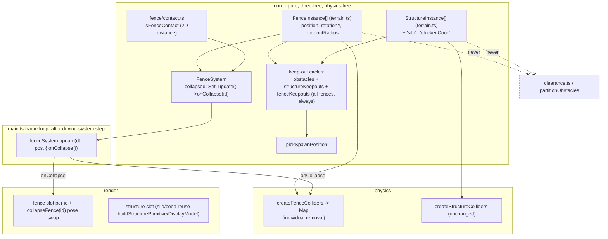

# ADR 0019 — Farmstead re-layout + silo/chicken-coop structures + breakable fences

Status: Proposed (Sprint 6) — **amended 2026-07-12 (see §Amendment (2026-07-12) at the end)**. After the human saw the implemented layout live and shared a reference concept-art image, they confirmed a redesign folded into #54 (deliberately *not* split into new issues, to move fast): the chicken coop moves out of the farmyard into its own separate fenced pen; the windmill moves *into* the farmyard cluster; field space is reserved near the new coop pen; plus three new scope additions — dramatic cliff/canyon terrain relief, waterfall visuals, and denser scattered trees. Parts of §6 below are superseded by that amendment (struck through inline with pointers to it).
Date: 2026-07-12
Related: `docs/requirements/farm-layout-and-fields.md` (issue #54, AC5-AC13 — source of truth); ADR 0012 (the `StructureInstance` / `createStructureColliders` / spawn-keep-out pipeline this extends — issue #46/#47) and its 2026-07-10 mountain addendum; ADR 0001 §2 (kinematic-only physics), §4 (`core/` purity / physics-engine-agnostic contact checks); ADR 0008 (`isFuelContact` — the per-frame 2D-distance contact-check + per-session `System` precedent the fence mechanic mirrors); ADR 0010 (asset pipeline / primitive fallback); ADR 0018 (truck-scale `TRUCK_CONTACT_RADIUS` growth — **shared-tunable cross-check below**). Does **not** cover corn/wheat fields (sibling issue #53) — see §Layout for where fields are reserved space so the two issues don't produce a nonsensical map.
Shared-tunable cross-check (Sprint-1 retro discipline): the fence-collapse contact check is a **new, 7th reader of `TRUCK_CONTACT_RADIUS`**, which ADR 0018 grew from `0.9` to `0.9·TRUCK_SCALE` (≈1.215 today). Reconciled in §Risks/§Consequences; a dated pointer is added to ADR 0018 §2.

## Context

`TERRAIN_BOUNDS` is now −50..50 (100×100, landed via issue #49/ADR 0017), but the four existing structures (windmill, barn, farmhouse, mountain) still sit at their old 40×40-era coordinates in `core/terrain.ts` — clustered in the small central patch, most of the map empty. Issue #54 requires two things: (1) genuinely re-lay-out those four plus new silo/chicken-coop/fence content into one coherent farmstead (AC5/AC6); and (2) add the new structures. Silo and chicken coop are ordinary collidable `StructureInstance`s — no new pattern (AC7). Fences are the genuinely new problem (AC8): every `StructureInstance` shipped so far is **static for the life of a session**, but a fence must start solid, then *collapse and become permanently passable on truck contact for the rest of the session*, then reset to standing on a new session. This is the first `StructureInstance`-family element needing **mutable per-session state**, and the requirements doc explicitly hands the architect three sub-questions: how to represent that state, how to detect contact (must be `core/`-pure 2D distance per ADR 0001 §4, **not** raw Rapier collision events), and how to remove a single fence's collider mid-session from the currently one-shot `createStructureColliders`. Exact coordinates are explicitly *not* in scope (Non-goals) — this ADR fixes the *approach*, to be screenshot-iterated at build time exactly as ADR 0012's placements were.

## Decision

### 1. Fences are a new `FenceInstance` type, not an overloaded `StructureInstance` — and the collapsed state lives in a per-session `FenceSystem`, never on the shared data constant

This is the core AC8 decision. Two things are deliberately kept apart:

**(a) Authored, immutable fence data** — a new sibling type in `core/terrain.ts`, parallel to `StructureInstance` but *not* the same type:

```ts
export interface FenceInstance {
  id: string;
  position: Vec2;
  /** Yaw (radians) of the segment along the boundary line — see §5, orientation is its own concern. */
  rotationY: number;
  /** Circle radius for the solid collider (physics) AND spawn keep-out (core). Not the visual mesh footprint. */
  footprintRadius: number;
}
export const STUB_FENCES: FenceInstance[] = [ /* … boundary line, §Layout */ ];
```

Rationale for a **new type rather than adding a mutable `broken: boolean` to `StructureInstance`** (the doc's explicit either/or):
- `StructureInstance.collidable` is documented in `terrain.ts` as a *static* design-intent flag, and `structureKeepouts()` filters on it. If a fence flipped `collidable` to `false` on collapse, it would silently drop out of the spawn keep-out set mid-session — but AC9 requires collapsed-fence footprints to *stay* in keep-out. Overloading the flag fights its existing meaning.
- Fences carry data structures don't (`rotationY` for the boundary line), and — critically — their standing/collapsed state is **runtime, per-session, per-instance mutable state**, which does not belong on an authored module-level constant at all (mutating `STUB_FENCES` would persist a collapse across sessions, violating AC8's reset-on-new-session).

**(b) Runtime collapsed state → a new `core/fence/` module + a `FenceSystem`**, mirroring the exact precedent of `AnimalSystem`/`FarmerSystem`/`FuelSystem`. The system owns a `Set<string>` of collapsed fence ids, **constructed fresh in `startDriving` every session** — so "fences reset to standing at the start of each new session" (AC8) is satisfied *for free by construction*, the same way a fresh `FarmerSystem`/`FuelSystem` resets the farmer/pickups each session, with zero explicit reset code. Its `update` runs the contact check per frame and emits a one-way `onCollapse(id)` callback the first time a still-standing fence is contacted (a still-standing fence, once in the collapsed set, is skipped forever after — the one-way transition).

`FenceInstance`, like `StructureInstance`, **never enters `partitionObstacles`/`clearance.ts`** — nothing in `core/fence/` or `core/terrain.ts` imports either. AC12 (wheel-tier clearance untouched) holds structurally, identical to the ADR 0012 §1 argument.

### 2. Contact detection: a pure 2D-distance `isFenceContact`, per-frame in `FenceSystem` (not Rapier events)

Add `core/fence/contact.ts` with `isFenceContact(truckPosition, truckRadius, fence, fenceRadius): boolean` — the identical circle-overlap-on-XZ pattern as `isBoopContact`/`isFarmerContact`/`isFuelContact` (`Math.hypot(dx,dz) < truckRadius + fenceRadius`). This keeps `core/` physics-engine-agnostic per ADR 0001 §4 and fully unit-testable with no Rapier in the loop, exactly as the doc's AC8 architectural note instructs. `FenceSystem.update(dt, truckPosition, callbacks)` iterates the still-standing fences, and on the first contact for a segment adds it to the collapsed set and fires `onCollapse(id)`.

Per AC8's non-blocking tuning note, **any contact triggers collapse** (no minimum approach speed/force) — simplest and consistent with the game's forgiving bias. A speed gate could be added later as a pure predicate change with no structural impact.

### 3. Collider removal: a keyed `createFenceColliders` returning a `Map<id, RigidBody>`, removed one at a time in the frame loop

`createStructureColliders` is one-shot (creates all, returns an array for bulk dispose) and can't remove an individual body mid-session. So fences get a sibling helper in `physics/world.ts`:

```ts
export function createFenceColliders(world, fences: FenceInstance[]): Map<string, RAPIER.RigidBody>
```

keyed by fence id, one fixed cylinder collider per standing fence (sized to `footprintRadius`, a *simplified* footprint — same rationale as ADR 0012 §2). On collapse the frame loop calls `world.removeRigidBody(fenceBodies.get(id)!)` and `fenceBodies.delete(id)`; on session dispose it removes whatever remains — same leak-avoidance discipline `createObstacleColliders`/`createStructureColliders` already document for the GAME_OVER→restart round trip.

**Timing safety (project QA gotcha):** the removal happens in the frame loop's contact-check block, which runs *after* `drivingSystem.update()` has already made this frame's single `truckController.step()` call (verified: `driving-system.ts:63`). `removeRigidBody` is therefore called strictly between two `world.step()`s, never during one — this avoids the wasm-state-corruption class the project has hit when physics state is mutated mid-step (CLAUDE.md QA note). This is a plain body removal, *not* a `world.step()`-driven teleport, so it is safe.

### 4. Silo and chicken coop: routine `StructureInstance`s (AC7) — union widening only

Widen `StructureKind` from `'windmill' | 'barn' | 'farmhouse' | 'mountain'` to add `'silo' | 'chickenCoop'`. They are `collidable: true` `StructureInstance`s and flow through the **entire existing pipeline unchanged**: `createStructureColliders` (solid collider), `structureKeepouts()` (spawn keep-out — AC9 for free, since it filters on `collidable`), `buildStructurePrimitive`/`buildStructureDisplayModel` (render + fallback), and the `tickEffects` sourced-art upgrade loop. The only new code is: two `STRUCTURE_PRIMITIVE_COLORS` entries, two `STRUCTURE_ASSET_KEYS` entries, two `buildStructurePrimitive` shape cases (a tall thin cylinder = silo; a small box = coop), and two `ASSET_MANIFEST` entries (Quaternius Farm Buildings Bundle, per AC11). No architecture decision here beyond "reuse ADR 0012 as-is."

Per open questions #2/#3 in the requirements doc, both **default to no functional coupling** — the coop does not bias chicken spawns and the silo has no fuel-system tie (they're decorative farmstead set-dressing). Flagged below for the human, non-blocking.

### 5. Fence orientation is its own concern, separate from the standing/collapsed pose (project convention)

A fence line only reads as a boundary if each segment is *yawed* to run along that line — a T-shaped or L-shaped pen needs segments at different headings. That spatial orientation (`rotationY`, authored per-segment in `FenceInstance`) is designed as **its own data field, distinct from the segment's visual state** (standing vs collapsed). This is the post-Sprint-4 convention (ADR 0015's farmer "never turns to face movement" bug came from designing the animation/pose in detail but never the rotation): here the analogous trap is conflating "which way the segment faces along the boundary" with "is it standing or collapsed," which would leave every fence axis-aligned and the boundary incoherent. They are separated explicitly:
- **Segment orientation** = `FenceInstance.rotationY`, static authored data, applied to the rendered segment's `rotation.y` at scene build. The collider is a `footprintRadius` cylinder (rotation-invariant), so orientation is purely a render concern — but it must still be *designed and authored*, not defaulted to 0.
- **Collapse pose** = the runtime standing→collapsed visual swap in `scene.collapseFence(id)`. Left as a tuning/asset detail per AC8 (a "broken fence" pose if the Quaternius asset ships one, else a simple tip-over/fade). Collapse *direction* (ideally tipping away from the truck) is a nice-to-have pose detail, not load-bearing; a symmetric flatten satisfies AC8.

The fence is not a travelling entity, so there is no "face direction of travel" requirement — but the segment-orientation-vs-visual-state separation is the same discipline, and is called out so it is designed rather than discovered in playtest.

### 6. Layout strategy (AC5/AC6) — zones, not coordinates

Coordinates are explicitly out of scope (Non-goals); this fixes the *approach* and a starting arrangement to be screenshot-iterated, exactly as ADR 0012's addendum handed the mountain a suggested `(-14,5)` to adjust live. The strategy is a **zone plan for the 100×100 map**, with the truck start staying central at `(0,6)`:

- ~~**Farmyard cluster (one quadrant, mid-distance from start):** barn + farmhouse + silo + chicken coop grouped within a ~15-unit span in one quadrant (suggest the +x/−z / south-east region, e.g. centred around `(22,-20)`), far enough from `(0,6)` that a child drives *toward* it across the newly-large map, not on top of it. This is the "farmyard" AC6 asks for.~~ **(superseded 2026-07-12 — the coop leaves the farmyard for its own pen, and the windmill joins the cluster instead; see §Amendment (2026-07-12) §A1.)**
- **Fence boundary adjacent to the cluster:** a short run of `FenceInstance`s (suggest 4–8 segments, count non-blocking) forming an L or a straight line that reads as a pen/field edge on the *open* side of the farmyard — i.e. between the farmyard and the reserved field space below. This is what the player smashes through.
- **~~Windmill and~~ mountain as ~~distant landmarks~~ a distant landmark (AC6 "landmarks, not spacing"):** ~~placed out in other quadrants as things to see and drive to across the open map — e.g. windmill north/north-west (`~(-20,32)`),~~ **(windmill relocated 2026-07-12 into the farmyard cluster — see §Amendment §A1)** mountain pushed toward a far corner now that there's room (`~(-35,-25)`), keeping `footprintRadius` (4.71) inside `TERRAIN_BOUNDS` (centre ≥ 45 from either bound). The river (z≈15–17 today) stays a northern feature; it can read as the natural water edge the fields sit along.
- **~~Reserved space for sibling #53 fields (not built here):** the fields should sit *adjacent to the farmyard on its open side*, between the farmyard/fence boundary and the river — i.e. the +x region around z≈0–14.~~ **(superseded 2026-07-12 — the reserved field space moves to sit adjacent to the new standalone coop pen instead; see §Amendment §A1.)** The fields should sit *adjacent to the farmyard on its open side*, between the farmyard/fence boundary and the river — i.e. the +x region around z≈0–14. This ADR does **not** place fields, but reserves that zone and keeps the farmyard/fence oriented so that when #53 ships independently the fence reads as "the field's fence" and the map isn't nonsensical. Flag to the #53 implementer: keep fields out of the far landmark corners and out of the truck-start pocket.

**Clearance rules to check at build time** (the same discipline ADR 0012 applied, now against the bigger truck of ADR 0018):
1. Every structure/fence footprint ≥ (its `footprintRadius` + `TRUCK_CONTACT_RADIUS` + a few units) from `TRUCK_START (0,6)`.
2. Every footprint clear of the three `STUB_OBSTACLES` and of the river route, and of each other (sum-of-radii + margin).
3. Every collidable centre + `footprintRadius` strictly inside `TERRAIN_BOUNDS`.
4. **Standing-fence spacing vs. the bigger truck collider (ADR 0018):** any *gap* the truck is meant to fit through, and any pinch point between a fence and an adjacent structure, must clear the enlarged `TRUCK_CONTACT_RADIUS` (≈1.215, i.e. ~2.43 diameter) plus margin — else the truck wedges. Because fences are breakable, this is lower-stakes than for structures (the truck smashes through rather than threads a gap), but a truck wedged *between* a standing fence and a solid silo with no breakable exit is the failure mode to check in the traversal playtest.

A `terrain.test.ts` assertion set (mirroring the existing mountain-clearance assertions) should encode rules 1–3 for the chosen coordinates once picked.

## Alternatives considered

- **Extend `StructureInstance` with a mutable `broken: boolean`.** Rejected: overloads the static-intent `collidable` flag that `structureKeepouts()` reads (would drop collapsed fences from keep-out, violating AC9), and puts per-session mutable state on an authored module constant (would persist across sessions, violating AC8's reset). A separate type + a per-session system is the project's own established shape for session state.
- **Detect collapse via Rapier collision events instead of a 2D-distance check.** Rejected: pulls Rapier into the collapse trigger, breaking `core/` purity (ADR 0001 §4) and the project's uniform contact-check convention (`isBoop/Farmer/FuelContact`). The 2D check is enough — a fence is a gameplay trigger, not a sliding-resolution problem, exactly like a boop.
- **Keep `createStructureColliders` one-shot and rebuild all fence colliders on each collapse.** Rejected: churns every fence body on every collapse and risks the mid-step mutation class the project has been bitten by; a keyed map removing exactly one body is smaller and safer.
- **Re-evaluate spawn keep-out when a fence collapses (open up its footprint).** Rejected per AC9's own recommendation: spawn positions are picked once, not continuously re-validated, so leaving collapsed-fence footprints permanently in the keep-out set is simpler and has no visible downside. `fenceKeepouts()` is therefore computed once from all authored fences and never mutated.

## Consequences

- **A new `core/fence/` module + `FenceSystem` + `FenceInstance` type + `createFenceColliders` + a `scene.collapseFence` render hook + one frame-loop contact block.** More surface than the silo/coop (which are pure ADR 0012 reuse), but each piece mirrors an existing sibling (`fuel/collect.ts`, `FuelSystem`, `createStructureColliders`, `upsertFuelPickup`), so there is no genuinely novel machinery — it's the fuel-pickup shape with a one-way collapse instead of a collect/despawn.
- **Fences carry the first mutable-per-session `StructureInstance`-family state**, but it lives in the system, not the data — so the "authored data is immutable, session state lives in a `System` constructed per session" invariant the rest of the codebase follows is preserved, not broken.
- **Shared-tunable interaction with ADR 0018, reconciled here (Sprint-1-retro class):** `isFenceContact` is a **7th reader** of `TRUCK_CONTACT_RADIUS` (ADR 0018 §2 listed 6). The bigger truck contacts — and therefore collapses — fences from slightly further out. This is benign and *positive* (smashing through fences is the intended fantasy; collapsing a touch early reads fine, unlike a farmer bump landing early). It does not falsify any ADR 0018 guarantee. The genuine ADR 0018 interaction to *watch* is the reverse one already in ADR 0018's own risk list: the enlarged collider getting *wedged* against a **standing** fence in a pinch point — covered by §Layout clearance rule 4 and the traversal playtest. A dated pointer is added to ADR 0018 §2 so this reader is not missed if the radius is retuned.
- **Silo/coop widen `StructureKind`**, so every `Record<StructureKind, …>` map (`STRUCTURE_PRIMITIVE_COLORS`, `STRUCTURE_ASSET_KEYS`) becomes a compile error until the two entries are added — a *helpful* exhaustiveness failure, not a silent gap.
- **The re-layout moves every existing structure**, so any test asserting the old coordinates (e.g. mountain-clearance in `terrain.test.ts`) must be updated to the new arrangement — expected churn, not breakage.

## Component / data design



| Location | Change | Responsibility |
|---|---|---|
| `src/core/terrain.ts` | Add `FenceInstance` + `STUB_FENCES`; widen `StructureKind` with `'silo' \| 'chickenCoop'`; add silo/coop `StructureInstance`s; re-place all four existing structures per §Layout. | Authored, immutable data. |
| `src/core/fence/contact.ts` | `isFenceContact(...)` — 2D circle overlap, mirrors `isFuelContact`. | Pure contact predicate. |
| `src/core/fence/fence-system.ts` (or `src/systems/`) | `FenceSystem`: owns `collapsed: Set<id>`, `update(dt, truckPos, {onCollapse})` fires once per segment. Constructed per session. | Per-session mutable collapse state + reset-by-construction. |
| `src/core/spawn/spawn-position.ts` | Add `fenceKeepouts(fences)` (all fences → keep-out circle, always, incl. collapsed — AC9). | Spawn keep-out for fences. |
| `src/physics/world.ts` | `createFenceColliders(world, fences): Map<id, RigidBody>`. | Individually-removable fence colliders. |
| `src/render/scene.ts` | Render each fence (yawed by `rotationY`) with a per-id slot; add `collapseFence(id)` pose swap; add silo/coop primitive cases + colors + asset keys. | Render + collapse visual + new structure art. |
| `src/render/assets/manifest.ts` | Silo/coop/fence `.glb` entries (Quaternius, AC11). | Asset sourcing. |
| `src/main.ts` `startDriving` | Construct `FenceSystem` + `createFenceColliders`; add a `fenceSystem.update(...)` block in `frame` (after `fuelSystem.update`, guarded by `disposed`) whose `onCollapse` removes the collider from the map and calls `scene.collapseFence(id)`; feed `fenceKeepouts` into the combined spawn keep-out; remove remaining fence bodies in `dispose()`. | Wiring, mirrors the fuel/farmer/animal blocks. |

## Risks

- **A truck wedged between a standing fence and a solid structure** with the enlarged ADR 0018 collider and no breakable exit. Most likely layout failure. Detected in the traversal playtest (drive the whole map, including through/around the farmyard). Mitigation: §Layout clearance rule 4; keep at least one clearly-breakable fence segment on any side that could trap the truck, and don't nest fences tight against a silo/coop.
- **Removing a fence collider corrupts Rapier state.** Guarded structurally by doing the removal in the post-`step()` contact block (§3) — a plain `removeRigidBody`, never a mid-step or `world.step()`-driven mutation. Would show as a "recursive use of an object" crash on collapse if placed wrong. Detected by a live smash-through playtest; the placement in the frame loop is the mitigation.
- **A fence renders axis-aligned / the boundary looks incoherent** because `rotationY` was defaulted to 0 rather than authored (the §5 orientation trap). Detected by looking at the running scene (a straight row of un-yawed segments won't enclose anything). Mitigation: `rotationY` is a required authored field, and the layout review looks specifically at whether the fence reads as a boundary.
- **Collapse doesn't actually open the path** — visual swaps but collider isn't removed (or vice versa). Detected by a smash-through playtest: drive at a fence, confirm it (a) changes pose *and* (b) the truck then passes where it stood. Both effects fire from the single `onCollapse(id)` callback, so they can't drift, but the removal-from-map + `delete` must both happen. A unit test on `FenceSystem` pins "fires `onCollapse` exactly once per segment, never again after collapse."
- **Silo/coop art-style or silhouette mismatch** (AC11). Detected in the live screenshot pass (per CLAUDE.md's mandatory look-at-screenshots discipline). Mitigation: source from the same Quaternius Farm Buildings Bundle as barn/windmill.
- **A spawn call site misses `fenceKeepouts`** → an animal/farmer/fuel pickup spawns inside a standing fence. Detected by extending the spawn unit tests with a fence-footprint case and by the injected-RNG assertion. Mitigation: feed the combined `obstacles + structureKeepouts + fenceKeepouts` set at the single point where the keep-out array is assembled.

## Open questions (surfaced to the human — all non-blocking, defaults chosen)

1. **Chicken-coop ↔ animal-spawn coupling** (req doc OQ2). Default: **no coupling** — coop is decorative, chickens keep spawning uniform-random-with-keep-out. Flip only if the human wants chickens to cluster near the coop (a new, separately-scoped tie-in).
2. **Silo ↔ fuel-system coupling** (req doc OQ3). Default: **no tie** — silo is decorative like the barn.
3. **Fence collapse trigger** — default **any contact** (no speed/force gate), per AC8's own recommendation and the forgiving bias. A minimum-approach-speed gate is a later pure-predicate change if playtest wants "you have to hit it with some oomph."
4. **Fence count / segment layout / exact structure coordinates** — non-blocking, resolved by the screenshot-and-iterate layout process (req doc OQ4), same as every prior placement decision. The §Layout zones + clearance rules are the starting point, not a locked spec.
5. **Collapse visual treatment** — asset-dependent (a Quaternius "broken fence" pose if one ships, else a tip-over/fade). Decided at build time against the actual sourced asset (AC8).

## Amendment (2026-07-12) — reference-art redesign: coop pen, clustered windmill, cliffs, waterfalls, forest

Context: the human drove the implemented #54 layout live, then shared a reference concept-art image of an idealized
farm and asked for a redesign. Through a round of clarifying questions they confirmed the scope below, **all folded
into #54** (a deliberate override of this project's usual new-issue-per-story default — confirmed with the human, to
move fast). This amendment supersedes the struck-through parts of §6 and adds three brand-new terrain/render concerns
(cliffs, waterfalls, forest) that the original requirements doc (`farm-layout-and-fields.md`) does not cover. Those
three are recorded here as the design of record; see §A6 "Open questions" for the flag that the requirements doc has
no ACs for them.

Cross-ADR reach of this amendment (each gets a dated pointer of its own):
- **ADR 0017** (terrain-hills / `core/terrain-height.ts`, `TERRAIN_BOUNDS`, the fixed chase camera it left alone) — the
  cliffs extend its height-field technique and **change its fixed-camera assumption** (§A2, the load-bearing
  cross-mechanic reconciliation).
- **ADR 0012** (the procedural river, §3) — waterfalls are a decorative sibling of the river, same "zero mechanical
  effect" precedent (§A3).

Non-negotiable invariant carried forward unchanged from ADR 0001 §2 and ADR 0017 AC8: **none of this touches the
truck's movement/collision sim.** Everything below feeds only the render layer and the render-only climb transform
(`group.position.y` / `rotation.x/.z`). `terrainHeightAt` still never reaches `truck-motion.ts`, `boundary.ts`, or
`physics/world.ts`. There is **no new blocking behaviour** anywhere in this amendment — the cliffs are driven over
exactly like today's hills (same code path, bigger numbers), and trees/waterfalls carry no collider.

### A1. Revised layout — coop as a standalone pen, windmill into the farmyard, fields reserved by the coop

Zones, not coordinates (same discipline as §6 — exact placement is the developer's screenshot-iterated call; the
numbers below are starting suggestions, pinned once chosen by `terrain.test.ts`). Truck start stays central at `(0,6)`.

- **Farmyard cluster (south-east, tightened):** barn + farmhouse + silo **+ windmill**, grouped within a ~15–20-unit
  span (keep the current ~`(14..30, −18..−30)` neighbourhood). The windmill moves *in* from its former distant NW
  landmark spot to sit tight with barn/silo — the reference image groups the windmill with the barn/silo, and the
  human confirmed this reversal of §6's "windmill as a distant standalone landmark." Suggested windmill seat: a corner
  of the cluster, e.g. `~(34,-20)` or `~(18,-32)`, screenshot-tuned. Clearance rules §6.1–§6.4 still apply (windmill
  `footprintRadius` 2 vs. the enlarged ADR 0018 truck collider — check the pinch points between windmill/silo/barn so
  the truck isn't wedged in the tighter cluster; there is no breakable exit *inside* the farmyard, so this is the
  §Risks "wedged between two solids" case, now slightly more likely in a tighter cluster — mitigate by keeping ≥
  `TRUCK_CONTACT_RADIUS·2 + margin` gaps between the four cluster solids).
- **Chicken-coop pen (its own quadrant, away from the farmyard):** the coop leaves the farmyard and becomes a small,
  self-contained fenced pen elsewhere — matching the reference image's "Animal Coop with Fence" as a visually distinct
  location. Suggested seat: the **north-east** quadrant, e.g. coop `~(26,24)`, with the `STUB_FENCES` run relocated to
  **enclose this pen** (an L or three-sided run around the coop, opening toward the reserved field space) rather than
  bounding the farmyard. The fence keeps its exact §1–§3/§5 mechanics (breakable, per-session `FenceSystem`,
  `createFenceColliders`, `rotationY`-authored orientation) — only its coordinates and what it encloses change. This
  is the "smash-through" content, now the coop-pen gate.
- **Reserved field space (sibling #53, still not built here):** moves to sit **adjacent to the new coop pen** (e.g. the
  NE region between the coop pen and the river, `~x 12..38, z 8..20`), so a plausible, natural gap/orientation is left
  for #53 to occupy later. Space reservation only — no field geometry, no data. Flag to the #53 implementer stays: keep
  fields out of the dramatic-terrain zones (§A2), the farmyard, the truck-start pocket, and the far landmark corners.
- **Mountain** stays a distant landmark (unaffected), far SW `~(-35,-25)`. **River** stays the northern feature
  (z≈15–17), now reading as the water edge the reserved fields sit along. ~~and as the visual source of the waterfall
  (§A3)~~ — **stale 2026-07-12:** the waterfall (§A3) was removed the same day; see §A3's own dated resolution note.

Net quadrant map: SE = farmyard (barn/farmhouse/silo/windmill), NE = coop pen + reserved fields, SW = mountain
landmark, N-centre = river, far W/NW + other empty peripheral pockets = dramatic terrain + forest (§A2/§A4), centre =
truck start. `terrain.test.ts`'s clearance assertions are re-pointed at the new coordinates once chosen.

### A2. Cliffs / canyon relief — zone-gated exaggeration of the existing `terrainHeightAt` height field (the main job)

Confirmed constraints: **visual-only, same technique class as the hills, never real terrain physics** (ADR 0001 §2's
flat/unflippable model is untouched), the truck drives over it exactly like today's hills, and none of the systems that
already depend on `terrainHeightAt` break. The decision below satisfies all of these by *extending* the one pure
height function, not adding a new mechanism.

**Decision: a zone-gated dramatic-relief term added inside `terrainHeightAt`, plus a camera change so the truck stays
framed when it drives onto dramatic ground.**

```
terrainHeightAt(p) = flattenMask(p) * ( gentleField(p) + dramaticZoneFactor(p) * dramaticField(p) )
```

- `gentleField` = today's `rawHeight` sum-of-sines (amplitude ~1.4, the existing `DEFAULT_HILL_CONFIG`), unchanged. The
  **drivable core stays gentle** — normal play feels exactly like it does now.
- `dramaticField` = a second, larger sum-of-sines (its own config: amplitude ~5–8, wavelength ~28–40 — see the
  steepness note below). Still a closed-form C¹ sum of sin/cos, so it is smooth everywhere — **no vertical
  discontinuity** (a truly vertical wall would make the four climb corners sample wildly different heights within one
  wheelbase and read as a teleport; a steep-but-continuous slope reads as a big hill the truck climbs). "Cliff/canyon"
  drama comes from *tall, steep-sided but still-continuous* mesas/ridges, not from a discontinuity.
- `dramaticZoneFactor(p)` ∈ [0,1] = a smooth gate built from a small authored set of `DRAMATIC_ZONES` (each `{center,
  innerRadius, outerRadius}`): 1 inside a zone's `innerRadius`, easing to 0 by `outerRadius`, taken as the max over
  zones. Reuses the existing `ringFactor` cubic smoothstep helper — same shape, same purity, same testability as the
  flatten mask.

**Why zone-based, not a global steepness bump (the §Alternatives call the task asked me to make explicitly):** a global
steepness increase would make the whole map — including every drivable approach to the farmyard/coop/fields and every
stretch a child crosses constantly — a rollercoaster, undoing the deliberately forgiving golf-course feel ADR 0017
chose for this young-child audience. It would also fight the content: the farmyard, coop pen, and mountain all sit in
the map's outer half, so a simple radial "edges are high" ring would put steep ground on the very approaches the player
drives to reach them. **Authored zones placed in the genuinely empty peripheral pockets** (the far W/NW edge north of
the mountain, and other corners between content) keep the drama off the play path while still being fully drivable if
the child steers into them. Suggested starting zone: one large canyon system along the far **west** edge, `center
~(-42,10)`, `innerRadius ~7`, `outerRadius ~22` — north of the mountain, west of everything else. ~~and adjacent to the
river's west end so it hosts the waterfall (§A3)~~ — **stale 2026-07-12:** the waterfall (§A3) was removed the same
day; see §A3's own dated resolution note. A second smaller zone in the deep-north or a far corner is optional.
Exact zones/severity are screenshot-iterated (Non-goals: coordinates not locked), same as every prior placement.

**Steepness vs. height are tuned separately.** Amplitude gives *drama* (tall features); the *slope the truck actually
experiences* is amplitude/wavelength. Keep wavelength long enough (≥ ~28) relative to amplitude that the per-wheelbase
gradient stays within a comfortable climb — the pitch/roll clamps (`maxPitch`/`maxRoll`) bound the tilt regardless, but
we want the *lift* to change smoothly, not lurch. Screenshot-tune both together; start at amplitude 6 / wavelength 32.

**Dependent-system re-check (every reader of `terrainHeightAt`, per the task):**

1. **Obstacle-climb four-corner sampling (`obstacle-climb.ts`)** — reads `terrainHeightAt` at 4 corners, *adds* it to
   the obstacle hump. **Preserved, two ways:** (a) the flatten mask still damps terrain to ~0 at every obstacle
   footprint, so the corner-sum collapses to the pure obstacle hump there and `DEFAULT_CLIMB_CONFIG`'s tuning is
   untouched (the exact ADR 0017 §Decision-4 argument, unchanged); (b) over dramatic ground the finite-difference
   pitch/roll still pass through the existing `maxPitch`/`maxRoll` clamps, so the truck tilts *to the clamp* on steep
   bits and never into a flat-ground-impossible orientation. `lift` (the mean) is unclamped and *should* be — that is
   the truck riding up the mesa surface, which is exactly what "drives over like a hill" means. The `() => 0`
   regression guard in `obstacle-climb.test.ts` still proves the obstacle-only path is byte-identical.
2. **Flatten mask (`terrainHeightAt` itself)** — still zeroes *all* terrain (gentle + dramatic) at every content
   footprint, so structures/fences/river/truck-start stay planted at y=0 with aligned colliders. Dramatic zones are
   authored away from content, so there is no overlap; the mask is defence-in-depth if a zone is ever nudged near
   content. **No change needed** beyond the mask now multiplying the larger combined field.
3. **Spawn systems / keep-out (`spawn-position.ts`)** — spawn is 2D-uniform-in-bounds with circular keep-outs; terrain
   height is not an input and dramatic terrain is drivable (reachable), so an animal/fuel/farmer on a mesa is not a
   correctness problem. **No spawn change required.** *Optional, non-blocking:* if playtest shows entities awkwardly
   stranded on steep faces, bias spawns toward gentle ground (add dramatic-zone footprints as soft keep-outs) — default
   is no change, to keep the spawn ACs untouched.
4. **Camera height (`scene.ts` `setTruckTransform`)** — **the load-bearing cross-mechanic reconciliation.** The chase
   camera today uses a *fixed* world-Y (`CAMERA_CHASE_HEIGHT = 4.2`) and looks at a *fixed* `y = 0.5` above the truck's
   XZ. That was correct for ADR 0017's ~1.4-unit hills (truck barely leaves y≈0). With dramatic elevation the truck
   rig can lift many units, so a fixed-height camera would let the truck rise **out of the top of the frame** while the
   camera stayed low. This is precisely the Sprint-1-retro class of bug (two individually-reasonable numbers — the
   issue-#17/ADR-0017 fixed camera height and the new cliff amplitude — decided apart, each fine alone, jointly
   breaking the camera's framing guarantee). **Reconciliation: make the chase camera track the truck's terrain lift in
   Y** — `camera.position.y = CAMERA_CHASE_HEIGHT + truckRig.group.position.y` and `camera.lookAt(x,
   truckRig.group.position.y + 0.5, z)`. This is a render-only change (the lift is already computed and applied to the
   rig), and it *also* very slightly improves gentle-hill framing (the camera now bobs ~1 unit over hills instead of
   holding dead-flat — minor, arguably nicer). A dated pointer is added to ADR 0017 so its fixed-camera decision is not
   read as still-current. **This is the one change with a perceptible feel-difference in ordinary play — flagged for
   human confirmation in §A6.**

**Ground mesh (`scene.ts`).** No structural change — the existing subdivide-displace-`computeVertexNormals` build reads
`terrainHeightAt`, so it renders the dramatic relief for free. Watch faceting: `GROUND_SEGMENTS = 128` (~0.78-unit
spacing) resolves wavelength-30 features with ~38 samples/wavelength — fine — but if steep cliffs look faceted, bump to
192–256 (still a one-time static build, no per-frame or bandwidth cost; ~65k verts at 256, within budget). Tuning knob,
not a redesign.

**Spatial orientation of moving entities on dramatic ground (post-Sprint-4 convention).** The truck's orientation is
already fully designed as its own concern (ADR 0017 §5: yaw from driving, pitch/roll from the climb transform) — the
cliffs change the *magnitude* of the terrain feeding that pitch/roll but not the design, so the truck stays correct. The
gap to flag: **animals/farmer are grounded Y-only** (ADR 0017 §Decision-4 explicitly does *not* slope-pitch them). On a
gentle 1.4-unit hill an un-pitched, perfectly-vertical cow is unnoticeable; on a steep dramatic slope it will read as
"floating stiffly / half-buried on one side." **Recommendation:** keep animals/farmer out of the steep dramatic zones
(the optional spawn bias in point 3 is the lever), OR accept the look for now and defer slope-pitching to a later
render nicety — do **not** silently ship un-pitched entities onto steep ground and discover it in playtest (the exact
ADR-0015 "orientation left undesigned" trap this convention exists to prevent). Default: rely on zones being off the
main spawn/play path; revisit if playtest shows a stranded, stiff entity on a cliff.

### A3. Waterfalls — a decorative procedural sibling of the river (ADR 0012 §3 precedent)

~~Same "zero mechanical effect, procedural, near-zero download" contract as the river, and the same spirit as the
already-backlogged river-splash story #51. **No physics, no collider, no keep-out, no new asset-heavy pipeline.**~~

~~**Decision: a procedural waterfall feature built in `render/scene.ts` (a `buildWaterfallMesh` sibling to
`buildRiverMesh`), placed at a cliff in a dramatic zone (§A2), reading `terrainHeightAt` for its top lip and base pool
so it plants on the actual rendered surface.** Geometry: a tilted/near-vertical translucent quad (the falling sheet)
from the higher terrain lip down to a small flat pool quad at the base — both in the river's material family (blue,
`transparent`, `DoubleSide`, matching `RIVER_COLOR`). Faux motion via a cheap **vertical UV scroll** on the sheet's
texture in the render loop (an animated-texture-offset, render-only, like the optional river UV-scroll ADR 0012 §3
already sanctioned) — or a static faux-motion-blur gradient if we skip animation. Authored data (`{topPos, bottomPos,
width}`, a small `WATERFALL_FEATURES` array) can live in `core/terrain.ts` next to `RIVER_ROUTE` for a single source of
truth, consumed only by render.~~

~~**Interaction with the flatten mask (called out so it isn't a surprise):** the river *corridor* is flattened to y=0 (so
the flat ribbon sits level and drivable), but the waterfall deliberately needs the height drop, so **the waterfall is
NOT added to the flatten mask** — it is sited just *outside* the flattened river corridor, at the lip where the
adjacent dramatic zone rises/drops. Reading gives a natural "the river reaches the canyon edge and tumbles down": the
flat river corridor ends near the west dramatic zone (§A2's suggested `(-42,10)` zone sits by the river's `(-18,16)`
west end), and the waterfall sheet drops from that lip into a pool below. Optionally nudge `RIVER_ROUTE`'s west end a
few units toward the waterfall's top pool for visual continuity — screenshot-tuned, non-blocking. Graceful-degrade like
the river: a malformed/empty feature returns an empty group, no crash.~~

**Addendum (2026-07-12, third implementation pass, human live-screenshot report):** ~~a tilted/near-vertical
translucent quad~~ turned out to require two follow-up fixes after shipping, both caught by rendered screenshots
rather than the test suite: a second pass discovered the dramatic-terrain height field (§A2) is deliberately smooth
(no genuinely steep local gradient existed anywhere in it at the time), so a *literal* `terrainHeightAt` sample at
both `topPos` and `bottomPos` could only ever produce a barely-visible ~12.6-degree slab — that pass's fix decoupled
`topPos`'s height into an authored offset above the real `bottomPos` height instead. A third pass then found that
decoupling is exactly what let the sheet's top silently float ~7 units above empty air the same day
`DEFAULT_DRAMATIC_FIELD_CONFIG` was retuned (terrain-height.ts) for an unrelated "cliffs aren't dramatic enough" fix —
nobody had re-checked the fabricated height against the reshaped field. The retune's own effect turned out to be the
resolution: it made the field genuinely locally steep in places (max local gradient found ~37-39 degrees, up from the
original tuning's ~18), so this pass reverts to *literal* `terrainHeightAt` sampling at both ends (no authored
offset), sited at one of the field's now-genuinely-steepest local points (`core/terrain.ts`'s `WATERFALL_FEATURES`
doc comment has the full derivation). The sheet reads as steep/dramatic (~37 degrees, clearly beyond the gentle
field's own slope) rather than the originally-envisioned literal "near-vertical" — the terrain field has no steeper
*local* gradient anywhere to draw on, and grounding correctly takes priority over hitting a specific angle target.
This also fixed a related material defect the same screenshot surfaced (a steep quad's face normal can end up
strongly angled away from the scene's one directional light depending on which way its authored coordinates happen to
run, rendering it as a dark, nearly-opaque slab under `MeshStandardMaterial`'s lighting — unlike the river, which is
always near-horizontal and reliably catches the light): the waterfall sheet/pool now use an unlit `MeshBasicMaterial`
instead, so its appearance no longer depends on orientation relative to the sun. See `render/scene.ts`'s
`buildWaterfallMesh` doc comment and `terrain-height.test.ts`'s `WATERFALL_FEATURES` regression suite (which now also
pins the sheet's top against a brute-force sample of nearby real terrain, the specific check missing through all
three passes) for the full detail.

**Removed 2026-07-12** — after three rounds of live-screenshot-caught fixes (uphill-flowing coordinates, then a
too-shallow angle, then a floating-disconnected-from-terrain + dark-material bug), the human decided not to keep this
feature. `WaterfallFeature`/`WATERFALL_FEATURES` (`core/terrain.ts`), `buildWaterfallMesh`/`WATERFALL_POOL_Y_OFFSET`
(`render/scene.ts`), and their test coverage in `render/scene.test.ts` and `terrain-height.test.ts` have all been
deleted. The river (ADR 0012 §3) and dramatic-cliffs terrain (§A2) are unaffected.

### A4. Forest / scattered trees — sparse non-collidable props, the fields' pattern, NOT `InstancedMesh`

Per the task and `farm-layout-and-fields.md`'s deliberate `InstancedMesh` non-goal: **do not introduce instancing.**
Trees follow the fields' own "~15–30 scattered stalk-cluster props" pattern, scaled up a little for map coverage.

**Decision: trees are non-collidable decorative props authored as plain data in `core/terrain.ts` (a `DECORATIVE_TREES`
array of `{position, rotationY?, scale?, variant?}`), consumed only by `render/scene.ts`, grounded by sampling
`terrainHeightAt`.** They are **not** `StructureInstance`s, carry **no collider and no spawn keep-out** (exactly like
the fields' stalk-clusters, `farm-layout-and-fields.md` AC2), and are **not** in the flatten mask (we *want* trees on
hills and dramatic slopes — a forested mesa reads well, and a vertical tree on a slope looks acceptable). Rendering:
**load one small tree `.glb` once and `.clone()` it per instance** (~25–45 clones across the map — sparse, well within
the ADR 0010 budget; this is the "load-once, clone-many" shape, categorically different from the thousands-of-stalks
dense instancing the non-goal rejects). Placement is authored to read as a couple of loose forest clumps plus scattered
singles, kept clear of the truck-start pocket, the farmyard interior, and the fence/coop pen — screenshot-iterated.

**Collidability is a genuine product choice, flagged (§A6).** Default = **non-collidable** (forgiving bias; matches the
fields precedent; no keep-out/wedge risk; no new keep-out reader). A reasonable alternative a child might expect is a
monster truck *knocking trees over* — that is cleanly expressible later by reusing the exact `FenceInstance` /
`FenceSystem` breakable machinery this ADR already built (a "breakable tree" = a fence-shaped one-way collapse), but it
is **not** built now; recording it as the clean extension point.

**Asset sourcing is orchestrator work, not the developer's** (per CLAUDE.md's asset-sourcing convention): real low-poly
CC0 tree model(s) (Quaternius Nature / similar) need sourcing, license-checking, and CREDITS.md entry by the
orchestrating session before the developer wires them in. Primitive fallback per ADR 0010 / AC10: a classic
cone-on-cylinder low-poly tree, so a load failure degrades gracefully and never crashes.

### A5. Component / data-design delta (what actually changes for the developer)

| Location | Change | Note |
|---|---|---|
| `core/terrain.ts` | Re-seat coop as a standalone pen + move windmill into the farmyard cluster + relocate `STUB_FENCES` to enclose the coop pen (new coordinates only, no type change). Add `DRAMATIC_ZONES` data (§A2). Optionally add `WATERFALL_FEATURES` (§A3) and `DECORATIVE_TREES` (§A4) authored arrays. | Authored data only. Coordinates screenshot-iterated, pinned by `terrain.test.ts`. |
| `core/terrain-height.ts` | Add `dramaticField` config + `dramaticZoneFactor` (reusing `ringFactor`); combine per the §A2 formula. Bounded/flatten/`≈0-at-content` invariants unchanged in shape. | Pure, still the single source of truth for render + climb. |
| `render/scene.ts` | Camera Y now tracks `truckRig.group.position.y` (§A2 point 4). Add `buildWaterfallMesh` + its UV-scroll tick (§A3). Render `DECORATIVE_TREES` via load-once/clone-many + cone-cylinder fallback (§A4). Possibly raise `GROUND_SEGMENTS` if cliffs facet. | Dumb adapter over core data + the camera reconciliation. |
| `render/assets/manifest.ts` | Tree `.glb` entry (orchestrator-sourced). Optional waterfall texture (or procedural). | AC10 fallback applies. |
| Tests | `terrain-height.test.ts`: dramatic zones exceed the gentle bound; central play area stays within the gentle bound; content still ≈0. `terrain.test.ts`: new coop/windmill/fence clearances. `obstacle-climb.test.ts`: `() => 0` regression guard still holds. | test-engineer/developer work. |

Unchanged and explicitly *not* touched: `truck-motion.ts`, `boundary.ts`, `physics/world.ts`, the wheel-tier clearance
system (`clearance.ts`/`partitionObstacles` — AC12), `computeClimbTransform`'s math (only its *input* magnitude grows),
and the fence collapse mechanics (§1–§3/§5 — only fence coordinates move).

### A6. Open questions / needs human input before implementation

1. **Chase-camera behaviour change (§A2 point 4).** The camera will now gently track the truck's terrain lift, so it
   bobs ~1 unit over ordinary hills where today it holds flat. Recommended (it is what makes dramatic elevation
   framable and is arguably nicer), but it is the one change with a perceptible feel-difference in normal play —
   **confirm acceptable.** If the human dislikes any hill-bob, the fallback is to track lift only above a threshold
   (flat below ~2 units, tracking above) — slightly more code, same result for cliffs.
2. **Tree collidability (§A4).** Default non-collidable (forgiving, matches fields). Confirm, or opt into "knock trees
   over" (reuse the fence breakable machinery) as a scoped extension.
3. **Requirements-doc gap.** Cliffs, waterfalls, and forest are new asks with **no ACs in `farm-layout-and-fields.md`**
   — the human folded them into #54 to move fast. Recommend the orchestrator have `requirements-analyst` append ACs (or
   explicitly accept this ADR amendment as the sole record). Non-blocking; the human already decided the scope.
4. **Placement/severity of dramatic zones, waterfall siting, tree count/clumping, exact new coop/windmill/fence
   coordinates** — all screenshot-iterated at build time per this project's standing layout convention (§6 / Non-goals).
   The suggestions above are the starting point, not a locked spec.
5. **Animals/farmer on steep dramatic ground (§A2 orientation note).** Default: rely on zones being off the spawn/play
   path; keep entities Y-only. Slope-pitching them, or actively keeping spawns out of steep zones, is a deferred
   nicety — flag if playtest shows a stiff/stranded entity on a cliff.
